## 2021년 06월15일 c# 개요 및 언어 구조  
## intro   
```
MS의 랜더스 헬스버그에 의해서 고안된 언어
C언어 계열에 속하는 범용 프로그래밍 언어

C# 1. 설계 목표 간단
   2. 객체 지향적
   3. .NET에 최적화된 언어
   4. 컴포넌트 지향 프로그래밍 언어
   5. 안정적 타입
   6. 현대적

컴포넌트 -> 사용자 인터페이스 쉽게 만들 수 있는 것
```
## 오늘의 Point   
### C# 언어의 특징은?  
```
1. 자료 추상화
2. 델리게이트와 이벤트
3. 예외처리
4. 멀티스레드
```
### 자료 추상화   
```
- - 사용자 정의 자료형을 마치 시스템 제공 자료형 처럼
사용할 수 있는 기능
- 클래스를 통해 구현 가능
```
### 델리게이트와 이벤트   
```
- - 메소드를 다른 객체에 전달해야 하는 프로그래밍 기법을 위해
델리게이트를 지원하여 이벤트를 형식적으로 정의하고 사용할 수 있는 방법을 제공
```
### 예외처리 & 멀티 스레드  
```
- 실행 시간에 일어나는 에러인 예외를 언어 수준에서 체계적으로 다룰 수 있는 방법 제공
- 동시처리를 위한 멀티 스레드 기능 지원
```
## 학습 목표  
```
1. C#언어의 개요와 특징을 이해하고 설명  할 수 있다.
2. C#언어 구조를 이해하고 설명 할 수 있다.
```
## c#의 개요  
## 1. 소개  
```
C계열의 언어, C++, 자바의 영향 받았음

- 연산자와  문장
- 예외처리와 스레드
```
## c#언어의 계통도  
```
프로그래밍 언어의 역사적인 관점
1. 현대적인 의미를 갖는 범용 프로그래밍언어의 뿌리는 3세대 프로그램 언어인 Algol로
간주
2. C언어 계열과 파스칼 언어 계열로 분파되어 각각 독자적으로 발전
```
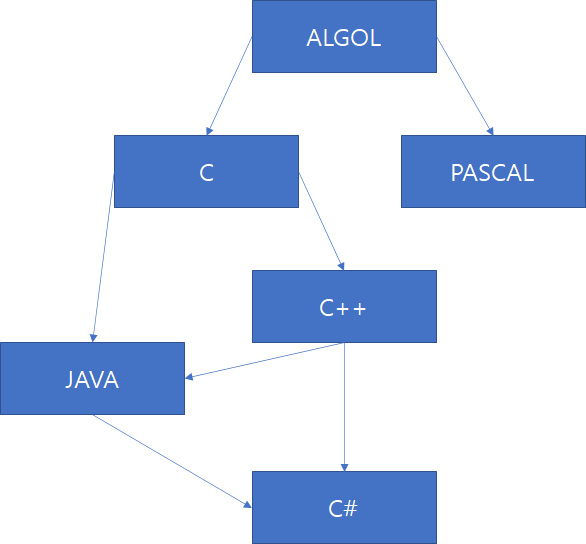
## 2. 개발환경  
```
C# 프로그램을 작성하고 실행하기 위한 개발 환경

1. 콘솔/ 윈폼 애플리케이션 
출력되는 문자 확인 위해 , 문자 기반 명령어 프롬프트 환경에서실행,
키보드를 통해 입력, 화면에 문자로 출력

2. C# 개발환경  
SDK 이용, 편집기, 컴파일러, 실행 엔진 클래스 라이브러리
통합 개발 환경 (IDE)
```
## 3. C# 애플리케이션  
```c#
using System;
class HelloWord{
	public static void main(){
		Console.WriteLine("Hello World");
	}
}
(한번더 복습할때 보기)
using System; // 변수나 이름 지정시 여러 프로젝트에서 같은 이름 쓸 수 있는데
// 중복해서 쓰기 위해 시스템이라는 범위 한정 시키기 위해 라고 하는데
// 다른 네임 스페이스를  쓰면 거기서도 똑같은 이름 쓸 수 있음
// 이게 무슨 말이지 모르겠음
```
## 4. 실행 과정  
```
컴파일 과정: CSC : C# compiler
실행 시스템: CLR : Common Language Runtime
```
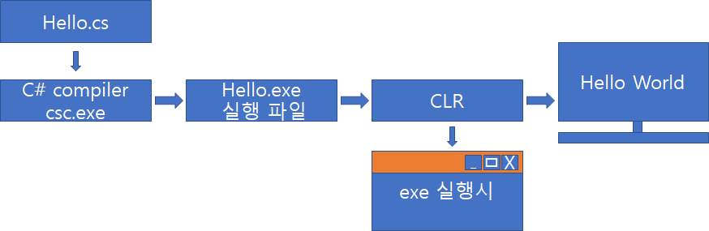
```
compiler에서 우리가쓴 고급어라고 하나 그것을 저급어로 바꿔줌
binary code로 바꿔줌 컴퓨터가 이해하는 언어로 만들어주는 것

이 기계어로 변환한것으로 실행파일에서 읽는것

CLR 동작은 exe 실행시 창에서 실행 
아니면 콘솔 실행이 된다. 
```
## 5. 기본 특징  
```
클래스, 프로퍼티, 연산자 중복, 델리게이트, 이벤트, 스레드, 제네릭

개념 복잡하지만 무튼 클래스가 중요하고
클래스에 데이터 추상화 의 개념이 있다고 함 

객체지향 패러다임에 동작하는것 

1. 클래스와 객체
2. 객체 자료형(클래스)
3. 클래스 멤버  

클래스 : 청사진, 설계도 
객체 : 설계도로 만들어진 집, 물건 (실제적인 것)
-> 하나의 설계도 클래스 그 설계도로 여러개의 같은 집을 만들수 있는것이다. 그것 객체
```
## 클래스의 설계  
```
개체의 속성과 행위

속성은 필드이고 행위는 메소드 이다.

속성: 형용사로 표현하는것 빨갛다 이런것
행위: 움직임이다.

Class CoffeeMaker{
	public bool onState; //이것이 속성
	public void startCoffeeMaker(){//이것이 행위이다.
		...
	}
}
```
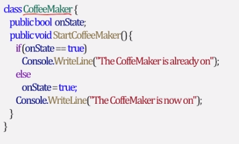
## 프로퍼티의 개념  
```
- 클래스의 private 필드를 형식적으로 다루는 일종의 메소드  
- 값을 지정하는 셋-접근자와 값을 참조하는 겟-접근자로 구성

셋-접근자:
배정문의 왼쪽에서 사용되면 호출됨
겟-접근자:
배정문의 오른쪽에서 사용되면 호출됨

[property-modifiers]return Type PropertyName{
	get{
		//get-accessor body //속성을 읽어내기 위한 파트
	}
	set{
		//set-accessor body// 값을 지정하는 파트
	}
}
```
## 연산자 중복의 의미  
```
- 시스템에서 제공한 연산자를 재정의하는 것
- 클래스만을 위한 연사자로서 자료 추상화가 가능 
(시스템에서 제공한 연산자처럼 사용가능)
- 문법적인 규칙은 변경 불가(연산 순위나 결합 법칙 등)

+기호를 숫자가 아닌 스트링에서 쓸수 있는거 처럼 쓴다는것 연산자 재정의
```
## 연산자 중복 정의 형태  
```
public extern returnType operator op (parameter1[,parameter2]){
	//-operator overloading body
}
```
## 델리게이트  
```
델리게이트(delegate)는 메소드 참조 기법
- 객체지향적 특징이 반영된 메소드 포인터
- 클래스만을 위한 연산자로서 자료 추상화가 가능(시스템에서 제공한 연산자처럼
사용 가능)
- 문법적인 규칙은 변경 불가(연산 순위나 결함 법칙 등)
```
## 이벤트와 스레드를 처릴하기 위한 방법론
```
선언 형태 
[modifiers] delegate returnType DelegateName(parameterList);
```
## 이벤트   
```
- 사용자 행동에 의해 발생하는 사건
- 어떤 사건이 발생한 것을 알리기 위해 보내는 메시지로 간주
- C#에서는  델리게이트를 이용하여 이벤트를 처리

이벤트 정의 형태
[event-modifier]event DelegateType EventName;
```
## 이벤트 주도  프로그래밍  
```
이벤트와 이벤트 처리기를 통하여 객체에  발생한 사건을
다른 객체에 통지하고 그에 대한 행위를 처리하도록 시키는 구조를 가짐

각 이벤트에 따른 작업을 독립적으로 기술

프로그램의 구조가 체계적/구조적이며 복잡도를 줄일 수 있음

예를 들면 마우스를 들 수 있다.
클릭을 하면 변화가 일어나는데 거기에 대해서 대응을 해주는 것 

탭을 누르면 탭에대한 이벤트를 실행하는 것
```
## 스레드  
```
특징
1. 순차 프로그램과 유사하게 시작, 실행, 종료의 순서를 가짐
2. 실행되는 동안에 한 시점에서 단일 실행점을 가짐
3. 프로그램 내에서만 실행 가능

멀티스레드 시스템 
스레드가 하나의 프로그램 내에 여러 개 존재
응용 프로그램의 병행 처리를 위해 스레드 개념을 지원
스레드를 생성하고 실행시키고 제어하는 방법을 제공
델리게이트를 이용하여 처리
```
## 제네릭의 의미  
```
자료형을 매게변수로 가질 수 있는 개념
c++의 템플릿과 유사한 개념
```
## 제네릭 단위  
```
클래스 , 구조체, 인터페이스, 메소드
```
##  제네릭 클래스   
```
- 범용 클래스 또는 포괄 클래스 
- 형 매개변수 (Type Parameter)
- <>안에 기술 
```
## 예시
```
class Stack<StackType>{
	private StackType[] stack = new StackType[100];
	//...
	public void Push(StackType element){/*...*/}
	public StackType Pop(){/*...*/}
}

Stack<int>stk1 = new Stack<int>(); //정수형 스택
Stack<doubble>stk2 = new Stack<double>(); // 실수형 스택

StackType 이것이 제네릭
타입이 다르지만 하나의 코드로 동작한다.
```
## C#의 언어 구조  
## 1. 어휘 구조  
```
어휘는 
- 프로그램을 구성하고 있는 기본 소자
- 토큰이라 불림 
- 문법적으로 의미 있는 최소 단위
```
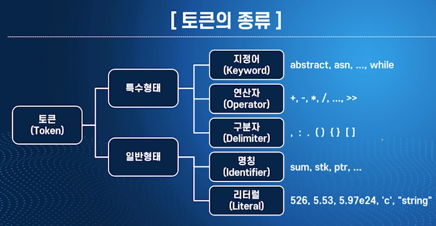
## 지정어(키워드)  
```
- 프로그래밍 언어 설계시에 그 기능과 용도가 이미 정의 되어 있는 단어
- 사용자가 임의로 결정하는 변수 이름이나 메소드 이름등으로 사용할 수 없음
- C#지정어(77개)
- C# language specification (ECMA TC39/TG2)
```
## 명칭의 의미  
```
자료의 항목 (변수, 상수, 배열, 클래스, 메소드, 레이블)을 식별하기 위하여 붙이는 이름
```
## 명칭의 형태  
```
문자로 시작
길이에는 제한이 없음
대소문자 구분
@기호를 붙이면 명칭으로 사용할 수 있음
```
## 리터럴의 의미  
```
자신의 표기법이 곧 자신의 값이 되는 상수 
12 라고 표기하면 값이 12인 정수를 나타내는 경우
```
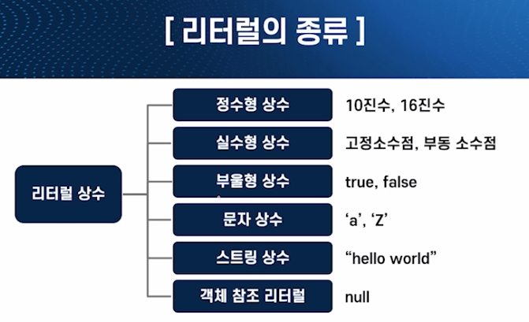
## 객체참조 리터럴(Object Reference)  
```
여기서 참조란 포인터 즉, 가리키는 것
- 널(null): 아무 객체도 가리키지 않는 상태
- 부적당하거나 객체를 생성할 수 없는 경우 초기화에 사용
```
## 주석의 의미  
```
프로그램을  설명하기 위한 문장  
프로그램의 실행에는 무관하다 컴파일러가 무시하지만 프로그램 유지보수에 중요
```
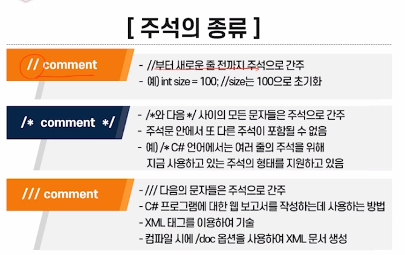
## 주석의 종류 예
```
/// comment에서 /doc 옵션을 사용한 예

csc CommentApp.cs/doc:CommentApp.xml 에서 참고 

XML문서
T: CommentApp - T is Type
M: CommentApp.Main - M is Method
```
## 자료형의 의미  
```
자료 객체가 갖는 형으로 구조 및 개념,
값의 범위, 연산 등을 정의 
```
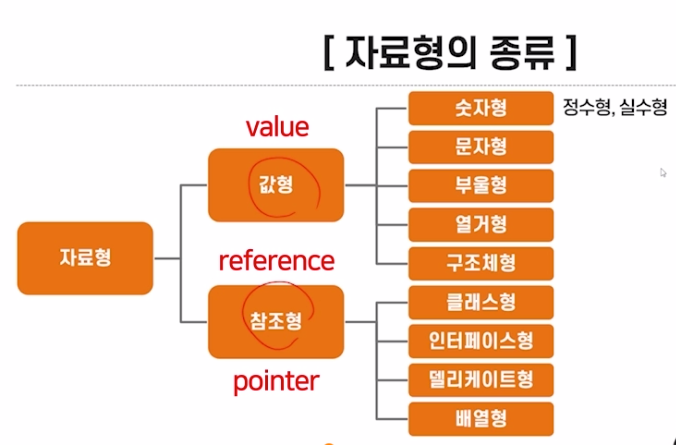
## 숫자형  
```
값을 표현하는 방법과 연산하는 방식에 따라 정수형과 실수형으로 구분됨
```
## 문자형과 부울형  
```
- 문자형: 16비트 유니코드를 사용 
- 부울형: true, false, 숫자값을 가질 수 없음
다른 자료형으로 변환 불가
```
## 열거형과 구조체형   
```
열거형:
- 서로 관련 있는 상수들의 모음을 심볼릭한 명칭의 집합으로 정의한 것 
- 기호 상수: 집합의 원소로 기술된 명칭  
- 순서값: 집합에 명시된 순서에 따라 0부터 부여된 값

구조체형: 
- 클래스처럼 고유의 필드, 메서드, 생성자를 가지나 참조형식이 아닌 형식
- 기본 생성자 선언 불가
```
## 배열형  
```
- 같은 형의 여러 개의 값을 저장하는데 사용하는 자료형
- 순서가 있는 원소들의 모임
- 배열을 하나의 객체로 취급하여 참조형으로 다룸
```
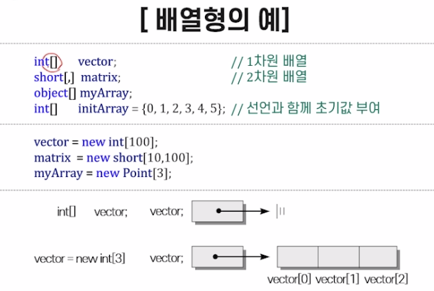
## 스트링형의 의미  
```
- 문자열을 표현하기 위해 사용하는 자료형  
- System.String 클래스형과 동일한 자료형
```
## StringBuilder 클래스  
```
효율적으로 스트링을 다루기 위한 클래스 

객체에 저장된 내용을 임의로 변경 가능

스트링 중간에 삽입, 추가시키는 다양한 메소드 제공
```
## 식과 연산자  
```
식:
문장에 값을 계산하는데 사용
연산자:
- 식의 의미를 결정 (대게 익스프레션? 이라고 함)
- 피연산자가 어떻게 계산될지를 나타내는 기호 
```
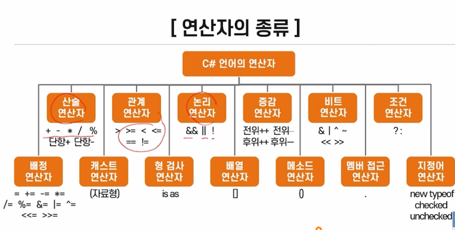
## 묵시적 형 변환  
```
- 컴파일러에 의해 자동적으로 수행되는 형 변환  
- 작은 크기 자료현 -> 큰 크기 자료형 
```
## 명시적 형 변화   
```
- 프로그래머가 캐스트 연산자를 사용하여 수행하는 형 변환
- 형태: (자료형)식 
- 큰 크기 자료형에서 작은 크기 자료형으로 변환 시 정밀도 상실
```
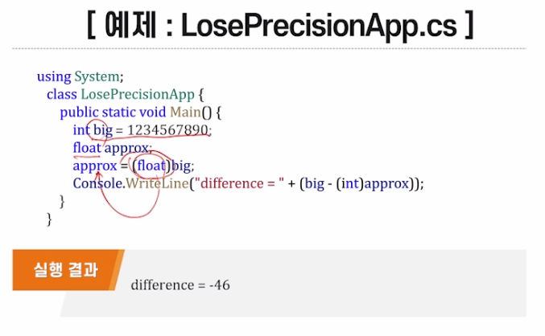
## 박싱  
```
- 값형(value)의 데이터를 참조형(pointer)으로 변환하는 것
- 컴파일러에 의해 묵시적으로 행해짐  
```
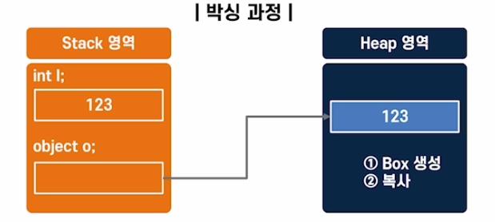
## 언박싱  
```
- 참조형의 데이터를 값형으로 변환하는 것
- 반드시 캐스팅을 통하여 명시적으로 행해짐
- 반드시 박싱될 때 형으로 언박싱을 해주어야함
```
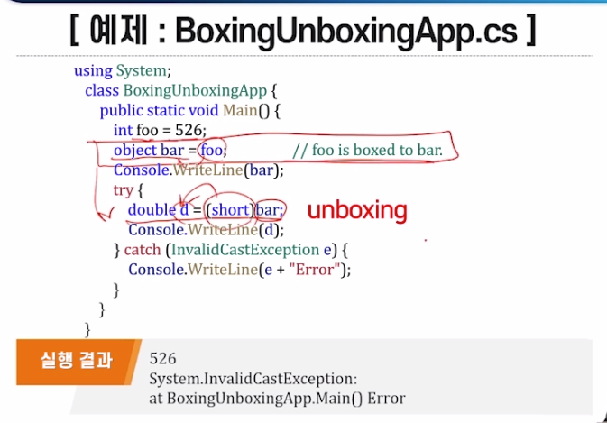