## 2021년 06월18일 폴더 모니터링 계획 및 과제  
## 과제 요구사항 정리  
  - **요구사항**  
    - 환경 설정에서 지정한 폴더의 경로를 모니터링 
      - 가장 최근 변경(top) & 가장 오래 변경 안 된(under) 파일과 폴더를 모니터링
      - 확장 단위로 요약 정보(개수, 크기)를 제공
      **1.  환경 설정**  
```
- 환경 설정 파일은 .yml 파일
- 환경 설정 파일 정보 
  period: 30s    // 모니터링 수집 주기 30초 단위로 정보 수집
  top: 5         // 수정된 시간 정렬 상위(가장 최근에 수정) 5개
  under: 5       // 수정된 시간 정렬 하위(가장 오래 전 수정) 5개
  path: ["감시폴더명1","감시폴더명2"]  // 모니터링 폴더
  extensions: ["TIFF","001","SMF"]  // 모니터링 파일 확장자
```
**2. 모니터링**  
```
path에 정의된 폴더를 지정한 period인 30초 주기로 모니터링
모니터링 정보를 파일과 콘솔에 출력한다.
 - 총 파일 개수 
 - top 파일 정보 : 파일명, 파일 만든 날짜, 파일 수정한 날짜, 파일 액세스한 날짜
```
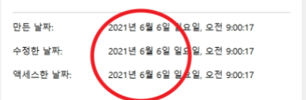
```
- 총 폴더 개수 
- top 폴더 정보:  폴더명, 폴더 만든 날짜, 폴더 수정한 날짜
- under 파일, 폴더 : top 동일
---------------------------------------------------------
paths 경로에 있는 파일 중에서 extensions에 있는 확장자 기준으로 
정보를 추가로 제공한다.
 - 파일 개수
 - 파일 크기 : 총 확장자 파일 크기
예.
> a.tif 10mb
> b.tif 20mb
> c.tif 30mb
tif 3개
tif 60mb
```
## **계획**
- 1. kibana & elasticSearch docker로 실행 해서 winbeat, metricbeat 동작확인
- 2. 나만의 beat 만들기로 비트 만들기
- 3. kibana에서 비트 동작 확인 
- 4. yml 파일 환경 설정하기 
- 5. 모니터링 요구 사항에 맞게 출력 시키기 
  - 총 파일 개수 출력 하고 파일명, 만든 날짜, 수정한 날짜, 액세스한 날짜 (top, under 동일)
  - 총 폴더 개수 출력 하고 폴더명, 폴더 만든 날짜, 폴더 수정한 날짜 (top, under 동일)
- 6. path 경로에 있는 파일 중 extensions 에 있는 확장자 기준으로 정보 추가 제공
  -  파일의 개수, 파일의 크기(총 확장자 파일의 크기 합)


## 필요한 것  
```
1. 나만의 beat 만들기 학습
2. 모니터링의 요구조건 어떤식으로 가져올것에 대해서 생각
3. 어떤 경로를 지정을 해야하는지 감시폴더명 1개만 해야하는지 2개이상을 해야하는지
4. 모니터링 정보를 파일과 콘솔에 출력한다 는 말이 무슨 말인지?
(의미가 불명확한 파일 출력이 정확히 무엇인지)
```
## 1. kibana & elasticSearch실행 하여 기존 beat 동작확인  
## kibana & elasticSearch실행  
```
FROM amazon/opendistro-for-elasticsearch:1.13.2
RUN /usr/share/elasticsearch/bin/elasticsearch-plugin remove opendistro_security
COPY --chown=elasticsearch:elasticsearch elasticsearch.yml /usr/share/elasticsearch/config/

원하는 디렉토리에 Dockerfile 을 이렇게 생성해줍니다.
위의 경우 보안을 지운형태로 실습을 진행합니다.

cluster.name: "docker-cluster"
network.host: 0.0.0.0

elasticsearch.yml파일도 위를 입력해서 저장합니다.
```
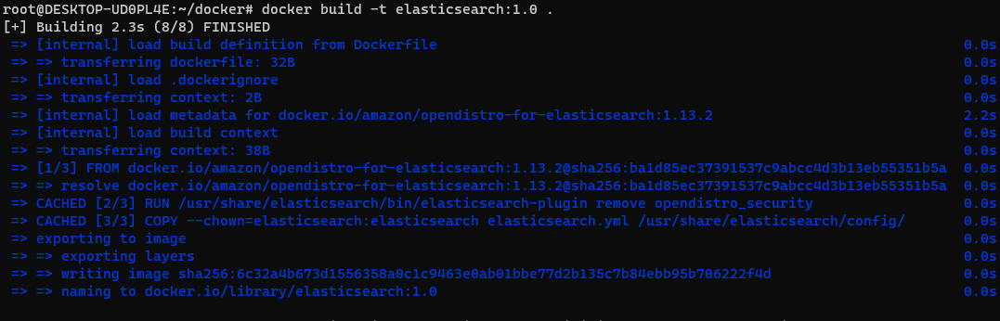
```
Dokcerfile이 있는 디렉토리로 가서 docker build -t elasticsearch .
이미지를 생성해줍니다.
```
## 이미지 확인  

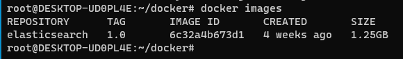

## 키바나 이미지 생성  
```
FROM amazon/opendistro-for-elasticsearch-kibana:1.13.2
RUN /usr/share/kibana/bin/kibana-plugin remove opendistroSecurityKibana
COPY --chown=kibana:kibana kibana.yml /usr/share/kibana/config/

Dockerfile 생성을 위와 같이 해줍니다.

server.name: kibana
server.host: "0"
elasticsearch.hosts: http://localhost:9200

kibana.yml 파일을 위에 입력하고 만들어 줍니다.
그리고 키바나 디렉토리에서 
docker build -t kibana:1.0 .
을 이용해서 이미지를 생성해줍니다.
```
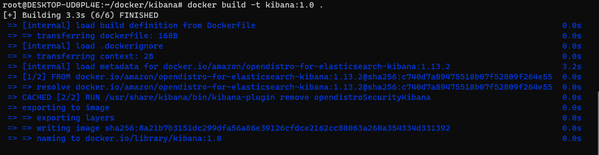
## 만들어진 이미지 확인   
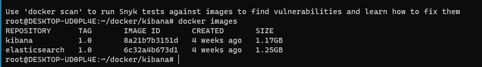
##  docker-compose.yml 파일 수정하기  
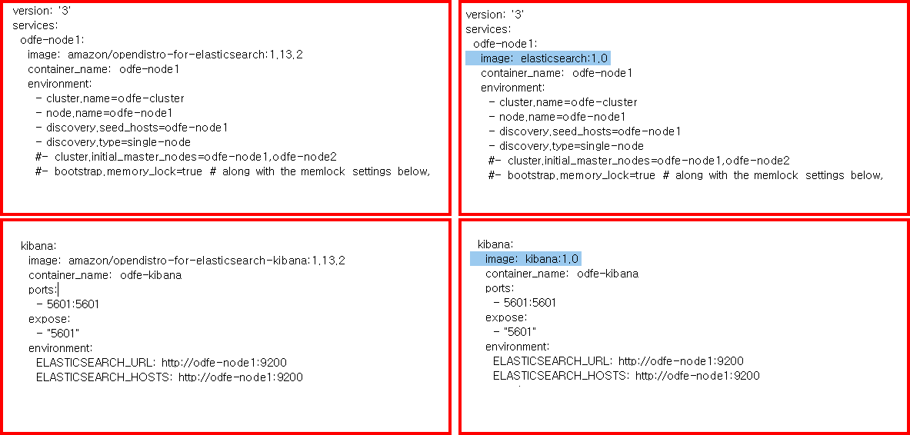
```
만든 이미지를 저렇게 docker-compose에 적용합니다. 
그리고 docker-compose.yml이 있는 디렉토리에서 
docker-compose up 을 해줍니다.
```
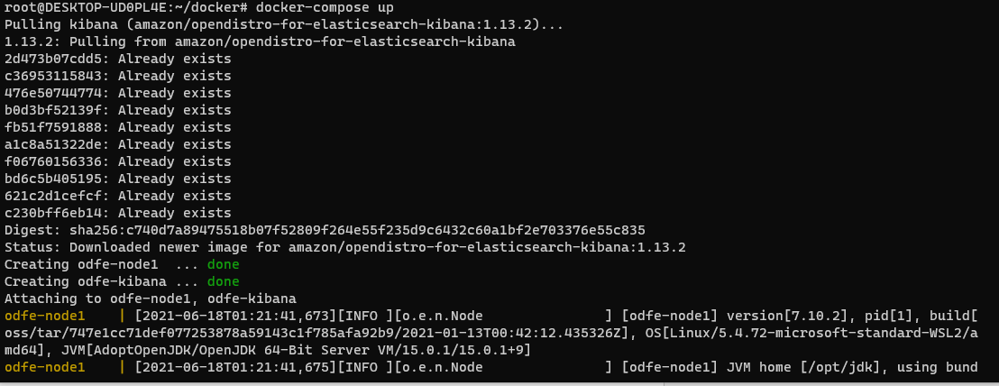
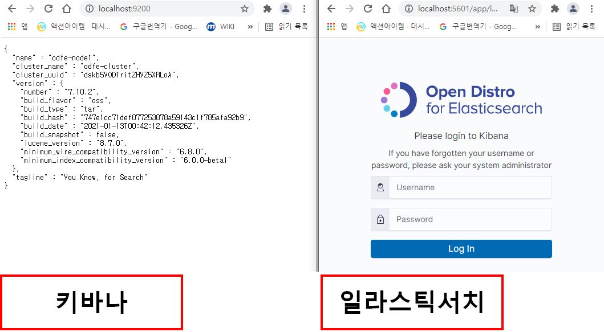

## beat 실행 하기  

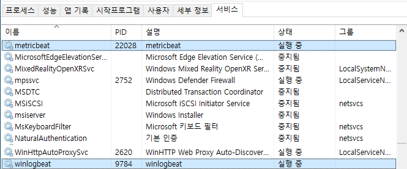
```
이렇게 두개가 켜져 있는 상태여야합니다. kibana를 확인해보면 아래와 같습니다.
```
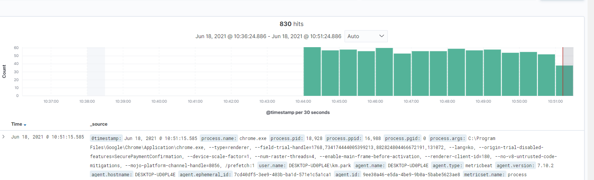
```
어찌됬든 위와같이 데이터가 나와야한다. 이제 원하는 비트를 만들어 봅시다.
```
## 2. 나만의 beat 만들기   
[나만의 beat 만들기 참고 사이트](https://www.elastic.co/kr/blog/build-your-own-beat)  
## Step1 Go 언어 환경 설정  
```
간단하게 Golang 프로그램은 커맨드 라인 매개변수에 지정된 경로의
모든 파일과 디렉토리 그리고 하위 디렉토리의 목록을 조회 할것입니다.
```
```go
package main

import (
	"fmt"
	"io/ioutil"
	"os"
)

func main() {
	if len(os.Args) == 1 {
		listDir(".")
	} else {
		listDir(os.Args[1])
	}
}
func listDir(dirFile string) {
	files, _ := ioutil.ReadDir(dirFile)
	for _, f := range files {
		t := f.ModTime()
		fmt.Println(f.Name(), dirFile+"/"+f.Name(), f.IsDir(), t, f.Size())
		if f.IsDir() {
			listDir(dirFile + "/" + f.Name())
		}
	}
}
```
## Step2 - 생성  
```
우선 BeatGenerator를 사용해야하는데 그러기 위해서는 cookiecutter를 설치해야함
https://cookiecutter.readthedocs.io/en/latest/installation.html
이 설치 링크에서 설치해보자.
```
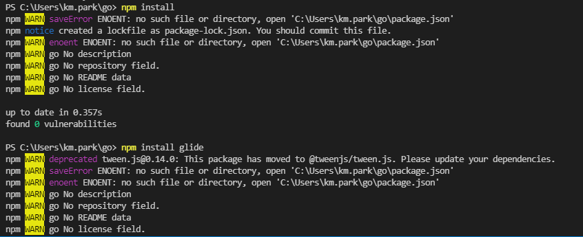
```
npm install하고 
npm install go
npm install glide

go가 없으면 설치하고 아니면 glide만 설치하자. 
여기서 glide는 Golang에서 사용하는 Package Management 도구이다.
완료후 비트 이름을 지정해야하는데 반드시 한단어 이며 영어 소문자이어야 함
여기서는 lsbeat 라고 하자.
```
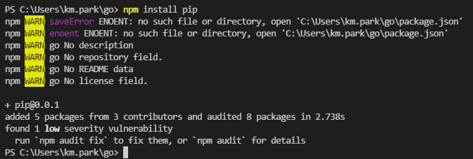
```
npm install pip  로 pip 설치
```
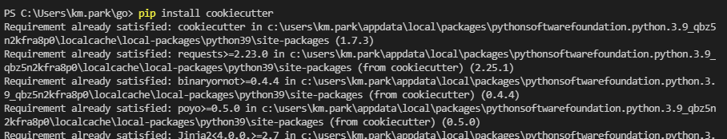
```
pip install cookiecutter
쿠키 커터 설치 
```
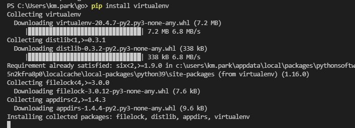

```
pip install virtualenv 설치 합니다.
```
```
우선 Beat skeleton을 생성하기 위해 beats 리파지토리에 있는
Beat generator 패키지를 내려받자.
go get github.com/elastic/beats
라고 하는데 
cookiescutter를 이용해서 다운합시다.
cookiecutter https://github.com/elastic/beat-generator.git
```
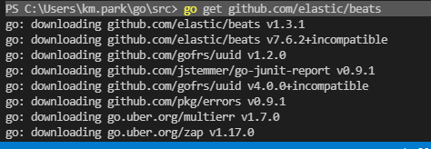
```
아마 저 명령어 자체가 안될것이다. 
우선
 python -m virtualenv venv
 이걸로 가상환경을 켠다. 
 venv\Scripts\activate.bat
 하고 
```
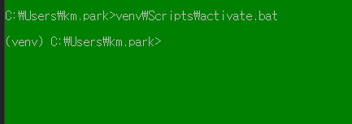
```
pip install cookiecutter
쿠키커터를 설치합니다.
```
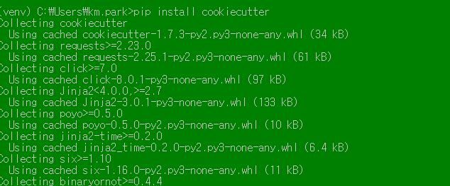
## 디렉토리 이동  
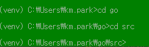
```
이렇게 해도 안됬다. 
```
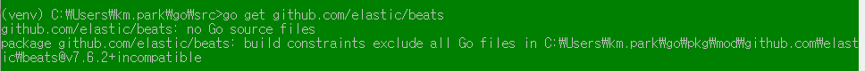
```
mkdir -p ${GOPATH}\src\github.com\elastic
C:\users\km.park\go\src\github.com\elastic
우선 파일을 생성해주자.
git clone https://github.com/elastic/beats ${GOPATH}/src/github.com/elastic/beats
git clone https://github.com/elastic/beats C:\users\km.park\go\src\github.com\elastic\beats
이걸로 다운을 해준다.
mkdir ${GOPATH}/src/github.com/{user}
mkdir ${GOPATH}/src/github.com/{user}

cd C:\users\km.park\g\src\github.com\elastic\beats
//위치로 가서
mage GenerateCustombeat
```
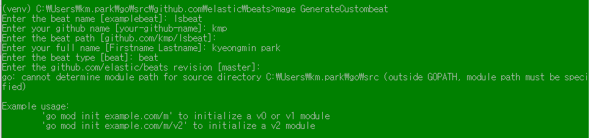
```
위와 같이 입력하면 생성이된다.
처음에는 make init을 해줘야한다.

이명령어도 제대로 동작하지 않는다.
```
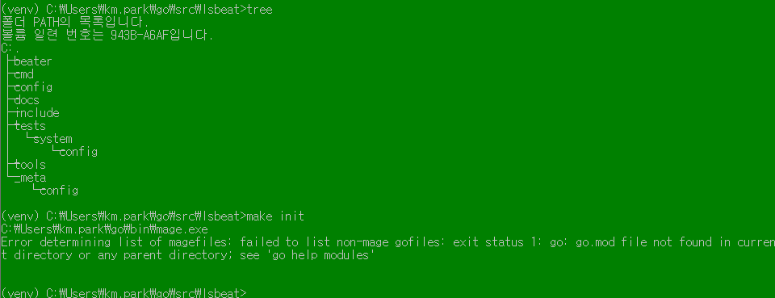
```
일단 import 부분이 에러가 생겨서 좀더 검색 후 진행
```

