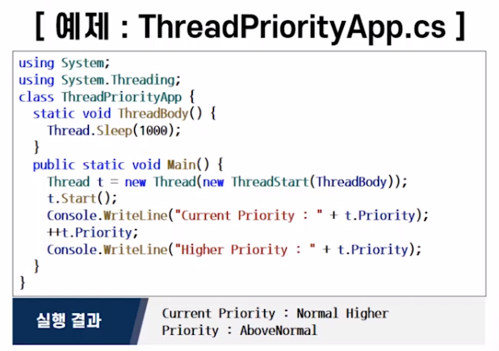

## 2021년 06월18일  C# 고급프로그래밍 기법  
## 제네릭  
```
- 코드, 알고리즘의 재사용 촉진 
- 패턴이 구현되면 구현 코드를 재사용 하는 것이 핵심 
- 하나의 클래스나 인스턴스에서 원하는 방식으로 선언하여 사용
```
## 애트리뷰트  
```
코드에 대한 부가 정보 기록, 열람 즉 읽을 수 있는 기능으로
사람이 작성하고 컴파일러에 의해 다양하게 사용됨
종류: 
표준 애트리뷰트, 사용자 정의 애트리뷰트
```
## 예외 처리  
```
프로그램 실행 도중 예외 상황(에러) 발생  

예외 상황에 대한 정보 (예외 객체)생성 

예외 상황에 대한 대응 
```
## 스레드  
```
실행중인 프로그램의 최소 단위
여러개의 스레드가 한 프로세스에서 동작
운영체제에 의해 관리
프로그램 처리 속도 향상
```
## 학습 목표  
```
제네릭을 이해하고 구현할 수 있다.
애트리뷰트를 이해하고 구현 할 수 있다.
예외와 예외 처리를 이해하고 구현할 수 있다.
스레드를 이해하고 구현할 수 있다.
```
## 제네릭  
```
변수의 형을 매개 변수로 하여 클래스나 메소드의 알고리즘을 자료형과 무관하게 
기술하는 기법

장점:
알고리즘의 재사용성을 높임
자료형에 따른 프로그램의 중복을 줄임
프로그램의 구조를 단순하게 만듦

정의 형태:
[modifiers] class ClassName<TypeParameters>{
}
```
## 형 매개 변수  
```
- 클래스 내의 필드나 메소드 선언시 자료형으로 사용함  
- < 과 > 사이에 형 매개 변수의 이름을 기술:
- <T1, T2, T3,..., Tn>
일반적인 모든형태를 담을수 있어서 제너레이트라고함

형 매개 변수를 가지는 클래스:
- 형 매개 변수를 이용하여 필드나 지역변수에 사용함
- 실제 형 정보는 객체 생성 시에 전달받음

형식 매개 변수 형 :
- 제네릭 클래스를 선언할 때 사용한 형 매개 변수 
- class SimpleGeneric <T> {...}
```
## 실제 형 인자  
```
- 제네릭 클래스에 대한 객체를 생성할 때 주는 자료형 
- new SimpleGeneric <Int32> (10);
```


## 형 매개 변수를 가지는 인터페이스  
```
- 형 매개 변수의 선언 외에 일반 인터페이스를 구현하는 과정과 동일 

제네릭 인터페이스의 정의 형태:
[modifiers] interface IName<TypeParameters>{
}
예)
인터페이스 정의, 구현 그리고 사용
```


## 제네릭 메소드  
```
형 매개 변수를 갖는 메소드  

정의형태:
void Swap<DataType> (DataType x, DataType y){
	DataType temp = x;
	x = y;
	y = temp ;
}
예:
Swap<int>(a,b);
Swap<doble>(c,d);
```
## 형 매개 변수의 중첩  
```
- 제네릭 메소드의 형 매개 변수의 이름과
제네릭 클래스의 형 매개변수 이름이 같은 경우
- 서로 독립된 형 매개 변수의 개념을 가짐 
제네릭 클래스는 객체 생성 시에 형 매개 변수를 전달받음
제네릭 메소드는 호출시에 유추하여 형 매개 변수가 결정됨
```

## 형 매개 변수의 범위   
```
프로그램의 유연성 <-> 프로그램의 신뢰성 
트레이드 오프가 있는데 하나가 좋아지면 하나가 나빠지는것 
그래서 범위 제한을 함

형 매개 변수의 제한 조건:
프로그램의 신뢰성을 증진하기 위해
제네릭에 전달 가능한 자료형의 범위를 제한 할 필요가 있음
```

## 제네릭 클래스를 작성 시 한정  
```
where 키워드 사용 
< T > where T : S // S 형의 서브클래스형으로 제한함
```

```
실행 결과:
 Type is System.NullReferenceException
 Type is System.IndexOutRangeException
```
## 에트리뷰트  
```
1. 어셈블리나 크래스, 필드, 메소드, 프로퍼티 등에 다양한 종류의
속성 정보를 추가하기 위해서 사용함
2. 어셈블리에 메타데이터형식으로 저장되며, 
이를 참조하는 .NET 프레임 워크나 C#또는 다른 언어의 컴파일러에 의해 
다양한 용도로 사용함

정의 형태 :
[attribute AttributeName]("Positional_parameter", named_parameter = value, ...)]

종류: 
- 표준 애트리뷰터(.NET 프레임 워크에서 제공)
- 사용자 정의 애트리뷰트
```
## Conditional 애트리뷰트  
```
- 조건부 메소드를 작성할 때 사용함
- C/C++ 언어에서 사용했던 전처리기 지시어를 이용하여 명칭을 정의함(#define)
- System.Diagnostics를 사용해야함 
```
## Obsolete 애트리뷰트  
```
- 앞으로 사용되지 않을 메소드를 표시하기 위해서 사용함
- 해당 애트리뷰트를 가진 메소드를 호출할 경우 
컴파일러는 컴파일 과정에서 애트리뷰트에 설정한 내용이 출력하는 경고를 발생함
```
## 사용자 정의 애트리뷰트  
```
- System.Attribute 클래스에서 파생: 이름의 형태: XxxxAttribute
- 정의한 애트리뷰트를 사용할 때는 이름에서 Attribute가 제외된 부분만을 사용
Xxxx 부분만 사용
- 사용자 정의 애트리뷰트나 표준 애트리뷰트를 사용하기 위해서는
.NET 프레임워크가 제공하는 리플렉션 기능을 사용함

예)
public Class AttributeNameAttribute : Attribute{
}

사용한 예)
[AttributeName()]
```

## 예외  
```
- 실행시간에 발생하는 에러
- 프로그램의 비정상적인 종료
- 잘못된 실행 결과
- 메소드의 호출과 실행, 부정확한 데이터, 
그리고 시스템 에러 등 다양한 상황에 의해 야기
```
## 예외 처리(Exception Handling)  
```
- 기대되지 않은 상황에 대해 예외를 발생함
- 야기된 예외를 적절히 처리 (exception handler)
```
## 예외 정의  
```
- 예외도 하나의 객체로 취급함 
따라서 먼저 예외를 위한 클래스를 정의하여야함
- 예외를 명시적으로 발생시키려면 예외를 처리하는 예외 처리기가 반드시 필요함
- 예외에 관련된 메시지를 스트링 형태로 예외 객체에 담아 전달 가능함
```
## 예외 클래스  
```
1. 모든 예외는 형이 Exception 클래스 또는 그의 파생 클래스들 중에
하나로부터 확장된 클래스의 객체
2. 일반적으로 프로그래머는 EXception 클래스의 파생 클래스인 
ApplicationException 클래스를 확장하여 새로운 예외 클래스를 정의하여 사용
```

## 시스템 정의 예외 (System-defined Exception)  
```
- 프로그램의 부당한 실행으로 인하여 시스템에 의해 묵시적으로 일어나는 예외
- SystemException 클래스나 IOException 클래스로 부터 확장된 예외
- CLR에 의해 자동적으로 생성 
- 야기된 예외에 대한 예외 처리기의 유무를 컴파일러가 검사하지 않음
(Unchecked Exception)
```

## 묵시적 예외 발생  
```
- 시스템 정의 예외로 CLR에 의해 발생 
- 시스템에 의해 발생되므로 프로그램 어디서나 발생 가능
- 프로그래머가 처리하지 않으면 디폴트 예외 처리기
(Default Exception Handler)에 의해 처리
```
## 명시적 예외 발생  
```
- throw 문을 이용하여 프로그래머가 의도적으로 발생  
정의형태: throw ApplicationExceptionObject;
- 프로그래머 정의 예외는 생성된 메소드 내부에 예외를 처리하는 
코드 부분인 예외 처리기를 두어 직접 처리해야함 
```


## 에러 처리기의 실행 순서  
```
1. try 블록 내에서 예외가 검사되고 또는 명시적으로 예외가 발생하면,
2. 해당하는 catch 블록을 찾아 처리하고,
3. 마지막으로 finally 블록을 실행한다.
```

## 예외의 전파  
```
- 호출한 메소드로 예외를 전파하여 특정 메소드에서 모아 처리 
(예외 처리 코드의 분산을 막을 수 있음)
- 예외 전파 순서 
예외를 처리하는 catch 블록이 없으면 호출할 메소드로 예외를 전파함
예외처리기를 찾을 때까지의 실행은 무시

전파 순서:
- 예외를 처리하는 catch 블록이 없으면 호출할 메소드로 예외를 전파함
- 예외처리기를 찾을 때까지의 모든 실행은 무시함
```

## 스레드  
```
- 순차 프로그램과 유사하게 시작, 실행, 종료의 순서를 가짐 
- 실행되는 동안에 한 시점에서 단일 실행 점을 가짐
- 프로그램 내에서만 실행 가능함 
  - 스레드는 프로그램 내부에 있는 제어의 단일 순차 흐름임
  - 단일 스레드 개념은 순차 프로그램과 유사함
```
## 멀티 스레드 시스템  
```
- 스레드가 하나의 프로그램 내에 여러 개 존재임
- 공유 힙과 공유 데이터, 그리고 코드를 공유함으로써 문맥 전환 시 적은 부담을 가짐
- 한개의 프로그램 내에서 동일 시점에 각각 다른 작업을 수행하는 여러 개의 
스레드가 존재하므로 복잡한 문제들이 야기될 수 있음
```

## C#에서의 스레드 개념  
```
- 객체이며 스레드가 실행하는 단위는 메소드임
- 스레드 객체를 위해 Thread클래스를 제공함
- 메소드 연결을 위해 ThreadStart 델리게이트를 제공함(System.Threading)

스레드 프로그래밍의 순서  
- 스레드 몸체에 해당하는 메소드를 작성
- 작성된 메소드를 ThreadStart 델리게이트에 연결
- 생성된 델리게이트를 이용하여 스레드 객첼르 생성
- 스레드의 실행을 시작(Start()메소드를 호출)
```


## 스레드 스케쥴링의 정의  
```
실행가능한 상태에 있는 여러 스레드의 실행 순서를 제어하는 것

특징:
- 스레드의 스케쥴링에 따라 스레드의 작업 순서가 달라지며, 스레드의 우선순위에
따라 실행 순서가 결정됨

스레트가 생성될때 그 스레드를 만든 스레드의 우선 순위가 상속되며
Thread,Priortiy 프로퍼티를 통해서 참조하거나 변경 가능함
```


## 핵심 요약  
## 제네릭  
```
제네릭이란 형을 매개변수로 하여 클래스나 메소드의 알고리즘을 자료형과 
무관하게 기술하는 기법
```
## 애트리뷰트  
```
어셈블리나 클래스, 필드, 메소드, 프로퍼티 등에 다양한 종류의 속성 정보를
추가하기 위해 사용하는 것을 말함
```
## 예외  
```
실행시간에 발생하는 에러(run-time error)를 말함
```
## 스레드  
```
프로그램 내부에 있는 제어의 단일 순차 흐름을 말함
```