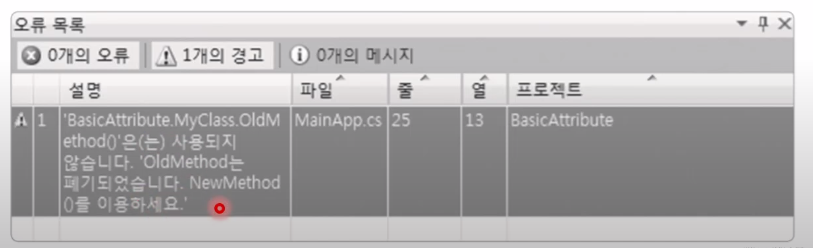
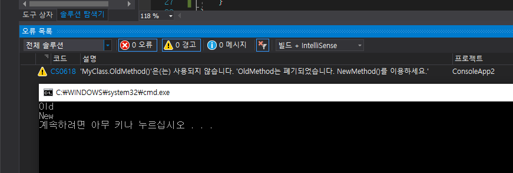
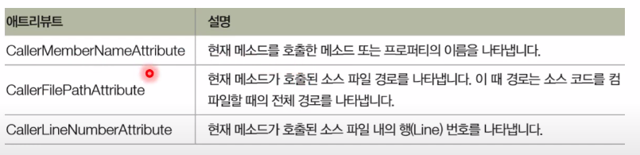
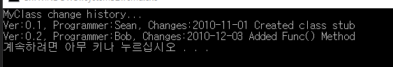

## 2021년 06월20일 애트리 뷰트   
## 애트리뷰트  
```
코드에 대한 부가 정보를 기록하고 읽으 수 있는 기능

주석 vs 애트리뷰트 
주석 : 사람이 읽고 쓰는 정보
애트리뷰트 : 사람이 작성하고 컴퓨터가 읽는 정보

시나리오 예 
새 라이브러리를 배포하면서 이전 메소드의 보안 경고를 표시해야 하는 경우
```
## 사용 형식   
```
[애트리뷰트_이름( 애트리뷰트_매개 변수)
public void MyMethod()
{
	//...
}

여기서는 Obsolete 애트리뷰트 이용 

class MyClass 
{
		[Obsolete("OldMethod는 폐기되었습니다. NewMethod()를 이용하세요.")]
		public void OldMethod(){
		}
}
컴파일시 아래와 같이 나옴
```


```
using System;
using System.ComponentModel;

namespace BasicAttribute
{
    class MyClass
    {
        [Obsolete("OldMethod는 폐기되었습니다. NewMethod()를 이용하세요.")]
        public void OldMethod()
        {
            Console.WriteLine("Old");
        }
        public void NewMethod()
        {
            Console.WriteLine("New");
        }

    }
    class MainApp
    {
        static void Main(string[] args)
        {
            MyClass obj = new MyClass();
            obj.OldMethod();
            obj.NewMethod();
        }
    }
}
```
## 호출자 정보 애트리뷰트  
```
메소드의 매개 변수에 사용됨
- 메소드의 호출자 이름, 호출자 메소드가 정의되어 있는 소스파일 경로, 
소프 파일 내의 행 번호 파악 

3가지 호출자 정보 애트리뷰트
```

```
using System;
using System.ComponentModel;
using System.Runtime.CompilerServices;

namespace BasicAttribute
{
    public static class Trace
    {
        public static void WriteLine(string message,
        [CallerFilePath] string file = "",
        [CallerLineNumber] int line = 0,
        [CallerMemberName]string member = "")
        {
            Console.WriteLine($"{file}(Line:{line}{member}:{message}");
        }
    }

    class MainApp
    {
        static void Main(string[] args)
        {
            Trace.WriteLine("코딩 연습");
        }
    }
}
```
## 내가 만드는 애트리뷰트  
```
System.Attribute 클래스로 부터 상속

class History : System.Attribute
{
 //
}
위에를쓰면 이전의 개발자가 써놓으면 이것은 어떤 조치를 안하면
한번 밖에 못쓴다 그래서 아래의 방법을 이용한다. 

System.AttributeUsage
- 애트리뷰트의 애트리뷰트
- 애트리뷰트가 설명하는 대상 (논리 합 연산자 사용 가능)
- 애트리뷰트의 중복 사용 여부

[System.AttributeUsage{
	System.AttributeTargets.Class | System.AttributeTargets.Method,
	AllowMultiple = true)]
	class History : System.Attribute
	{
	}
	
	AttributeTargets은 설명대상을 나타냄 
	AllowMultiple 이것이 true이면 여러번 수정 허용한다는것
```
```
using System;

namespace HistoryAttribute
{
    [System.AttributeUsage(System.AttributeTargets.Class, AllowMultiple = true)]
    class History : System.Attribute
    {
        private string programmer;

        public double Version
        {
            get;
            set;
        }

        public string Changes
        {
            get;
            set;
        }

        public History(string programmer)
        {
            this.programmer = programmer;
            Version = 1.0;
            Changes = "First release";
        }

        public string Programmer
        {
            get { return programmer; }
        }
    }

    [History("Sean",
        Version = 0.1, Changes = "2010-11-01 Created class stub")]
    [History("Bob",
        Version = 0.2, Changes = "2010-12-03 Added Func() Method")]
    class MyClass
    {
        public void Func()
        {
            Console.WriteLine("Func()");
        }
    }

    class MainApp
    {
        static void Main(string[] args)
        {
            Type type = typeof(MyClass);
            Attribute[] attribues = Attribute.GetCustomAttributes(type);

            Console.WriteLine("MyClass change history...");

            foreach (Attribute a in attribues)
            {
                History h = a as History;
                if (h != null)
                    Console.WriteLine("Ver:{0}, Programmer:{1}, Changes:{2}",
                        h.Version, h.Programmer, h.Changes);
            }
        }
    }
}
```
