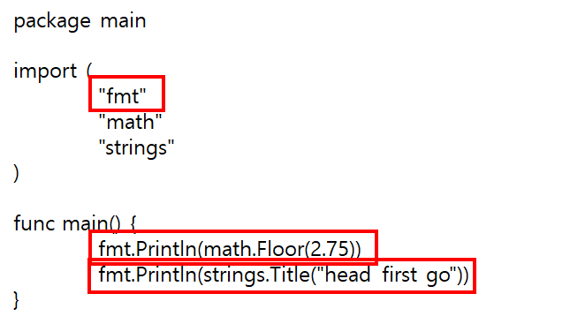

### 2021년 06월01일 GOlang 언어 문법기초, 조건문과 반복문  
```go
package main
import "fmt"
fuc main(){
    fmt.Println("Hello, Go!")
}
```
```
여기서 는 Hello, Go!가 출력 된다.
여기서는 C, C++에서 import fmt부분은 
잘 생각해보면 Println의 메소드를 이용해서 스트링 함수를 출력하니까
#include<stdio> 표준 입출력에 대한 선언을 위해 임폴트 했다고 생각이 든다.
```
- **package**  
```
여기서 패키지는 문자열 서식 기능 모음이나 이미지 그리기 기능 모음 같은
유사한 기능을 수행하는 코드들의 모임

고랭에서는 무조건 필요한 패키지만 가져와야한다. 
당연한 말이지만 한번에 가져오면 프로그램이 불필요하게 커지고 느려지기 때문이다.
```
- **함수 란**  
```
코드의 어딘가에서 호출 할 수 있는 한 줄 이상의 코드로 이루어진 코드의 집합
```
## Go 파일의 기본 형식  
```
1. package 절
2. import 문
3. 실제 코드
```
## 코드를 잘 못 입력한 경우  
  
```
fmt.Println("Hello, playground")인 정상적인 코드를 아래
fmt.Println "Hello, playground" 이렇게 바꾸게 된다면

./prog.go:8:14: syntax error: unexpected literal "Hello, playground" at end of statement

이런 에러가 발생한다. 
```
## 에러가 생기는 이유  
```
- package절을 제거한 경우
- import문을 제거한 경우
- 미사용 패키지를 가져온경우 
ex) import "strings"를 가져오고 이 패키지를 쓰지 않아도 에러가 생긴다.
- 함수명을 다르게 쓴경우 대문자, 소문자 구분함
- Println 함수 앞의 패키지면 제거
ex) fmt.Println("  ") -> Println("  ")
 앞의 fmt.을 제거 한다면 에러가 생김 
 자바를 해보면 알듯이 클래스의 참조변수으로 클래스 안의 메소드에
접근하려면 대게 .으로 접근하는데 그 위치를 알지못하면 즉 참조변수가 없다면
그 메소드를 사용할 수 없는 경우와 비슷하다고 생각한다.
```
## 함수 호출하기  
```
예제 코드에서 봤듯이 fmt 패키지의 Println 함수를 호출해서 사용하고 있음
함수를 호출하려면 함수명을 작성한뒤에 괄호 쌍을 붙이면 된다.

fmt.Println()
Println : 부분이 함수명
() : 괄호
다른 많은 함수들과 마찬가지로 Println도 하나이상의 인자를 받을 수 있다.

fmt.Println("first","second") 이렇게 괄호안에 쉼표로 구분하여 인자를 여러개 사용
```
  
  
```
Println은 인자 없이 호출할 수 있고, 여러 인자를 전달할 수도 있음
```
## Println() 함수  
```
출력값을 찍을 때 사용 
자바의 System.out.println()
C, C++의 printf("\n"), cout<<endl;
이랑 비슷하다. 
```
## 다른 패키지의 함수 사용하기  
```
우리가 작성하는 프로그램의 경우 main 패키지에 속하지만
Println 함수는 fmt 패키지에 속해 있음
fmt : format의 약자

즉 fmt.Println()에서 
fmt는 패키지명
Println()은 함수명
```
- **서로 다른 패키지에 있는 함수를 호출 하는 경우**  
```go
package main

import (
	"math"
	"strings"
)

func main() {
	math.Floor(2.75)
	strings.Title("head first go")
}
```
```
위와 같이 이렇게 해서 불러오면 출력이 되지는 않는다.
```
## 함수 반환 값  
```
위의 예제를 출력해주기 위해서는 당연히 Println()함수를 써주면 된다.
즉,

import 부분에 "fmt"를 추가하고
fmt.Println(mat.Floor(2.75))
fmt.strings.Title("head first go")
```

```
위와 같이 해주면 
아래와 같은 결과를 얻을 수 있다.
```

## 문자열  
```
Println의 인자로 지금까지 문자열을 전달 
문자열(string)은 : 텍스트 문자를 나타내는 일련의 바이트
문자열(string literal) : 리터럴을 사용하면 코드 내에서
문자열을 직접정의하고 사용할 수 있음
```
-  **문자열 리터럴**  
``` 
Go가 문자열로 취급하는 큰 따옴표 사이의 텍스트
```
- **이스케이프 시퀀스**  
```
다른 문자를 표현하기 위해 특정 문자 앞에 역슬래시 문자를 붙인 문자의 조합
```

## 룬  
```
문자열은 보통 일련의 텍스트 문자를 나타내는 데 사용
반면 Go의 룬은 단일 문자를 나타내는 데 사용

룬 리터럴은 작은따옴표를 사용
룬 저장시 표준 유니코드를 사용하기 때문에 
Go 프로그램에서는 지구상에 존재하는 거의 모든 언어에 포함된 모든 문자 사용 가능
룬을 fmt.Println에 룬을 전달하면 문자가 아닌 숫자 코드가 출력
C언어에서 아스키코드 값이랑 비슷한 느낌
pritnf("%d",'A'); 하면 65가 나오는것 처럼
```
## 부울  
```
부울은 true 또는 false 중 하나의 값만 가질 수 있음
대게 조건문에서 많이 사용
```
## 산술 연산자와 비교 연산자  
- **산술 연산자**  
```
산술 연산자는 대부분 언어와 비슷하게 동작
fmt.Println(3-1)
fmt.Println(3+2)
fmt.Println(3*2)
fnt.Println(4/2)
```
- **비교 연산자**  
```
이것도 당연한 이야기지만 
두 값의 대소를 비교 할 수 있음
== : 같음
!= : 같지 않음
<, >, <=, >= 사용가능
```
## 타입  
```
math.Floor(2.75) -> 부동 소수점 숫자를 가장 가까운 정수로 내림하는 것
strings.Title("go go") -> 첫 문자를 대문자로 변환하는 함수

이를,
math.Floor("go go")
strings.Title(2.75) 
한다면 타입이 맞지 않아 에러가 생긴다.

Go는 정적 타입 언어이기 때문에 
프로그램이 실행되기 전에 값의 타입을 미리 알아낼 수 있음
그래서 잘못된 위치에서 잘못된 타입을 사용하면 경고 메세지를 반환
```
## 타입 값 알아내기  
```
reaflect 패키지의 TypeOf 함수를 사용하면 값의 타입을 알 수 있다.
```


- **타입의 종류**  
```
int : 정수 타입
float64 : 부동 소수점 숫자 타입으로 소수부를 가진 숫자 값 반환 64비트를 사용하여 
값을 저장한다는 의미, 완벽하지는 않지만 정밀한 정확도 가짐
bool : true, false 중 하나의 값만 가짐
string : 문자열 타입 , 텍스트 문자를 나타내는 일련의 바이트
```
## 변수 선언하기  
```
변수란 값을 가지고 있는 저장소
var라는 키워드 뒤로 변수 이름과 변수 타입을 차례대로 작성

var quantity int 
quantity : 변수명
int : 변수값의 타입

var len, wid float64 로 선언 가능
C,C++로 따지면 
int quantity;
double len, wid; 이런 느낌
```
- **변수에 값 할당**  
```
그리고 변수 선언하고 quantity = 2 이런식으로 타입의 값을 할당 
여러개를 할당하는법

var len, wid float64
len, wid = 2.0, 2.4
이렇게 할당 가능
당연한 소리지만 선언하면서 할당도 되고 GO에서는 타입에 맞게 할당을 해줘야
에러가 생기지 않는다.
```
## 제로 값  
```
값을 할당하지 않고 선언한 변수는 타입에 대한 제로값으로 초기화됨
문자열 변수의 제로 값은 빈 문자열이며 부울 변수의 제로 값은 false임
```
## 단축 변수 선언  
```
변수를 선언할 때 선언과 동시에 값을 할당할 수 있다고 말했는데
보통은 단축 변수 선언을 많이 사용
변수 타입을 명시적으로 선언하고 나중에 값을 할당하는 대신 := 연사자를 이용

quantity := 4
len, width := 1.2, 2.4
Name := "KMP"
```
## 에러가 생기는 경우  
```
- 같은 변수를 두번 선언 
- 단축 변수 선언에서 : 를 생략 
ex) num = 4 이렇게만 한경우 
- int 변수에 문자열 할당
ex) num := 4
    num = "a"
- 변수와 값의 개수 불일치
ex) width, height := 1.2
- 변수를 사용하는 코드 제거 
ex) 변수를 선언했는데 그냥 선언만하고 사용하지 않은 경우
```
## 네이밍 규칙  
```
변수, 함수, 타입을 명명하는 규칙

- 변수, 함수, 타입의 이름이 대문자로 시작하면 외부로 노출
자바로 생각하면 pubilc 으로 선언된 것 같은 느낌
- 외부로 노출않고 동일한 패키지에서만 접근
자바로 생각하면 default 로 선언된 것 같은 것
```
```
특정 문맥에서 이름의 의미가 명확할 때는 보통 축약성 사용
index는 i
maximum은 max

lenString 
TotalNum
i 
이런식으로 쓰는것 좋다. 카멜케이스 형식으로
```
## 타입 변환  
```
수학 및 비교 연산에서는 동일한 타입의 값만 사용 가능
타입이 다르면 당연히 에러 

len := 1.2
wid := 1
fmt.Println("here", len* wid) //에러 생김
fmt.println("now", len>wid) //에러 생김
```
- **타입 변환 하기**  
```
var myInt int = 2
float64(myInt) 이렇게 하면 
타입을 변환 할 수 있다.
흔히 C에서 볼 수 있는 casting 캐스팅가 비슷함

즉, 
len := 1.2
wid := 1
fmt.Println("here", len * float64(wid) //정상 동작
fmt.println("now", len > float64(wid) //정상 동작
```
[고랭 설치](https://golang.org/)  
```
위에 링크에 들어가서 고를 설치해 주세요.
설치 후 명령 프롬프트에 go version 입력해서 확인 해보자.
```

## Go 코드 컴파일 하기  
```
여기서는 대략적인 go 프로그램 동작 방식에 대해서 알아보자.
```

```
Go 코드를 실행하기 위해서는 소드 코드 파일을
컴파일 해서  cpu가 실행 할 수 있는 바이너리 포맷으로 변환 하는 과정 거침
```

```
원하는 디렉토리에 hello.go라는 파일을 만들어서 저렇게 입력해줍니다.
그리고 나서 파일이 있는 디렉토리로 와서 
go fmt hello.go
go build hello.go
hello.exe // 윈도우 경우
./hello //리눅스 또는 맥 os
해줍니다.
```
- **해당 디렉토리로 이동**   

- **컴파일하고 .go 파일 실행하기**  

## go fmt hello.go  
```
필수는 아니지만 코드 형식을 정리해줌
```
## go build hello.go  
```
현재 디렉토리에 실행 파일 생성
리눅스 맥은 hello 파일
윈도우는 hello.exe 파일
```
## Go도구   
```  
Go를 설치하고 나면 명령 프롬프트에 go라는 실행 파일이 추가

go build : 소스코드를 바이너리 파일로 컴파일
go run : 프로그램을 컴파일한 다음 즉시 실행, 컴파일된 실행 파일은 저장 안함
go fmt : 소스 코드 형식을 Go 표준 포맷으로 정렬
go version : go 버전 정보 보여줌
```
## go run으로 빠르게 코드 실행  

```
이처럼 run 명령으로 한번에 가능하다.
도커에서 컨테이너 실행 할때 pull create start 안하고
run으로 컨테이너 실행하는것과 유사함
```