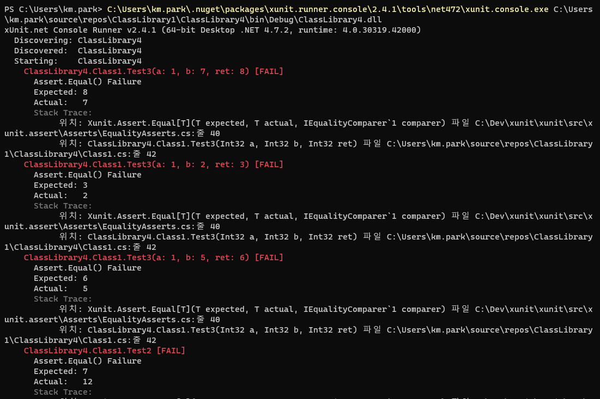

## 2021년 06월08일 C#의 UnitTest 동작실습
## 단위테스트
## 메뉴얼 동작
```
unitTest 또는 테스트 자동화라고 불린다. 
소스 코드 특정 모듈이 의도한 대로 정확히
테스트 케이스를 작성하는 절차

각 테스트는 서로 분리
가짜 객체 Mockobject 
독립적 이다.
디버깅 시간 단축한다.

컴퓨터 프로그래밍에서 소스 코드의 특정 모듈이 의도된 대로 정확히 작동하는지 검증하는 절차
언제라도 코드 변경으로 인해 문제가 발생할 경우,
단시간 내에 이를 파악하고 바로 잡을 수 있도록 해줌
```
##  xunit 설치  

```
NuGet 패키지 관리로 들어갑니다.
xunit이라고 입력을 하고 xunit에서 일단 낮은 버전을 2.10으로 설치합시다.

```

## 클래스 라이브러리로 진행  
```c#
using System;

namespace AddLib
{
        public class AddClass
        {
            public double double_add(double a, double b)
            {
                return a + b;
            }
            public int int_add(int a, int b)
            {
                return a * b;//단위 테스트를 위한 오타
            }
        }
}

```

```
새 프로젝트 추가해서
```


```c#
using System;
using Xunit;

namespace TestProject1
{
    public class UnitTest1
    {
        [Fact]
        public void Test1()
        {

        }
    }
}
```

```
여기서 이렇게 나오는데 여기서 우리는
최근에 만든 Xunit부분에 종속성에 오른쪽 클릭하고 프로젝트 참조 추가를 눌러줌
```

```
체크를 해주고 확인 해줍니다.
```
```c#
using System;
using Xunit;
using AddLib

namespace TestProject1
{
    public class UnitTest1
    {
        [Fact]
        public void Test1()
        {
            double a = 3;
            double b = 4;
            double expected = 7;
            var calc = new AddClass();
            var actual = calc.double_add(a, b);
            Assert.Equal(expected, actual);
        }
        [Fact]
        public void Test2()
        {
            int a = 3;
            int b = 4;
            int expected = 7;
            var calc = new AddClass();
            var actual = calc.int_add(a,b);
            Assert.Equal(expected, actual);
            
        }
    }
}

//같은 클래스에 있지만 이 두개의 매소드는 독립적이다.
```


```
위와 같이 창이 생성이 됩니다.
```

```
 현재 에러가 생기는게 보이는데 일부러 에러를 발생하게 한것이기 때문에 그렇다.
 여기서 보면 지금은 두개라서 금방 오류를 찾아낼 수 있지만 그것이 천개 또는 만개라 생각했을때
 계속해서 새로운 코드가 쌓인다고 하자 이때 이런 단위테스트가 없다면 오류를 찾는데 오래 걸리것이고
 
 이전에 구현했던 코드가 100% 안정하다는걸 보장 할 수 있을까?
 그렇다고 하더라도 새로운 코드로 인한 오류가 생길 수있다. 
 이때 이런식으로 단위테스트로 해놓는다면 금방 그 오류 위치를 찾아서 에러를 해결할 수 있고
 매번 단위테스트가 정해진 시간에 동작한다고 했을때 그런 코드 커버리지? 100% 만족할수 있는 
 개발을 할 수 있다.
```
```
각 테스트는 독립성을 가지고 있고,
예외가 없으면 성공이고 예외가 있으면 실패이다. 
X 는 예외가 있으니 실패이고
V 는 예외가 없어서 성공이다.
```
```
회기 테스트가 가능하다 회기 테스트는 이전의 것 까지 확인해주는것이다. 그래서 이전의 소스도
안전함을 보장할 수 있는 자료나 근거가 될 수있다.
```
## Theory, InlineData
```
        [Theory]
        [InlineData(1, 7, 8)]
        [InlineData(1, 2, 3)]
        [InlineData(1, 5, 6)]
        public void Test3(int a, int b, int ret)
        {
            var calc = new AddClass();
            var actual = calc.int_add(a, b);
            Assert.Equal(ret, actual);
        }
이렇게 하면 알아서 세번 동작해서 확인을 한다.

[Theory]: 같은 코드를 실행하지만, 다른 입력 인수가 포함된 테스트 모음
[InlineData]: 특성은 해당 입력에 대한 값을 지정
```
[참고 사이트](https://hijuworld.tistory.com/31)

## 자동화

```
위에서 exe 경로를 확인하고 
```

```
현재 테스트 코드가 있는 위치를 알고 나서 cmd 창을 켜줍니다.

 C:\Users\km.park\.nuget\packages\xunit.runner.console\2.4.1\tools\net472\xunit.console.exe C:\Users\km.park\source\repos\ClassLibrary1\ClassLibrary4\bin\Debug\ClassLibrary4.dll
```
## 실패하는 경우

## 성공하는 경우

```
중요한것은 .net4.7.2로 했으면 당연한거지만 test 코드라 프로덕션 코드가 일치 해야 자동화할때
실행이 된다.
```

