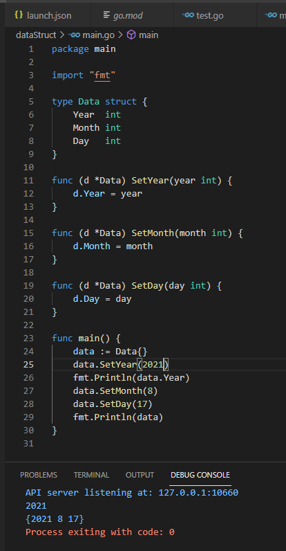

## 2021년 06월09일 golang 캡슐화와 임베딩  
```
잘못된 데이터로부터 구조체 타입의 필드를 보호하기 위한 캡슐화
캡슐화를 사용하면 데이터 필드를 좀 더 안전하게 다룰 수 있음

그리고 구조체 타입에 다른 타입을 임베드할 수 있는 방법도 알아 보자.
우리가 만든 타입에 필요한 매서드가 이미 다른 타입에 정의 되어 있는 경우
메서드 코드를 복사 붙여넣기 할 필요없이
해당 타입을 임베딩하면  마치 직접 정의한 것 처럼 사용 가능
```
## Data 구조체 타입 만들기  

## 사용자가 Data 구조체 필드에 잘못된 값을 넣는 경우  
```
현재 위에 소스에 0이나 -999 값을 넣어도 동작을 한다. 
이게 원래 년도나 월이나 일인경우 유효한 숫자가 있는데
이때 필요한 것은 사용자가 입력한 값을 저장하기 전에
먼저 유효성을 확인하는 일이다.

컴퓨터사이언스에서 이를 가리켜 데이터 유효성 검증 이라고 함
```
## 설정자 메서드  
```
구조체 타입은 또 다른 사용자 정의 타입으로 다른 사용자 정의 타입과 
마찬가지로 메서드를 정의할 수 있음

Data 타입의 각 필드에 적절한 값을 설정하기 위해 
값을 검증하기 위한 SetYear, SetMonth, SetDay 메서드를 추가해 보자.
```

## 나머지 설정자 메서드 추가하기  
```
나머지 SetMonth, SetDay를 구현해보자.
```

```
이렇게 했다고 해도 0이나 - 값을 예외로 할 수는 없다. 
```
## 설정자 메서드에 유효성 검증 추가하기  
```
설정자 메서드에 데이터 유효성 검증 로직을 추가하려면
각 설정자 메서드에서 전달받은 값이 유효한 범위 내에 속하는지 확인

유효 범위 내에 속하지 않은 경우 error 반환
유효한 경우 Data 구조체 필드에 값을 저장한 뒤 nil에러 반환 하면됨

조건은 메서드 블록에서는 전달 받은 year 매개변수의 값이 1보다 작은지 
검사해서 1보다 작으면 invalid year 메세지 에러 반환

err가 nil이 아니면 잘못 전달 된거라 에러 보고후 종료
```

## 필드에 잘못된 값이 들어갈 여지가 있는 경우  
```
사용자가 설정자 메서드를 사용하는 경우에는
유효성을 검증할 수 있지만, 구조체 필드에 값을 직접 설정하는 
사용자가 있는 경우 잘못된 값이 들어오는 경우가 생김

구조체 필드를 직접 설정하는 경우 오류를 막을 방법이 없다. 
Data 타입을 사용하는 사용자가 설정자 메서드를 통해서만 필드를 설정할 수 
있도록 필드를 보호하는 방법이 필요.
	data = calendar.Data{Year: 0, Month: 0, Day: -2}
이렇게 선언하면 에러된 값도 들어간다는 소리

약간 자바로 따지면 은닉화와 비슷한것 같다. private로 해서 내부접근만 허용하는것

여기서 방법은 Data타입을 별도 패키지로 분리하고 
다음 필드를 모두 노출시키지 않는것이다.
```
## Data 타입 별도 패키지로 옮기기  
```
Go 작업 공간에 headfirstgo 디렉터리에 calendar 패키지를 저장하고 doat.go
파일을 생성하자.
```
## data.go  
```go
package calendar

import (
	"errors"
)

type Data struct {
	Year  int
	Month int
	Day   int
}

func (d *Data) SetYear(year int) error {
	if year < 1 {
		return errors.New("invalid year")
	}
	d.Year = year
	return nil
}

func (d *Data) SetMonth(month int) error {
	if month < 1 || month > 12 {
		return errors.New("invalid year")
	}
	d.Month = month
	return nil
}

func (d *Data) SetDay(day int) error {
	if day < 1 || day > 31 {
		return errors.New("invalid year")
	}
	d.Day = day
	return nil
}
```
## main.go  
```go
package main

import (
	"fmt"

	"src/github.com/headfirstgo/calendar"
)

func main() {
	data := calendar.Data{}
	data.Year = 2019
	data.Month = 8
	data.Day = 20
	fmt.Println(data)

	data = calendar.Data{Year: 0, Month: 0, Day: -2}
	fmt.Println(data)
}
```

## Data 필드 숨기기  
