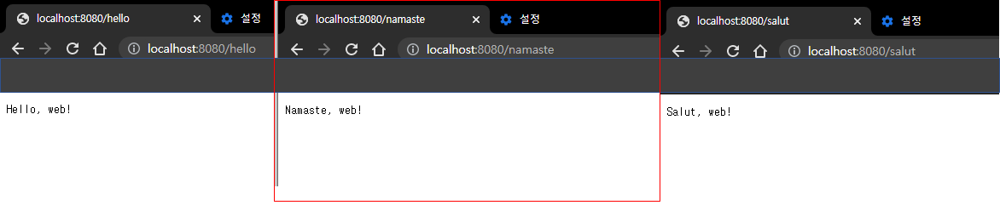
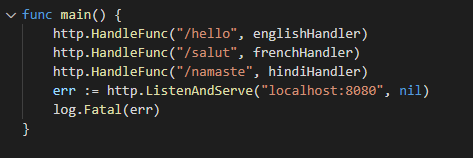
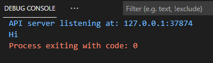
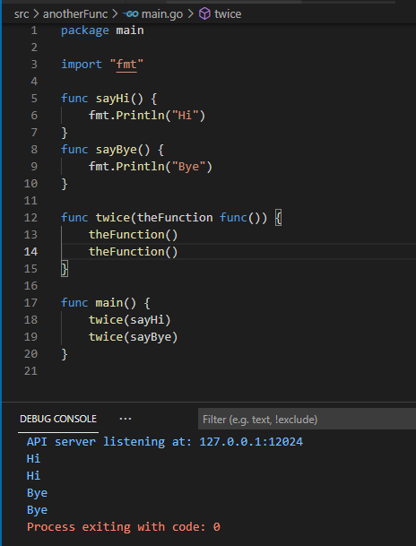
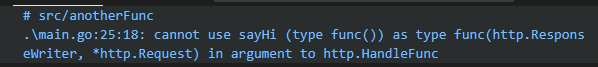
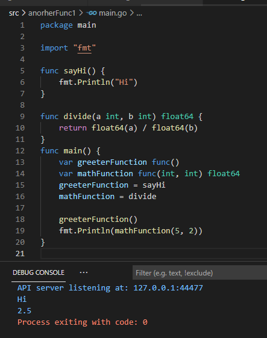

## 2021년 06월14일 go lang 웹 앱
```
Go 에는 웹 앱 개발에 필요한 모든 것이 준비 되어 있다.
웹 앱에서 가장 먼저 필요한 것은 웹 브라우저가 보낸 요청에 응답하는 기능
이번 장에서는 net/http 패키지를 사용하여 요청에 응답하는 방법에 대해 알아보자.
```
## Go로 웹 앱 작성하기   
```
현재 Go는 웹 개발을 더 쉽게 만들어 주는 몇 가지 훌륭한 패키지를 제공
그러한 패키지 중 하나가 바로 net/http 패키지
HTTP란 HyerTextTransferProtocol의 약자로 웹 서버 간 통신에서 사용되는 프로토콜
```
## 브라우저, 요청,  서버 및 응답  
```
브라우저에 URL 입력하면 브라우저는 웹 페이지에 대한 요청을 서버로 전송
요청을 받은 서버는 적절한 페이지를 가져온 다음 응답에 담아 브라우저로 돌려줌

예전의 서버는 보통 하드 드라이브에 저장된 HTML 파일에서 읽어 온 내용을 브라우저로 
돌려줬다.

지금은 서버가 직접 파일을 읽어 오는 대신 요청을 처리하는 프로그램과 
통신하는 것이 일반적이다. 
이런 프로그램은 Go뿐만 아니라 원하는 그 어떤 언어로도 작성할 수 있다.
```
##  간단한 웹 앱  
```
현재 우리가 해볼 것은 응답 데이터를 채워 넣는것 만 하면된다.
다음은 net/http를 사용하여 브라우저에 간단한 응답을 반환하는 프로그램이다.

package main

import (
	"log"
	"net/http"
)

func viewHandler(writer http.ResponseWriter, request *http.Request) {
	message := []byte("Hello, web!")
	_, err := writer.Write(message)
	if err != nil {
		log.Fatal(err)
	}
}

func main() {
	http.HandleFunc("/hello", viewHandler)
	err := http.ListenAndServe("localhost:8080", nil)
	log.Fatal(err)
}
```

```
현재 위에 웹앱은 실행이 중단될 때까지 계속해서 요청을 수신
응답 페이지가 잘 보이면 터미널에서 종료하고 싶다면 CTRL + C 하면된다.
```
##  웹 앱 동작 방식 설명  
```
main 함수에서는 /hello  문자열과 viewHandler 함수로 
http.HandlerFunc를 호출
이 코드는 /hello로 끝나는 URL 요청을 받을 때마다 viewHandler를 호출하라의 의미

그 다음 http.ListenAndServer를 호출해서 웹 서버를 실행
그리고 localhost:8080이라는 문자열을 전달하면 8080번 포트에서 
자기 자신으로부터 전달되는 요청만 수락하게 됨
만약 다른 컴퓨터의 요청도 받기 위해서는 
0.0.0.0:8080 을 사용하면 됨

두 번째 인자로 nil을 전달 했는데 이는 HandleFunc롤 설정한 함수로만 요청을 처리
하겠다는 것이다.

ListenAndServe를 HandleFunc보다 나중에 호출한 이유는 
ListenAndServe는 에러가 발생하지 않는 이상 무한히 실행되기 때문에

서버는 브라우저 응답에 데이터를 추가할 때 사용할 http.ResponseWriter와 
브라우저 요청을 나타내는 http.Request 값의 포인터를 viewHandler함수로 전달
```
```
viewHandler에서는 ResponseWriter.Write의 Write 메서드를 사용해 응답데이터 추가
현재 메서드는 문자열이 아닌 바이트 슬라이스를 받기 때문에 
message := []byte("Hello, web!") //"Hello,web!"을 바이트 슬라이스로 변환
_, err := writer.Write(message) //응답에 message 내용 전달

http.Get함수를 통해 받아 온 응답 값을 ioutil.ReadAll함수에 전달하면
바이트 슬라이스가 반환됨
```
## 참고  
```
byte 타입 또한 float64나 bool과 같은 Go의 기본  타입으로 보통 파일이나
네트워크 연결에서 읽은 로우(raw)데이터를 저장하는 데 사용
byte 슬라이스는 직접 출력할 경우 (숫자로 표현된 로우 데이터 이기에)
알아보기가 힘들다. 그래서 string으로  변환하면 좀 더 읽기 좋은 형태의
텍스트로 볼 수 있음
따라서 응답 바디를 string으로 변환해 출력하는 것으로 함수를 완성할 수 있음

func main(){
 response, err  :=  http.Get("https://example.com")
 if err != nil {
  	log.Fatal(err)
 }
 defer response.Body.Close()
 body, err := ioutil.ReadAll(response.Body)
 if err != nil{
	log.Fatal(err)
 }
 fmt.Println(string(body))
}
```
## 리소스 경로  
```
URL에서 호스 주소와 포트 다음에 오는 부분을  리소스 경로 라고 한다. 
이를 통해 브라우저는 그 수많은 리소스 중 어떤 리소스가 필요한 건지 서버에게 알려줌

net/http 서버는 URL의 끝 부분에서 경로를 가져와 요청 처리 시 사용

웹 앱에서 http.HandleFunc 함수를 호출할 땐 /hello 문자열과 viewHandler 함수를 
전달 했다. 
이때 전달한 문자열은 요청 리소스의 경로를 사용
이때부터 /hello 경로를 가진 요청이 들어오면 viewHandler 함수가 호출
viewHandler 함수는 전달 받은 요청에 대한 적절한 응답을 생성하는 역할을 수행

http.HandleFunc("/hello", viewHandler)

서로 다른 요청에 서로 다른 응답을 내리기 위한 한가지 방법은 
처리하려는 경로마다 해당 경로를 처리하기 위한 함수와 함께 HandlerFUnc를 호출
이렇게 하면 앱은 해당 경로에 응답을 할 수 있게 됨
```
## 서로 다른 리소스 경로에 다르게 응답하기  
```
/hello 경로를 가진 요청이 들어오면 englishHander 함수 호출
/salut 요청은 frenchHandler함수가 처리
/namaste 요청은 hindiHandler 함수가 처리 하는 프로그램을 짜보자.

각 핸들러 함수는 자기 자신의 ResponseWriter 값과 문자열을 새로운 
write 함수로 전달 
write 함수는 전달받은 문자열을 응답에 추가함

package main

import (
	"log"
	"net/http"
)

func write(writer http.ResponseWriter, message string) {
	_, err := writer.Write([]byte(message))
	if err != nil {
		log.Fatal(err)
	}
}

func englishHandler(writer http.ResponseWriter, request *http.Request) {
	write(writer, "Hello, web!")
}

func frenchHandler(writer http.ResponseWriter, request *http.Request) {
	write(writer, "Salut, web!")
}

func hindiHandler(writer http.ResponseWriter, request *http.Request) {
	write(writer, "Namaste, web!")
}

func main() {
	http.HandleFunc("/hello", englishHandler)
	http.HandleFunc("/salut", frenchHandler)
	http.HandleFunc("/namaste", hindiHandler)
	err := http.ListenAndServe("localhost:8080", nil)
	log.Fatal(err)
}
```

## 일급 함수  
```
핸들러 함수와 함께 http.HandleFunc를 호출하는 부분을 자세히 보면 
핸들러 함수의 호출 결과를 HandleFunc에 전달하고 있지는 않음
HandeleFunc에는 함수 그 자체를 전달 하고 있음
해당 함수는 일치하는 요청 경로로 요청이 수신될 때 호출 되도록 저장
```

```go
Go 언어는 일급함수(first-class function)를 지원함
Go에서 함수는 일급 시민으로 취급된다.

일급함수를 지원하는 프로그래밍 언어에서는 함수를 변수에 할당하고,
해당 변수에서 함수를 호출할 수 있음

package main

import "fmt"

func sayHi() {
	fmt.Println("Hi")
}
func main() {
	var myFunction func()
	myFunction = sayHi
	myFunction()
}
```

## 다른 함수에 함수 전달하기  
```
일급 함수를 지원한다면 함수를 다른 함수의 인자로 전달 할 수 있음
```

## 타입으로서의 함수  
```
다른 함수를 호출할 때 인자로 아무 함수나 사용할 수 없음
http.HandleFunc의 인자로 sayHi 함수를 전달하려고 하면 컴파일 에러 생김
func sayHi() {
	fmt.Println("Hi")
}
http.HandleFunc("/hello",sayHi)
```

```
함수의 매개변수와 반환 값은 함수 타입의 일부
함수를 저장하는 변수는 함수가 가지고 있어야 하는 매개변수 및 반환 값을 지정해야함
해당 변수는 지정된 매개변수 및 반환 값의 개수와 타입이 일치하는 함수만 저장할수 있음

다음 코드는 func() 타입의 greeterFunction을 정의
이 변수는 매개변수와 반환 값이 없는 함수를 저장
그다음 func(int, int) float64 타입의 mathFunction을 정의하고 있음
greeterFunction변수에 sayHi 를 할당하고
mathFunction 변수에 divide를 할당하면 코드는 정상적으로 컴파일 되고 잘 실행됨
```

```
sayHi랑 divide를 바꾸면 에러가 발생을 하는데 반환값도 다르고 형식이 다르니
당연한 것 같다.

함수를 매개변수로 받는 함수는 전달받은 함수의 매개변수 및 반환 값의 타입도 지정
해야한다. 
```

