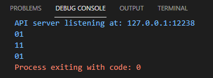

## 2021년 06월14일 golang 파일 열기  
```
단순히 파일에서 데이터를 읽어 올 수도 있지만 
파일에 데이터를 기록해야 하는 경우도 있음 
```
## os.OpenFile 이해하기  
```
options := os.O_WRONLY | os.O_APPEND | os.O_CREATE 
file, err := os.OpenFile("signatures.txt",options, os.FileMode(0600))

이전에 이런식으로 구현했었는데 
우선 OpenFile 명령어를 봅시다.
```

```
함수는 파일명, 정수형 플래그 , 권한을 나타내는 os.FileMode를 인자로 받음

파일명은 파일의 이름 이다.
```
## os.OpenFile에 플래그 상수 전달하기  
## os.O_RDONLY 파일 읽기  
```
플래그로 사용할 수 있는 값중 하나로 os.O_RDONLY를 언급하고 있음
의미는 os.OpenFile의 동작 방식을 제어하기 위해 인자로 전달하는 
int 형 상수 중 하나 
```

```
문서에는 이런식으로 설명이 되어있다. 
우선 aardvark.txt라는 이름으로 하나 생성하고 
Aardvarks are ...을 입력합시다.
```

## os.O_WRONLY 덮어쓰기  
```go
위는 알다시피 파일을 열어서 출력을 해줍니다.

파일을 써보자.
main함수에 os.OpenFile에 os.O_WRONLY 상수를 전달하여
파일을 쓰기 모드로 열자. 
그다음 바이트 슬라이스와 함께 파일 값의  Write메서드를 호출하여 파일에 데이터씀

func main() {
	file, err := os.OpenFile("aardvark.txt", os.O_WRONLY, os.FileMode(0600))
	check(err)
	_, err = file.Write([]byte("amazing\n"))
	check(err)
	err = file.Close()
	check(err)
}

위의 경우는 파일에 덮어쓰기가 됩니다. 
```

## os.O_APPEND 파일 끝에 데이터 추가하기  
```
	file, err := os.OpenFile("aardvark.txt", os.O_APPEND, os.FileMode(0600))
	check(err)
	_, err = file.Write([]byte("amazing\n"))
	check(err)
	err = file.Close()
	check(err)
```

```
원래 저런식으로 단독으로 쓰면 에러가 생긴다고 하는데 
일단 직접했을 때 에러는 없다 하지만 규칙은
os.O_APPEND 플래그는  os.OpenFile에 단독으로 전달 할 수 없다.
만약 단독으로 전달하게 되면 에러가 발생하긴 한다지만
O_APPEND 와 O_CREATE를 또는 조건으로 묶어서 사용해야한다고 한다. 
```
## 이진법  

## 비트 단위 연산자  
```
산술 연산자 뿐만 아니라 숫자를 구성하는 각 비트 간 연산을 
수행할 수 있는 비트 단위 연산자(bitwise operator)또한 지원
가장 흔히 사용되는 두개의 비트 단위 연산자로는 &와 | 비트 연산자가 있음

& : Bitwise AND
| : Bitwise OR
```
## 비트 단위 AND 연산자  
```
&& 경우 좌변과 우변이 모두 참일때 참이다.
```


```
마지막 사진의 경우 큰숫자에 대해서 의미를 파악하기 힘들다. 
비트 단위 연산은 각 숫자를 개별 비트로 이루어진 값으로 볼 때 의미가 없다.
& 연산자는 좌변의 숫자와 우변의 숫자의 동일한 위치의 비트 값이 모두 1인 경우에만
결과 비트를 1로 설정

	fmt.Printf("%02b\n", 1)
	fmt.Printf("%02b\n", 3)
	fmt.Printf("%02b\n", 1&3)

하는 경우 를 보자.

1 0 이면 0
0 1 이면 0
1 1 이면 1
0 0 이면 0
무조건 두개가 1이여야 참
한개라도 0이면 거짓
```


## 비트 단위 OR 연산자  
```
이것은 쉽게 하나라도 참이면 참이다.
```

```
0 1 이면 1
1 0 이면 1
1 1 이면 1
0 0 이면 0
한개라도 참이면 참
```
## os 패키지 상수에 비트 단위 OR 사용하기  
```
os.O_APPEND와 os.O_CREATE, os.O_RDONLY, os.O_WRONLY 또는 os.O_RDWR
또는 조건을 묶어서 사용한다. 

실제 이 상수 값은 모두 int 이다. 
```


```
위를 보면 각 비트들이 간섭없이 결합할 수 있는 구조이다. 
그래서 1번째 비트의 값이 1인지 확인하여 파일이 쓰기 모드 인지 판단
7번째 비트가 1이면 openFile은 파일이 존재 하지 않은 경우 파일 생성
11번째 비트가1이면 openFile은 데이터를 파일의 끝에 이어서 써라는 것
```
## 비트 단위 OR 연산자를 사용해 os.OpenFile 옵션 수정  
```go
options := os.O_WRONLY | os.O_APPEND
file, err := os.OpenFile("aardvark.txt", options, os.FileMode(0600))
check(err)
_, err = file.Write([]byte("amazing\n"))
check(err)
err = file.Close()
check(err)

이렇게 하고 결과를 보면 뒤로 이어서 들어가고 
```

## Create 옵션   
```
	options := os.O_WRONLY | os.O_APPEND | os.O_CREATE
해주면 파일이 없다면 생성해서 넣어준다.
```
## 유닉스 스타일의 파일 권한  
```
file, err := os.OpenFile("aardvark.txt", options, os.FileMode(0600))
 os.FileMode(0600) 이부분이 파일 권한 부분인데 
 
 리눅스에서  r 내용 읽기 가능
 w 내용 쓰기 가능
 x 파일 실행 할 수 있음 
```
## os.FileMode 타입으로 권한 나타내기  
```
실제 아래와 같이 출력해보면 스트링메서드 라서 저렇게 나타난다.
```


```
	fmt.Println(os.FileMode(0700))
	fmt.Println(os.FileMode(0070))
	fmt.Println(os.FileMode(0007))
//순서대로 보면
-파일의 소유자는 모든 권한 갖음
-파일의 그룹에 속한 모든 사용자는 모든 권한을 갖음
-시스템상 모든 타 사용자는 모든 권한을 갖음
```

```
FileMode는 unit32 부호 없는 32비트 정수 를 기본 타입으로 갖음
음의 정수는 가질수 없고 32비트 메모리로 표현 할 수 있는 더 크고 많은 숫자를
가질 수 있음

하지만 변환 결과는 다소 이해하기 어렵다.
```

## 팔진법  
```
팔진법을 사용하면 FileMode 값으로 변환할 정수를 좀더 쉽게 지정 가능
0~7 까지 자리 사용
%O 형식 동사를 사용하면 확인 가능
```

## 팔진수를 FileMode 값으로 변환  
```
왜 팔진수를 사요할 까
각 자릿수를 3비트 메모리로 표현 할 수 있어서 이다.
0007 경우 000 000 111
0070     000 111 000
0700     111 000 000
이렇게 되기 때문이다. 

	fmt.Printf("%09b %s\n", 0000, os.FileMode(0000))
	fmt.Printf("%09b %s\n", 0111, os.FileMode(0111))
	fmt.Printf("%09b %s\n", 0222, os.FileMode(0222))
	fmt.Printf("%09b %s\n", 0333, os.FileMode(0333))
	fmt.Printf("%09b %s\n", 0444, os.FileMode(0444))
	fmt.Printf("%09b %s\n", 0555, os.FileMode(0555))
	fmt.Printf("%09b %s\n", 0666, os.FileMode(0666))
	fmt.Printf("%09b %s\n", 0777, os.FileMode(0777))
```


```
go가 지원하는 8진법 사용하면 동일한 컨벤션 따를 수 있음
```
## os.OpenFile 호출 코드 설명  
```
다음 코드는 기존 로그 파일에 새로운 데이터를 추가하고 있고
파일의 소유자는 파일을 읽고 쓸 수 있으며 그 외의 다른 모든 사용자는 읽기만 가능
options := os.O_WRONLY | os.O_APPEND
file, err := os.OpenFile("aardvark.txt", options, os.FileMode(0644))

그리고 다음은 파일이 존재 하지 않으면 파일 생성
데이터를 파일 끝에 추가 
결과 파일은 소유자만 읽고 쓸 수 있고 그 외 다른 모든 사용자는 접근할 수 없음

options := os.O_WRONLY | os.O_APPEND | os.O_CREATE
file, err := os.OpenFile("aardvark.txt", options, os.FileMode(0600))
```
