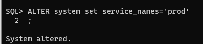
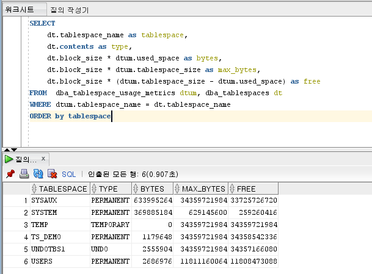

## 2021년09월05일_오라클디비설치및프로메테우스익스포터연결

## 오라클 디비설치를 위한 docker-compose.yml

```yml
version: "3.3"
services:
  oracle:
    container_name: demo_oracle
    build:
      context: ./oracle/
      dockerfile: Dockerfile
    image: demo/oracle-xe-11g:latest  
    environment:
      - ORACLE_ALLOW_REMOTE=true
    ports:
      - "1531:1521"
```


## init 폴더


## oracleinit1_init.sql

```sql
-- 테이블 스페이스 생성
CREATE TABLESPACE TS_DEMO  datafile '/u01/app/oracle/oradata/XE/TS_DEMO.dbf' SIZE 100M AUTOEXTEND on next 100M;
-- 임시 테이블스페이스 생성
CREATE TEMPORARY TABLESPACE TS_DEMO_TEMP  TEMPFILE  '/u01/app/oracle/oradata/XE/TS_DEMO_TEMP.dbf' SIZE 100M AUTOEXTEND on next 10M;

-- 계정생성
CREATE USER DEMO  IDENTIFIED BY  "test1004"
DEFAULT TABLESPACE TS_DEMO
TEMPORARY TABLESPACE TS_DEMO_TEMP
QUOTA UNLIMITED ON TS_DEMO;

-- 접속 권한주기
GRANT RESOURCE, CONNECT to DEMO;
-- 테이블스페이스 사용권한
GRANT UNLIMITED TABLESPACE TO DEMO;
```

## oracleinit2_ddl.sql

```sql
CREATE TABLE DEMO.TEST_CONTENT 
(
  TEST_SEQ_NO NUMBER(19,0) NOT NULL 
, CONTENT VARCHAR(100) NOT NULL  
, CONSTRAINT PK_TEST_CONTENT PRIMARY KEY 
  (
    TEST_SEQ_NO 
  )
);


CREATE SEQUENCE  DEMO.DEMO_TEST_SEQ_NO  MINVALUE 1 INCREMENT BY 1 START WITH 1 CACHE 20 NOORDER  NOCYCLE; 

-- ALTER TABLE DEMO.TEST_CONTENT COMMENT '테스트';
```

## oracle 폴더


```dockerfile
FROM oracleinanutshell/oracle-xe-11g

# ENV ORACLE_ALLOW_REMOTE true
ADD init/*.sql /docker-entrypoint-initdb.d/
```

- 우선 이미지 만들기

```dockerfile
docker build --tag demo/oracle-xe-11g:latest .
```

- 이미지를 생성을 해준 후에 도커컴포즈 파일 올리기

- 포트 의 경우 1521로해도되는데 거부 당해서 1531로함

```go
docker-compose up -d 
```

- 이렇게 하면 오라클 디비가 올라감


## 오라클 디비 접속

```dockerfile
 docker exec -it 1ad2f099704b_demo_oracle bash
```

- -it 와 bash 사이에는 컨테이너 이름이 들어가면됨

``` go
netstat -nlpt
```


- 제대로 포트가 열려있는지 확인 여기서는 1521이여야함 

## 오라클 접속을 위한 os 계정 변경

```sql 
su oracle

cd $ORACLE_HOME

bin/sqlplus / as sysdba
```

- 이것까지 하면 오라클 서버에 접속이 된다.


### 동작확인

```sql
SELECT status FROM v$instance;
```


## 아이디/ 비번 설정 및 서비스 이름 설정

```go
create user 원하는계정명 identified by "원하는비밀번호";
```

## 계정 dba 권한 부여

```sql
grant dba to 원하는계정명 with admin option;
```

- 이렇게 하고 로그인 해보기

```sql
sqlplus
```


- 설정한 아이디 , 비번 입력


- 이렇게 하면 제대로 들어간것

## 서비스 네임 추가하기

``` sql
show parameter service_names
```


- 원래 기본값은 xe로 되어 있음

```sql
ALTER system set service_names='prod'
```

- 엔터하면 2가 나오는데 그냥 뒤에 ; 붙이면됨



```sql
show parameter service_names
```

- 다시 이름을 확인하면 이렇게 바뀐것이 보임


## sqldevelper에 연결해서 확인


- 테스트를 눌렀을때 성공하면 제대로 된것



- 제대로 동작한다.

## 프로메테우스에 연결하기

``` dockerfile
  node_exporter:
    image: iamseth/oracledb_exporter:alpine
    container_name: oracledb-exporter
    #network_mode: host
    #pid: host
    restart: unless-stopped
    environment:
      - "DATA_SOURCE_NAME=admin/admin@localhost:1531/kmp"
    volumes:
      - ./default-metrics.toml:/default-metrics.toml:ro
    ports:
      - "9161:9161"          
```

- 아이디 비번이 admin/admin인경우 
- 서비스아이디가 kmp인경우


- 근데 에러가 생긴다. 이것은 이유를 테스트 해보니
- localhost라고 하지말고 현재 컴퓨터 ip를 localhost대신 넣어주면 해결이됨


- 아이피 주소를 넣고 하면 위와 같이 나오면 성공이다. 

## 매트릭 비트에 연결해서 elk - kibana에서 확인


- 결론적으로 이렇게 데이터가 들어오면 성공 ~!