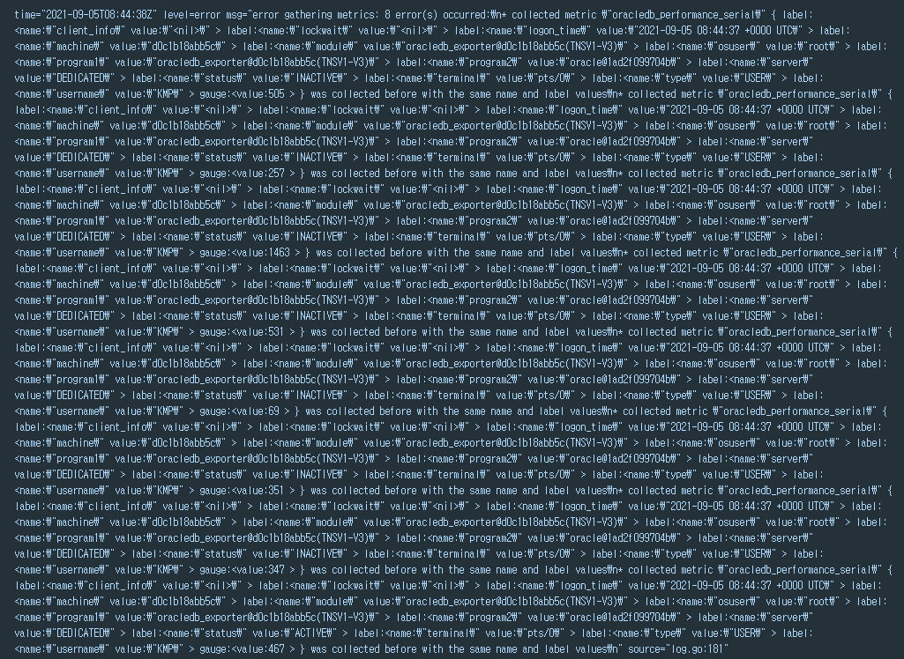
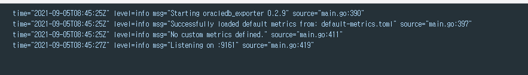

## 2021년09월06일_프로메테우스익스포터에러해결

## 에러

```dockerfile
  node_exporter:
    image: iamseth/oracledb_exporter:alpine
    container_name: oracledb-exporter
    #network_mode: host
    #pid: host
    restart: unless-stopped
    environment:
      - "DATA_SOURCE_NAME=kmp/kmp1@192.168.160.1:1531/kmp"
    volumes:
      - ./default-metrics.toml:/default-metrics.toml:ro
    ports:
      - "9161:9161"          
```

- 사용 버전 alpine 버전 



## 사용한 프로메테우스 익스포터 버전

```dockerfile
  node_exporter:
    image: iamseth/oracledb_exporter:0.2.9-alpine
    container_name: oracledb-exporter
    #network_mode: host
    #pid: host
    restart: unless-stopped
    environment:
      - "DATA_SOURCE_NAME=kmp/kmp1@192.168.160.1:1531/kmp"
    volumes:
      - ./default-metrics.toml:/default-metrics.toml:ro
    ports:
      - "9161:9161"    
```

- 0.2.9-alpine 버전 사용




## 사용한 default-metrics.toml

```sql
[[metric]]
context = "sessions"
labels = [ "status", "type" ]
metricsdesc = { value= "Gauge metric with count of sessions by status and type." }
request = "SELECT status, type, COUNT(*) as value FROM v$session GROUP BY status, type"

[[metric]]
context = "resource"
labels = [ "resource_name" ]
metricsdesc = { current_utilization= "Generic counter metric from v$resource_limit view in Oracle (current value).", limit_value="Generic counter metric from v$resource_limit view in Oracle (UNLIMITED: -1)." }
request="SELECT resource_name,current_utilization,CASE WHEN TRIM(limit_value) LIKE 'UNLIMITED' THEN '-1' ELSE TRIM(limit_value) END as limit_value FROM v$resource_limit"

[[metric]]
context = "asm_diskgroup"
labels = [ "name" ]
metricsdesc = { total = "Total size of ASM disk group.", free = "Free space available on ASM disk group." }
request = "SELECT name,total_mb*1024*1024 as total,free_mb*1024*1024 as free FROM v$asm_diskgroup_stat where exists (select 1 from v$datafile where name like '+%')"
ignorezeroresult = true

[[metric]]
context = "activity"
metricsdesc = { value="Generic counter metric from v$sysstat view in Oracle." }
fieldtoappend = "name"
request = "SELECT name, value FROM v$sysstat WHERE name IN ('parse count (total)', 'execute count', 'user commits', 'user rollbacks')"

[[metric]]
context = "process"
metricsdesc = { count="Gauge metric with count of processes." }
request = "SELECT COUNT(*) as count FROM v$process"

[[metric]]
context = "wait_time"
metricsdesc = { value="Generic counter metric from v$waitclassmetric view in Oracle." }
fieldtoappend= "wait_class"
request = '''
SELECT
  n.wait_class as WAIT_CLASS,
  round(m.time_waited/m.INTSIZE_CSEC,3) as VALUE
FROM
  v$waitclassmetric  m, v$system_wait_class n
WHERE
  m.wait_class_id=n.wait_class_id AND n.wait_class != 'Idle'
'''

[[metric]]
context = "tablespace"
labels = [ "tablespace", "type" ]
metricsdesc = { bytes = "Generic counter metric of tablespaces bytes in Oracle.", max_bytes = "Generic counter metric of tablespaces max bytes in Oracle.", free = "Generic counter metric of tablespaces free bytes in Oracle." }
request = '''
SELECT
    dt.tablespace_name as tablespace,
    dt.contents as type,
    dt.block_size * dtum.used_space as bytes,
    dt.block_size * dtum.tablespace_size as max_bytes,
    dt.block_size * (dtum.tablespace_size - dtum.used_space) as free
FROM  dba_tablespace_usage_metrics dtum, dba_tablespaces dt
WHERE dtum.tablespace_name = dt.tablespace_name
ORDER by tablespace
'''

[[metric]]
context = "performance"
metricsdesc = { cur_opened_current= "cur_opened_current", cur_opened_total="cur_opened_total", cur_parse_real="cur_parse_real",cur_parse_total="cur_parse_total" ,cur_session_cache_hits="cur_session_cache_hits.",cur_cache_hit_pct="cur_cache_hit_pct",io_reloads="io_reloads",lock_requests="lock_requests",pin_requests="pin_requests"}
request = '''
SELECT current_cursors AS cur_opened_current, 
		       total_cursors AS cur_opened_total, 
		       sess_cur_cache_hits - parse_count_total AS cur_parse_real,
		       parse_count_total AS cur_parse_total,
		       sess_cur_cache_hits AS cur_session_cache_hits, 
		       CASE WHEN total_cursors = 0 THEN -1
		            ELSE (sess_cur_cache_hits / total_cursors)
		        END AS cur_cache_hit_pct, 
		       io_reloads,
		       lock_requests,
		       pin_requests
		  FROM (SELECT sum ( decode ( name, 'opened cursors cumulative', value, 0)) total_cursors,
		               sum ( decode ( name, 'opened cursors current',value,0)) current_cursors,
		               sum ( decode ( name, 'session cursor cache hits',value,0)) sess_cur_cache_hits,
		               sum ( decode ( name, 'parse count (total)',value,0)) parse_count_total
		          FROM v$sysstat
		         WHERE name IN ( 'opened cursors cumulative','opened cursors current','session cursor cache hits', 'parse count (total)' )) a
		 INNER JOIN 
		       (SELECT AVG(gethitratio) as lock_requests, 
		               AVG(pinhitratio) as pin_requests, 
		               CASE WHEN (SUM(pins) = 0) THEN -1
		                    ELSE (SUM(reloads) / SUM(pins)) 
		                END as io_reloads  
		          FROM V$LIBRARYCACHE) b
		    ON 1=1	  
'''


[[metric]]
context = "performance"
labels = [ "machine","username" ]
metricsdesc = { cur_avg= "cur_avg", cur_max="cur_max", cur_total="cur_total" }
request = '''
SELECT avg(a.value) cur_avg, 
		       max(a.value) cur_max,
		       sum(a.value) cur_total, 
		       s.machine,
		       s.username
		  FROM v$sesstat a, v$statname b, v$session s
		 WHERE a.statistic# = b.statistic#  
		   AND s.sid = a.sid
		   AND b.name = 'opened cursors current'
		 GROUP BY s.username, 
		          s.machine
		 ORDER BY 1 DESC		
'''

[[metric]]
context = "performance"
metricsdesc = { value="Generic counter metric from v$sysstat view in Oracle." }
fieldtoappend = "name"
request = '''
SELECT RTRIM(REGEXP_REPLACE(METRIC_NAME,'[%()]', ''))as name, value 
FROM V$SYSMETRIC
WHERE 1=1
  AND BEGIN_TIME = (SELECT MAX(BEGIN_TIME) FROM V$SYSMETRIC)    
  AND (METRIC_NAME = 'Host CPU Utilization (%)' OR
      METRIC_NAME = 'Buffer Cache Hit Ratio' OR
      METRIC_NAME = 'Library Cache Hit Ratio' OR
      METRIC_NAME = 'Shared Pool Free %' OR
      METRIC_NAME = 'Average Active Sessions' OR
      METRIC_NAME = 'Logical Reads Per Sec' OR
      METRIC_NAME = 'Physical Reads Per Sec' OR
      METRIC_NAME = 'User Transaction Per Sec' OR
      METRIC_NAME = 'User Calls Per Sec' )
'''

[[metric]]
context = "performance"
labels = [ "buffer_pool" ]
metricsdesc = { cache_buffer_hit_ratio= "cache_buffer_hit_Ratio", cache_get_consistent="Gcache_get_consistent", cache_get_db_blocks="cache_get_db_blocks", cache_physical_reads="cache_physical_reads." }
request = '''
SELECT name as buffer_pool, 
		       CASE WHEN ((db_block_gets + consistent_gets) = 0) THEN -1
		            ELSE 1 - (physical_reads / (db_block_gets + consistent_gets)) 
		        END AS cache_buffer_hit_ratio,
		       consistent_gets as cache_get_consistent,
		       db_block_gets as cache_get_db_blocks, 
		       physical_reads as cache_physical_reads
		  FROM V$BUFFER_POOL_STATISTICS
		 WHERE physical_reads!=0 
'''

[[metric]]
context = "performance"
labels = ["os_username", "oracle_username", "terminal", "program", "object_name", "sysdate"]
metricsdesc = { session_id ="session_id"}
request = '''
SELECT DISTINCT 
            T1.SESSION_ID AS SESSION_ID,
            T1.OS_USER_NAME AS OS_USERNAME,
            T1.ORACLE_USERNAME AS ORACLE_USERNAME,
            T2.TERMINAL,
            T2.PROGRAM,
            T3.OBJECT_NAME, 
            SYSDATE
        FROM V$LOCKED_OBJECT T1, V$SESSION T2, SYS.DBA_OBJECTS T3, V$LOCK T4
        WHERE T1.SESSION_ID = T2.SID
            AND T1.OBJECT_ID = T3.OBJECT_ID
            AND T2.SID = T4.SID
'''
ignorezeroresult = true

[[metric]]
context = "performance"
labels = [ "status", "type","username", "osuser", "server", "machine", "module","client_info","terminal","program1","program2","logon_time","lockwait" ]
metricsdesc = { serial ="serial#"}
request = '''
SELECT S.STATUS, 
               S.SERIAL# as serial, 
               S.TYPE, 
               S.USERNAME, 
               TRIM(REGEXP_REPLACE(S.OSUSER,' ', ''))as osuser,
               S.SERVER, 
               S.MACHINE,
               TRIM(REGEXP_REPLACE(S.MODULE,' ', ''))as module, 
               S.CLIENT_INFO,
               S.TERMINAL, 
               TRIM(REGEXP_REPLACE(S.PROGRAM,' ', ''))as program1, 
               TRIM(REGEXP_REPLACE( P.PROGRAM,' ', ''))as program2,  
               S.LOGON_TIME, 
               LOCKWAIT
          FROM V$SESSION S, V$PROCESS P, SYS.V_$SESS_IO SI
         WHERE S.PADDR = P.ADDR(+)
           AND SI.SID(+) = S.SID
           AND S.USERNAME IS NOT NULL
           AND (NVL(S.OSUSER,'x') <> 'SYSTEM')
           AND (S.TYPE <> 'BACKGROUND')
         ORDER BY S.LOGON_TIME DESC         
'''
```

## localhost:9161/metrics

```json
# HELP go_gc_duration_seconds A summary of the GC invocation durations.
# TYPE go_gc_duration_seconds summary
go_gc_duration_seconds{quantile="0"} 0.000102
go_gc_duration_seconds{quantile="0.25"} 0.0001515
go_gc_duration_seconds{quantile="0.5"} 0.0001585
go_gc_duration_seconds{quantile="0.75"} 0.0001982
go_gc_duration_seconds{quantile="1"} 0.0001982
go_gc_duration_seconds_sum 0.0006102
go_gc_duration_seconds_count 4
# HELP go_goroutines Number of goroutines that currently exist.
# TYPE go_goroutines gauge
go_goroutines 12
# HELP go_memstats_alloc_bytes Number of bytes allocated and still in use.
# TYPE go_memstats_alloc_bytes gauge
go_memstats_alloc_bytes 1.71832e+06
# HELP go_memstats_alloc_bytes_total Total number of bytes allocated, even if freed.
# TYPE go_memstats_alloc_bytes_total counter
go_memstats_alloc_bytes_total 1.1729264e+07
# HELP go_memstats_buck_hash_sys_bytes Number of bytes used by the profiling bucket hash table.
# TYPE go_memstats_buck_hash_sys_bytes gauge
go_memstats_buck_hash_sys_bytes 1.44539e+06
# HELP go_memstats_frees_total Total number of frees.
# TYPE go_memstats_frees_total counter
go_memstats_frees_total 85681
# HELP go_memstats_gc_sys_bytes Number of bytes used for garbage collection system metadata.
# TYPE go_memstats_gc_sys_bytes gauge
go_memstats_gc_sys_bytes 3.574024e+06
# HELP go_memstats_heap_alloc_bytes Number of heap bytes allocated and still in use.
# TYPE go_memstats_heap_alloc_bytes gauge
go_memstats_heap_alloc_bytes 1.71832e+06
# HELP go_memstats_heap_idle_bytes Number of heap bytes waiting to be used.
# TYPE go_memstats_heap_idle_bytes gauge
go_memstats_heap_idle_bytes 6.3414272e+07
# HELP go_memstats_heap_inuse_bytes Number of heap bytes that are in use.
# TYPE go_memstats_heap_inuse_bytes gauge
go_memstats_heap_inuse_bytes 2.973696e+06
# HELP go_memstats_heap_objects Number of allocated objects.
# TYPE go_memstats_heap_objects gauge
go_memstats_heap_objects 4658
# HELP go_memstats_heap_released_bytes_total Total number of heap bytes released to OS.
# TYPE go_memstats_heap_released_bytes_total counter
go_memstats_heap_released_bytes_total 6.2111744e+07
# HELP go_memstats_heap_sys_bytes Number of heap bytes obtained from system.
# TYPE go_memstats_heap_sys_bytes gauge
go_memstats_heap_sys_bytes 6.6387968e+07
# HELP go_memstats_last_gc_time_seconds Number of seconds since 1970 of last garbage collection.
# TYPE go_memstats_last_gc_time_seconds gauge
go_memstats_last_gc_time_seconds 1.630831749351358e+09
# HELP go_memstats_lookups_total Total number of pointer lookups.
# TYPE go_memstats_lookups_total counter
go_memstats_lookups_total 0
# HELP go_memstats_mallocs_total Total number of mallocs.
# TYPE go_memstats_mallocs_total counter
go_memstats_mallocs_total 90339
# HELP go_memstats_mcache_inuse_bytes Number of bytes in use by mcache structures.
# TYPE go_memstats_mcache_inuse_bytes gauge
go_memstats_mcache_inuse_bytes 20832
# HELP go_memstats_mcache_sys_bytes Number of bytes used for mcache structures obtained from system.
# TYPE go_memstats_mcache_sys_bytes gauge
go_memstats_mcache_sys_bytes 32768
# HELP go_memstats_mspan_inuse_bytes Number of bytes in use by mspan structures.
# TYPE go_memstats_mspan_inuse_bytes gauge
go_memstats_mspan_inuse_bytes 102816
# HELP go_memstats_mspan_sys_bytes Number of bytes used for mspan structures obtained from system.
# TYPE go_memstats_mspan_sys_bytes gauge
go_memstats_mspan_sys_bytes 114688
# HELP go_memstats_next_gc_bytes Number of heap bytes when next garbage collection will take place.
# TYPE go_memstats_next_gc_bytes gauge
go_memstats_next_gc_bytes 4.194304e+06
# HELP go_memstats_other_sys_bytes Number of bytes used for other system allocations.
# TYPE go_memstats_other_sys_bytes gauge
go_memstats_other_sys_bytes 1.73105e+06
# HELP go_memstats_stack_inuse_bytes Number of bytes in use by the stack allocator.
# TYPE go_memstats_stack_inuse_bytes gauge
go_memstats_stack_inuse_bytes 720896
# HELP go_memstats_stack_sys_bytes Number of bytes obtained from system for stack allocator.
# TYPE go_memstats_stack_sys_bytes gauge
go_memstats_stack_sys_bytes 720896
# HELP go_memstats_sys_bytes Number of bytes obtained by system. Sum of all system allocations.
# TYPE go_memstats_sys_bytes gauge
go_memstats_sys_bytes 7.4006784e+07
# HELP http_request_duration_microseconds The HTTP request latencies in microseconds.
# TYPE http_request_duration_microseconds summary
http_request_duration_microseconds{handler="prometheus",quantile="0.5"} 1.8904091e+06
http_request_duration_microseconds{handler="prometheus",quantile="0.9"} 2.0527831e+06
http_request_duration_microseconds{handler="prometheus",quantile="0.99"} 2.0527831e+06
http_request_duration_microseconds_sum{handler="prometheus"} 1.5366745e+07
http_request_duration_microseconds_count{handler="prometheus"} 8
# HELP http_request_size_bytes The HTTP request sizes in bytes.
# TYPE http_request_size_bytes summary
http_request_size_bytes{handler="prometheus",quantile="0.5"} 170
http_request_size_bytes{handler="prometheus",quantile="0.9"} 170
http_request_size_bytes{handler="prometheus",quantile="0.99"} 170
http_request_size_bytes_sum{handler="prometheus"} 1360
http_request_size_bytes_count{handler="prometheus"} 8
# HELP http_requests_total Total number of HTTP requests made.
# TYPE http_requests_total counter
http_requests_total{code="200",handler="prometheus",method="get"} 8
# HELP http_response_size_bytes The HTTP response sizes in bytes.
# TYPE http_response_size_bytes summary
http_response_size_bytes{handler="prometheus",quantile="0.5"} 3683
http_response_size_bytes{handler="prometheus",quantile="0.9"} 3714
http_response_size_bytes{handler="prometheus",quantile="0.99"} 3714
http_response_size_bytes_sum{handler="prometheus"} 29486
http_response_size_bytes_count{handler="prometheus"} 8
# HELP oracledb_activity_execute_count Generic counter metric from v$sysstat view in Oracle.
# TYPE oracledb_activity_execute_count gauge
oracledb_activity_execute_count 43999
# HELP oracledb_activity_parse_count_total Generic counter metric from v$sysstat view in Oracle.
# TYPE oracledb_activity_parse_count_total gauge
oracledb_activity_parse_count_total 30429
# HELP oracledb_activity_user_commits Generic counter metric from v$sysstat view in Oracle.
# TYPE oracledb_activity_user_commits gauge
oracledb_activity_user_commits 231
# HELP oracledb_activity_user_rollbacks Generic counter metric from v$sysstat view in Oracle.
# TYPE oracledb_activity_user_rollbacks gauge
oracledb_activity_user_rollbacks 1
# HELP oracledb_exporter_last_scrape_duration_seconds Duration of the last scrape of metrics from Oracle DB.
# TYPE oracledb_exporter_last_scrape_duration_seconds gauge
oracledb_exporter_last_scrape_duration_seconds 1.830468
# HELP oracledb_exporter_last_scrape_error Whether the last scrape of metrics from Oracle DB resulted in an error (1 for error, 0 for success).
# TYPE oracledb_exporter_last_scrape_error gauge
oracledb_exporter_last_scrape_error 0
# HELP oracledb_exporter_scrapes_total Total number of times Oracle DB was scraped for metrics.
# TYPE oracledb_exporter_scrapes_total counter
oracledb_exporter_scrapes_total 10
# HELP oracledb_performance_average_active_sessions Generic counter metric from v$sysstat view in Oracle.
# TYPE oracledb_performance_average_active_sessions gauge
oracledb_performance_average_active_sessions 0
# HELP oracledb_performance_buffer_cache_hit_ratio Generic counter metric from v$sysstat view in Oracle.
# TYPE oracledb_performance_buffer_cache_hit_ratio gauge
oracledb_performance_buffer_cache_hit_ratio 100
# HELP oracledb_performance_cache_buffer_hit_ratio cache_buffer_hit_Ratio
# TYPE oracledb_performance_cache_buffer_hit_ratio gauge
oracledb_performance_cache_buffer_hit_ratio{buffer_pool="DEFAULT"} 0.9820510228954988
# HELP oracledb_performance_cache_get_consistent Gcache_get_consistent
# TYPE oracledb_performance_cache_get_consistent gauge
oracledb_performance_cache_get_consistent{buffer_pool="DEFAULT"} 266069
# HELP oracledb_performance_cache_get_db_blocks cache_get_db_blocks
# TYPE oracledb_performance_cache_get_db_blocks gauge
oracledb_performance_cache_get_db_blocks{buffer_pool="DEFAULT"} 238528
# HELP oracledb_performance_cache_physical_reads cache_physical_reads.
# TYPE oracledb_performance_cache_physical_reads gauge
oracledb_performance_cache_physical_reads{buffer_pool="DEFAULT"} 9057
# HELP oracledb_performance_cur_avg cur_avg
# TYPE oracledb_performance_cur_avg gauge
oracledb_performance_cur_avg{machine="1ad2f099704b",username="<nil>"} 1.2173913043478262
oracledb_performance_cur_avg{machine="1ad2f099704b",username="KMP"} 2
oracledb_performance_cur_avg{machine="4f9fc849a223",username="KMP"} 1
oracledb_performance_cur_avg{machine="DESKTOP-8RRN7UR",username="KMP"} 2
# HELP oracledb_performance_cur_cache_hit_pct cur_cache_hit_pct
# TYPE oracledb_performance_cur_cache_hit_pct gauge
oracledb_performance_cur_cache_hit_pct 0.49909348031039236
# HELP oracledb_performance_cur_max cur_max
# TYPE oracledb_performance_cur_max gauge
oracledb_performance_cur_max{machine="1ad2f099704b",username="<nil>"} 17
oracledb_performance_cur_max{machine="1ad2f099704b",username="KMP"} 2
oracledb_performance_cur_max{machine="4f9fc849a223",username="KMP"} 1
oracledb_performance_cur_max{machine="DESKTOP-8RRN7UR",username="KMP"} 2
# HELP oracledb_performance_cur_opened_current cur_opened_current
# TYPE oracledb_performance_cur_opened_current gauge
oracledb_performance_cur_opened_current 33
# HELP oracledb_performance_cur_opened_total cur_opened_total
# TYPE oracledb_performance_cur_opened_total gauge
oracledb_performance_cur_opened_total 41367
# HELP oracledb_performance_cur_parse_real cur_parse_real
# TYPE oracledb_performance_cur_parse_real gauge
oracledb_performance_cur_parse_real -9823
# HELP oracledb_performance_cur_parse_total cur_parse_total
# TYPE oracledb_performance_cur_parse_total gauge
oracledb_performance_cur_parse_total 30469
# HELP oracledb_performance_cur_session_cache_hits cur_session_cache_hits.
# TYPE oracledb_performance_cur_session_cache_hits gauge
oracledb_performance_cur_session_cache_hits 20646
# HELP oracledb_performance_cur_total cur_total
# TYPE oracledb_performance_cur_total gauge
oracledb_performance_cur_total{machine="1ad2f099704b",username="<nil>"} 28
oracledb_performance_cur_total{machine="1ad2f099704b",username="KMP"} 2
oracledb_performance_cur_total{machine="4f9fc849a223",username="KMP"} 1
oracledb_performance_cur_total{machine="DESKTOP-8RRN7UR",username="KMP"} 2
# HELP oracledb_performance_host_cpu_utilization Generic counter metric from v$sysstat view in Oracle.
# TYPE oracledb_performance_host_cpu_utilization gauge
oracledb_performance_host_cpu_utilization 0.932733457697794
# HELP oracledb_performance_io_reloads io_reloads
# TYPE oracledb_performance_io_reloads gauge
oracledb_performance_io_reloads 0.005454504726490748
# HELP oracledb_performance_library_cache_hit_ratio Generic counter metric from v$sysstat view in Oracle.
# TYPE oracledb_performance_library_cache_hit_ratio gauge
oracledb_performance_library_cache_hit_ratio 100
# HELP oracledb_performance_lock_requests lock_requests
# TYPE oracledb_performance_lock_requests gauge
oracledb_performance_lock_requests 0.5598385527592462
# HELP oracledb_performance_logical_reads_per_sec Generic counter metric from v$sysstat view in Oracle.
# TYPE oracledb_performance_logical_reads_per_sec gauge
oracledb_performance_logical_reads_per_sec 3.42105263157895
# HELP oracledb_performance_physical_reads_per_sec Generic counter metric from v$sysstat view in Oracle.
# TYPE oracledb_performance_physical_reads_per_sec gauge
oracledb_performance_physical_reads_per_sec 0
# HELP oracledb_performance_pin_requests pin_requests
# TYPE oracledb_performance_pin_requests gauge
oracledb_performance_pin_requests 0.7851806502396402
# HELP oracledb_performance_serial serial#
# TYPE oracledb_performance_serial gauge
oracledb_performance_serial{client_info="<nil>",lockwait="<nil>",logon_time="2021-09-05 06:54:42 +0000 UTC",machine="1ad2f099704b",module="SQL*Plus",osuser="oracle",program1="sqlplus@1ad2f099704b(TNSV1-V3)",program2="oracle@1ad2f099704b(TNSV1-V3)",server="DEDICATED",status="INACTIVE",terminal="pts/0",type="USER",username="KMP"} 3
oracledb_performance_serial{client_info="<nil>",lockwait="<nil>",logon_time="2021-09-05 08:21:17 +0000 UTC",machine="DESKTOP-8RRN7UR",module="SQLDeveloper",osuser="oksos",program1="SQLDeveloper",program2="oracle@1ad2f099704b",server="DEDICATED",status="INACTIVE",terminal="unknown",type="USER",username="KMP"} 429
oracledb_performance_serial{client_info="<nil>",lockwait="<nil>",logon_time="2021-09-05 08:49:21 +0000 UTC",machine="4f9fc849a223",module="oracledb_exporter@4f9fc849a223(TNSV1-V3)",osuser="root",program1="oracledb_exporter@4f9fc849a223(TNSV1-V3)",program2="oracle@1ad2f099704b",server="DEDICATED",status="ACTIVE",terminal="pts/0",type="USER",username="KMP"} 345
# HELP oracledb_performance_shared_pool_free Generic counter metric from v$sysstat view in Oracle.
# TYPE oracledb_performance_shared_pool_free gauge
oracledb_performance_shared_pool_free 94.074986282697
# HELP oracledb_performance_user_calls_per_sec Generic counter metric from v$sysstat view in Oracle.
# TYPE oracledb_performance_user_calls_per_sec gauge
oracledb_performance_user_calls_per_sec 0.197368421052632
# HELP oracledb_performance_user_transaction_per_sec Generic counter metric from v$sysstat view in Oracle.
# TYPE oracledb_performance_user_transaction_per_sec gauge
oracledb_performance_user_transaction_per_sec 0
# HELP oracledb_process_count Gauge metric with count of processes.
# TYPE oracledb_process_count gauge
oracledb_process_count 32
# HELP oracledb_resource_current_utilization Generic counter metric from v$resource_limit view in Oracle (current value).
# TYPE oracledb_resource_current_utilization gauge
oracledb_resource_current_utilization{resource_name="branches"} 0
oracledb_resource_current_utilization{resource_name="cmtcallbk"} 0
oracledb_resource_current_utilization{resource_name="dml_locks"} 0
oracledb_resource_current_utilization{resource_name="enqueue_locks"} 20
oracledb_resource_current_utilization{resource_name="enqueue_resources"} 17
oracledb_resource_current_utilization{resource_name="gcs_resources"} 0
oracledb_resource_current_utilization{resource_name="gcs_shadows"} 0
oracledb_resource_current_utilization{resource_name="ges_big_msgs"} 0
oracledb_resource_current_utilization{resource_name="ges_cache_ress"} 0
oracledb_resource_current_utilization{resource_name="ges_locks"} 0
oracledb_resource_current_utilization{resource_name="ges_procs"} 0
oracledb_resource_current_utilization{resource_name="ges_reg_msgs"} 0
oracledb_resource_current_utilization{resource_name="ges_ress"} 0
oracledb_resource_current_utilization{resource_name="ges_rsv_msgs"} 0
oracledb_resource_current_utilization{resource_name="k2q_locks"} 0
oracledb_resource_current_utilization{resource_name="max_rollback_segments"} 11
oracledb_resource_current_utilization{resource_name="max_shared_servers"} 4
oracledb_resource_current_utilization{resource_name="parallel_max_servers"} 0
oracledb_resource_current_utilization{resource_name="processes"} 32
oracledb_resource_current_utilization{resource_name="sessions"} 33
oracledb_resource_current_utilization{resource_name="sort_segment_locks"} 0
oracledb_resource_current_utilization{resource_name="temporary_table_locks"} 0
oracledb_resource_current_utilization{resource_name="transactions"} 0
# HELP oracledb_resource_limit_value Generic counter metric from v$resource_limit view in Oracle (UNLIMITED: -1).
# TYPE oracledb_resource_limit_value gauge
oracledb_resource_limit_value{resource_name="branches"} -1
oracledb_resource_limit_value{resource_name="cmtcallbk"} -1
oracledb_resource_limit_value{resource_name="dml_locks"} -1
oracledb_resource_limit_value{resource_name="enqueue_locks"} 2220
oracledb_resource_limit_value{resource_name="enqueue_resources"} -1
oracledb_resource_limit_value{resource_name="gcs_resources"} 0
oracledb_resource_limit_value{resource_name="gcs_shadows"} 0
oracledb_resource_limit_value{resource_name="ges_big_msgs"} -1
oracledb_resource_limit_value{resource_name="ges_cache_ress"} -1
oracledb_resource_limit_value{resource_name="ges_locks"} -1
oracledb_resource_limit_value{resource_name="ges_procs"} 0
oracledb_resource_limit_value{resource_name="ges_reg_msgs"} -1
oracledb_resource_limit_value{resource_name="ges_ress"} -1
oracledb_resource_limit_value{resource_name="ges_rsv_msgs"} 0
oracledb_resource_limit_value{resource_name="k2q_locks"} -1
oracledb_resource_limit_value{resource_name="max_rollback_segments"} 65535
oracledb_resource_limit_value{resource_name="max_shared_servers"} -1
oracledb_resource_limit_value{resource_name="parallel_max_servers"} 3600
oracledb_resource_limit_value{resource_name="processes"} 100
oracledb_resource_limit_value{resource_name="sessions"} 180
oracledb_resource_limit_value{resource_name="sort_segment_locks"} -1
oracledb_resource_limit_value{resource_name="temporary_table_locks"} -1
oracledb_resource_limit_value{resource_name="transactions"} -1
# HELP oracledb_sessions_value Gauge metric with count of sessions by status and type.
# TYPE oracledb_sessions_value gauge
oracledb_sessions_value{status="ACTIVE",type="BACKGROUND"} 23
oracledb_sessions_value{status="ACTIVE",type="USER"} 1
oracledb_sessions_value{status="INACTIVE",type="USER"} 2
# HELP oracledb_tablespace_bytes Generic counter metric of tablespaces bytes in Oracle.
# TYPE oracledb_tablespace_bytes gauge
oracledb_tablespace_bytes{tablespace="SYSAUX",type="PERMANENT"} 6.34191872e+08
oracledb_tablespace_bytes{tablespace="SYSTEM",type="PERMANENT"} 3.69885184e+08
oracledb_tablespace_bytes{tablespace="TEMP",type="TEMPORARY"} 0
oracledb_tablespace_bytes{tablespace="TS_DEMO",type="PERMANENT"} 1.179648e+06
oracledb_tablespace_bytes{tablespace="UNDOTBS1",type="UNDO"} 1.31072e+06
oracledb_tablespace_bytes{tablespace="USERS",type="PERMANENT"} 2.686976e+06
# HELP oracledb_tablespace_free Generic counter metric of tablespaces free bytes in Oracle.
# TYPE oracledb_tablespace_free gauge
oracledb_tablespace_free{tablespace="SYSAUX",type="PERMANENT"} 3.3725530112e+10
oracledb_tablespace_free{tablespace="SYSTEM",type="PERMANENT"} 2.59260416e+08
oracledb_tablespace_free{tablespace="TEMP",type="TEMPORARY"} 3.4359721984e+10
oracledb_tablespace_free{tablespace="TS_DEMO",type="PERMANENT"} 3.4358542336e+10
oracledb_tablespace_free{tablespace="UNDOTBS1",type="UNDO"} 3.4358411264e+10
oracledb_tablespace_free{tablespace="USERS",type="PERMANENT"} 1.1808473088e+10
# HELP oracledb_tablespace_max_bytes Generic counter metric of tablespaces max bytes in Oracle.
# TYPE oracledb_tablespace_max_bytes gauge
oracledb_tablespace_max_bytes{tablespace="SYSAUX",type="PERMANENT"} 3.4359721984e+10
oracledb_tablespace_max_bytes{tablespace="SYSTEM",type="PERMANENT"} 6.291456e+08
oracledb_tablespace_max_bytes{tablespace="TEMP",type="TEMPORARY"} 3.4359721984e+10
oracledb_tablespace_max_bytes{tablespace="TS_DEMO",type="PERMANENT"} 3.4359721984e+10
oracledb_tablespace_max_bytes{tablespace="UNDOTBS1",type="UNDO"} 3.4359721984e+10
oracledb_tablespace_max_bytes{tablespace="USERS",type="PERMANENT"} 1.1811160064e+10
# HELP oracledb_up Whether the Oracle database server is up.
# TYPE oracledb_up gauge
oracledb_up 1
# HELP oracledb_wait_time_application Generic counter metric from v$waitclassmetric view in Oracle.
# TYPE oracledb_wait_time_application gauge
oracledb_wait_time_application 0
# HELP oracledb_wait_time_commit Generic counter metric from v$waitclassmetric view in Oracle.
# TYPE oracledb_wait_time_commit gauge
oracledb_wait_time_commit 0
# HELP oracledb_wait_time_concurrency Generic counter metric from v$waitclassmetric view in Oracle.
# TYPE oracledb_wait_time_concurrency gauge
oracledb_wait_time_concurrency 0
# HELP oracledb_wait_time_configuration Generic counter metric from v$waitclassmetric view in Oracle.
# TYPE oracledb_wait_time_configuration gauge
oracledb_wait_time_configuration 0
# HELP oracledb_wait_time_network Generic counter metric from v$waitclassmetric view in Oracle.
# TYPE oracledb_wait_time_network gauge
oracledb_wait_time_network 0
# HELP oracledb_wait_time_other Generic counter metric from v$waitclassmetric view in Oracle.
# TYPE oracledb_wait_time_other gauge
oracledb_wait_time_other 0
# HELP oracledb_wait_time_scheduler Generic counter metric from v$waitclassmetric view in Oracle.
# TYPE oracledb_wait_time_scheduler gauge
oracledb_wait_time_scheduler 0
# HELP oracledb_wait_time_system_io Generic counter metric from v$waitclassmetric view in Oracle.
# TYPE oracledb_wait_time_system_io gauge
oracledb_wait_time_system_io 0.001
# HELP oracledb_wait_time_user_io Generic counter metric from v$waitclassmetric view in Oracle.
# TYPE oracledb_wait_time_user_io gauge
oracledb_wait_time_user_io 0
# HELP process_cpu_seconds_total Total user and system CPU time spent in seconds.
# TYPE process_cpu_seconds_total counter
process_cpu_seconds_total 1.6
# HELP process_max_fds Maximum number of open file descriptors.
# TYPE process_max_fds gauge
process_max_fds 1.048576e+06
# HELP process_open_fds Number of open file descriptors.
# TYPE process_open_fds gauge
process_open_fds 11
# HELP process_resident_memory_bytes Resident memory size in bytes.
# TYPE process_resident_memory_bytes gauge
process_resident_memory_bytes 4.9508352e+07
# HELP process_start_time_seconds Start time of the process since unix epoch in seconds.
# TYPE process_start_time_seconds gauge
process_start_time_seconds 1.63083152429e+09
# HELP process_virtual_memory_bytes Virtual memory size in bytes.
# TYPE process_virtual_memory_bytes gauge
process_virtual_memory_bytes 1.7265664e+09
```

