## 2021년 07월15일 Go Lang Slice
## 동적 배열 Slice 
- 동적 배열 []int VS 정적 배열( Fixed Size Arry )[10]int
- 동적배열은 처음에 3개 가 있으면 3개  있다가 6개 되면 6개만들고 3개 복사하고 3개 있던것 지운다.
- 동적배열은 포인터를 가지고 있다가 길이늘어나면 새 배열 생성하고 가리키는 식
- 동적배열은 실제 배열을 포인터 하고 있다.
## 선언 방법
```go
var a []int 
a := []int{1,2,3}
a:= make([]int, 3)
a:= make([]int, 0,8)
```
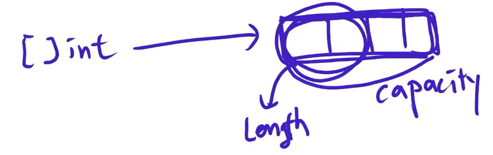
- a:= make([]int , 3, 8)의 의미는 동적배열은 capacity라고 미리 공간을 실제로도 추가될때 딱 그 크기에 맞춰서 늘어나는게 아니고 적절하게 좀더 많이 추가가 되는데 이것을 capacity이고 실제로 사용자가 사용하는 공간 Length라고 한다. 
- 위처럼 구현을 했다면 8개의 공간을 가졌지만 3개까지 사용하고 추가로 더 늘어나면 8개까지 쓸수 있는것이고 그이상이되면 또 공간을 늘려주는식으로 동작한다. 
## 실습  
-   ***var a []int**
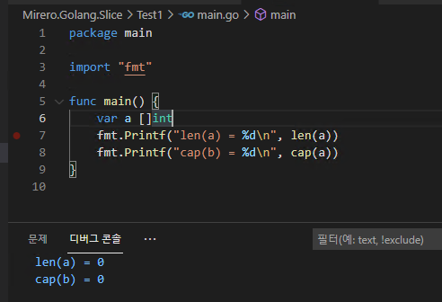
- **a := []int{1, 2, 3, 4, 5}**
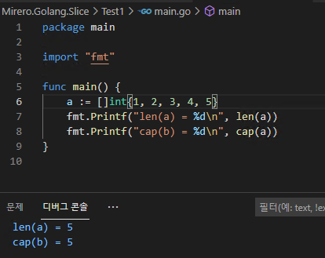
- **a := make([]int, 0, 8)**
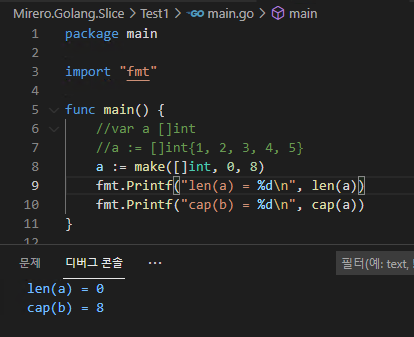
## 슬라이스 추가법
```go
a := []int{}
a = append(a,1)
```
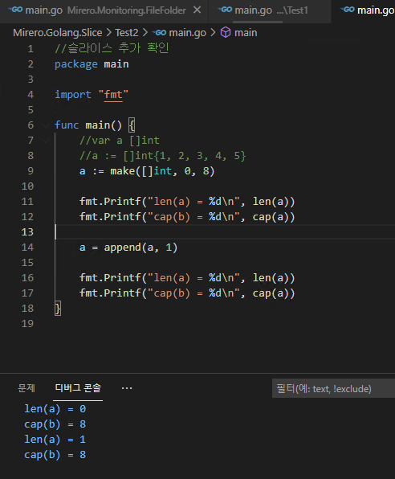
## append 추가시 서로 다른 슬라이스
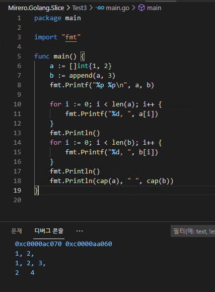
## 같은 슬라이스인 경우 
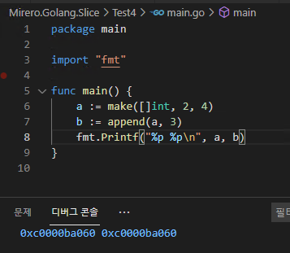
- 공간이 넉넉하면 같은 공간을 쓰고 그게 아니면 다른 메모리를 사용해서 추가한다.
## 주의  
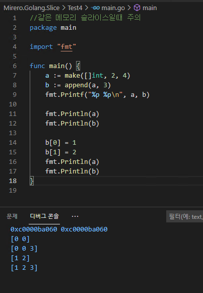
- 위에처럼 당연한 결과가 나온다 이유는 같은 메모리에 있기 때문에  바뀌는것이다.
- 진짜 개발할때 주의해야함 
## 슬라이스 자르기  
```go
a :=[]int{1,2,3,4,5,...10}

a[4:8] // a[StartIdx : End Idx]
// 결과는 [5,6,7,8]이 나온다.
```
## 부분 자르기
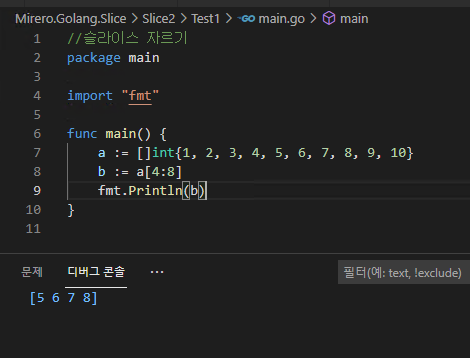
## 시작 위치만 지정하기  
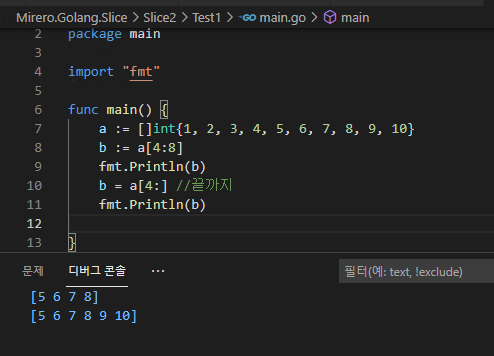
## 끝위치만 지정하기  
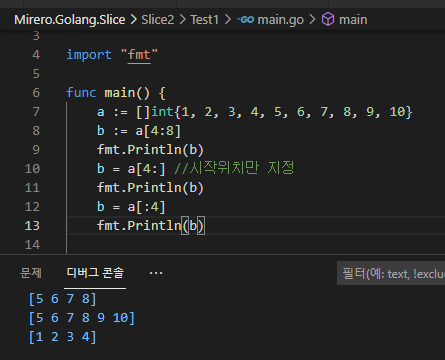

## Slice와 Instance  
## Slice

- Slice도 struct이다 데이터 Pointer *, len int, cap int로 구성되어 있음
- Slice는 3개의 properties를 가짐 
  - pointer : 시작 주소
  - lend : 개수
  - cap : 최대 개수

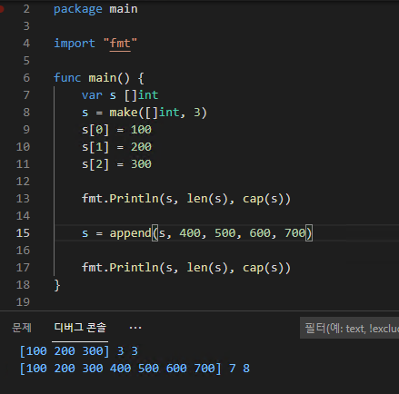

- pointer는 메모리 주소 번지 값으로 갖는 변수

## 왜 저렇게 되는지 정확히 이해를 해야함

``` go 
package main

import "fmt"

func main() {

	var s []int

	s = make([]int, 3)

	s[0] = 100
	s[1] = 200
	s[2] = 300

	var t []int
	t = append(s, 400)
	fmt.Println(s, len(s), cap(s))
	fmt.Println(t, len(t), cap(t))

	fmt.Println("///////////")
	var u []int
	u = append(t, 500)
	fmt.Println(s, len(s), cap(s))
	fmt.Println(t, len(t), cap(t))
	fmt.Println(u, len(u), cap(u))

	u[0] = 9999

	fmt.Println("///////////")
	fmt.Println(s, len(s), cap(s))
	fmt.Println(t, len(t), cap(t))
	fmt.Println(u, len(u), cap(u))

}
```
## 과정  
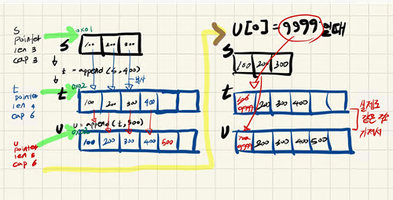
## 결과  
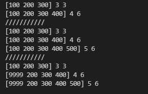
## Instance 
## 값타입 assign
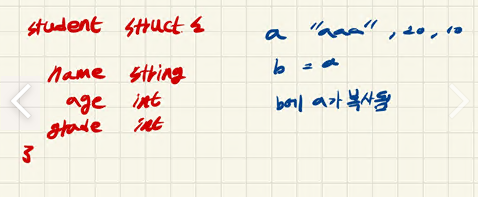
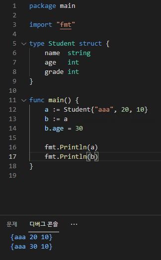
- 여기서 보면 b의 age만 바뀌었는데 이것을 value type 값타입이라고 한다.
## 주소타입 assign  
- 이것을 var b *Student, b=&a 이면 값이 어떻게 될까?
  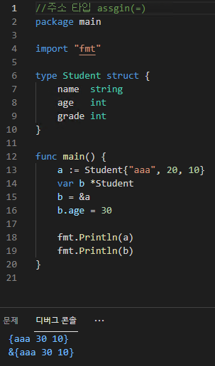
  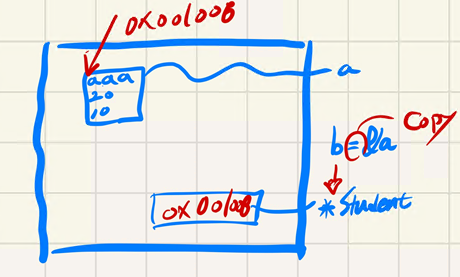
- b가 a를 가리키고 있다.이런 형태를 reference type이라고 함 \
```go
package main

import "fmt"

type Student struct {
	name  string
	age   int
	grade int
}

// func SetName(t Student, newName string) {////값 타입 assgin(=)

// 	t.name = newName
// }
func SetName(t *Student, newName string) { ////주소 타입 assgin(=)

	t.name = newName
}
func main() {
	a := Student{"aaa", 20, 10}
	SetName(&a, "bbb")
	fmt.Println(a)
}
```
- 값에의한 전달과 주소에 의한 전달을 잘 구분해야한다. 
```go
//값 타입 결과 
{aaa 20 10}
//주소 타입 결과
{bbb 20 10}
```
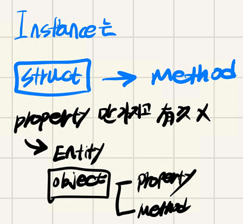
- golang의 struct는 property만 가진게 아니고 즉 오브젝트와 같이 메소드 기능도 가짐

```go
func SetName(t *Student, newName string) { ////주소 타입 assgin(=)

	t.name = newName
}
func (t *Student)SetName(newName string) { ////주소 타입 assgin(=)

	t.name = newName
}
//기능은 같지만 사실상 struct에 속한 기능이됨
```
```go
//값 주소 전달 테스트
package main

import "fmt"

type Student struct {
	name  string
	age   int
	grade int
}
// func SetName(t Student, newName string) {////값 타입 assgin(=)

// 	t.name = newName
// }
func (t *Student) SetName(newName string) { ////주소 타입 assgin(=)

	t.name = newName
}
func main() {
	a := Student{"aaa", 20, 10}
	//SetName(&a, "bbb")
	a.SetName("bbb")
	fmt.Println(a)
}
```
- SetName(&a, "bbb"), a.SetName("bbb")  사실 이두개의 기능적인 차이는 없지만 후자가 oop에 가깝다.
- SetName(&a, "bbb") // procedure (프로시져 방식) : 절차가 중요했다.
- a.SetName("bbb")// OOP (object[property + Method]가 중요하다.)
  - object가 되니 subject와 verb가 생기기 시작 , object 가 되는데 
  - 주어와 목적어 사이의 관계(Verb = Relationship)이 생김
## OOP
- 성적 프로그램을 예로 들면 
  - Teacher Input Student //  선생님 성적을 입력한다 학생의 .. 이런 관계가 생김
- 프로시져는 기능이 먼저라 Input 먼저 ( Teacher, Student) (기능이 먼저 였음)
- oop에서는 주체가 먼저 온다. 누가  
- 무엇을 할것인지 액션 ( 관계 )
- 누구와 관계를 맺을 것인지 (object)
- 즉, object와object의 관계가 중요해진것이 되었다. 
- ER(Entity - RelationShip)이것이 프로그램의 전부 
```go
a.SetName()
// a를 Instance라고 함 (인스턴스는 생명주기의 표현)
```