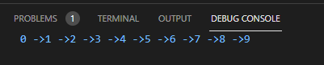

# # 2021년 07월15일  Linked List  
- Linked : 연결된 
- List : 나열하다. 
- 배열을 붙어있고 링크드 리스트는 떨어져있는 것이 연결되어 있다. 
- 연결 방법은 포인터로 연결   

## Linked List 구현하기 첫 번째 방법  
```go
//Linked List 만들기 
package main

import "fmt"

type Node struct {
	next *Node
	val  int
}

func main() {
	var root *Node
	root = &Node{val: 0}
	for i := 1; i < 10; i++ {
		AddNode(root, i)
	}

	node := root
	for node.next != nil {
		fmt.Printf("%d ->", node.val)
		node = node.next
	}
	fmt.Printf("%d\n", node.val)
}
func AddNode(root *Node, val int) {
	var tail *Node
	tail = root
	for tail.next != nil {
		tail = tail.next
	}

	node := &Node{val: val}
	tail.next = node
}
```

## Linked List 구현하기 두 번째 방법  
```go
//Linked List 만들기
package main

import "fmt"

type Node struct {
	next *Node
	val  int
}

func main() {
	var root *Node
	var tail *Node
	root = &Node{val: 0}
	tail = root

	for i := 1; i < 10; i++ {
		tail = AddNode(tail, i)
	}

	node := root
	for node.next != nil {
		fmt.Printf("%d ->", node.val)
		node = node.next
	}
	fmt.Printf("%d\n", node.val)
}
func AddNode(tail *Node, val int) *Node {
	node := &Node{val: val}
	tail.next = node
	return node
}
````
## RemoveNode  
```go
//Linked List 제거하는것 만들기
//시간 복잡도 O(1)
package main

import "fmt"

type Node struct {
	next *Node
	val  int
}

func main() {
	var root *Node
	var tail *Node
	root = &Node{val: 0}
	tail = root

	for i := 1; i < 10; i++ {
		tail = AddNode(tail, i)
	}

	PrintNode(root)
	root, tail = RemoveNode(root.next, root, tail) //1지우기
	PrintNode(root)
	root, tail = RemoveNode(root, root, tail) //0 지우기 root 값 지우기
	PrintNode(root)
	root, tail = RemoveNode(tail, root, tail) //9 지우기 tail 값 지우기
	PrintNode(root)
}
func AddNode(tail *Node, val int) *Node {
	node := &Node{val: val}
	tail.next = node
	return node
}

func RemoveNode(node *Node, root *Node, tail *Node) (*Node, *Node) {
	if node == root {
		root = root.next
		if root == nil {
			tail = nil
		}
		return root, tail
	}
	prev := root
	for prev.next != node {
		prev = prev.next
	}
	if node == tail {
		prev.next = nil
		tail = prev
	} else {
		prev.next = prev.next.next
	}
	return root, tail
}

func PrintNode(node *Node) {
	for node.next != nil {
		fmt.Printf("%d ->", node.val)
		node = node.next
	}
	fmt.Printf("%d\n", node.val)
}
```
- 지워주고 연결을 해주는식으로 진행을 한다. 
- 지워줄때는 100만개면 100만번 해야하고 6번째 있으면 6번 해야하고 즉 O(N)의 시간 복잡도