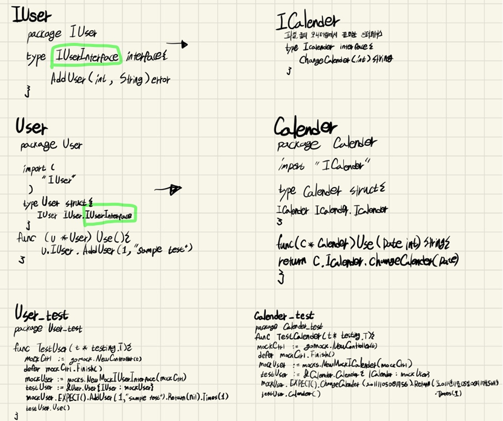
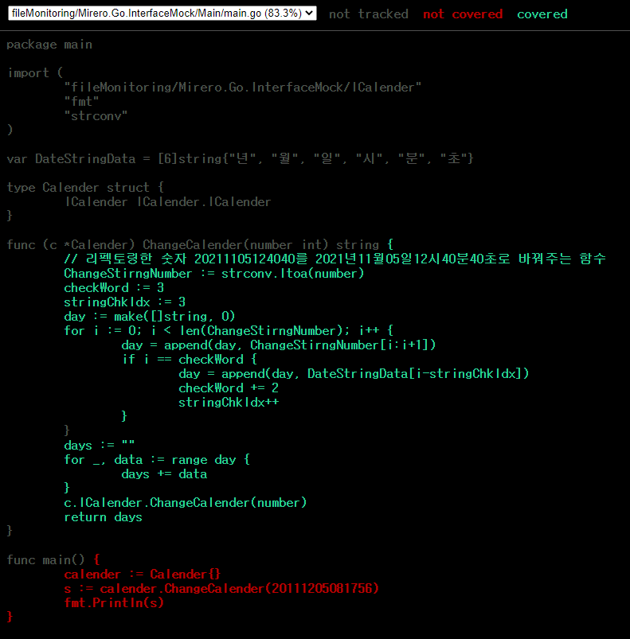

## 2021년 07월16일 Interface mock만들어 test확인하기  
## ICalender.go  
```go
package ICalender

type ICalender interface {
	ChangeCalender(int) string
}
```
## Calender.go
```go
package Calender

import (
	"fileMonitoring/Mirero.Go.InterfaceMock/ICalender"
)

type Calender struct {
	ICalender ICalender.ICalender
}

func (c *Calender) Use(date int) string {
	return c.ICalender.ChangeCalender(date)
}
```
```
mockgen -destination=mocks/mockRunner.go -package=mocks fileMonitoring/Mirero.Go.InterfaceMock/ICalender ICalender
```
- 이렇게 진행을 하면 mocks폴더가 생성되고 mockRunner.go가 만들어진다.

## Main문에 적용하기  
## main.go  
```go
package main

import (
	"fileMonitoring/Mirero.Go.InterfaceMock/ICalender"
	"fmt"
	"strconv"
)

var DateStringData = [6]string{"년", "월", "일", "시", "분", "초"}

type Calender struct {
	ICalender ICalender.ICalender
}

func (c *Calender) ChangeCalender(number int) string {
	// 리펙토링한 숫자 20211105124040를 2021년11월05일12시40분40초로 바꿔주는 함수
	ChangeStirngNumber := strconv.Itoa(number)
	checkWord := 3
	stringChkIdx := 3
	day := make([]string, 0)
	for i := 0; i < len(ChangeStirngNumber); i++ {
		day = append(day, ChangeStirngNumber[i:i+1])
		if i == checkWord {
			day = append(day, DateStringData[i-stringChkIdx])
			checkWord += 2
			stringChkIdx++
		}
	}
	days := ""
	for _, data := range day {
		days += data
	}
	c.ICalender.ChangeCalender(number)
	return days
}

func main() {
	calender := Calender{}
	s := calender.ChangeCalender(20111205081756)
	fmt.Println(s)
}
```
## main_test.go  

```go
package main

import (
	"fileMonitoring/Mirero.Go.InterfaceMock/mocks"

	"testing"

	"github.com/golang/mock/gomock"
	"github.com/stretchr/testify/assert"
)

func TestChangeCalender(t *testing.T) {
	assert := assert.New(t)
	mockCtrl := gomock.NewController(t)
	defer mockCtrl.Finish()
	mockCalender := mocks.NewMockICalender(mockCtrl)
	mockCalender.EXPECT().ChangeCalender(20111105081756)
	testCalender := &Calender{ICalender: mockCalender}
	s := testCalender.ChangeCalender(20111105081756)
	assert.Equal("2011년11월05일08시17분56초", s)
}
```
- 대략 매개변수가 제대로 들어갔는지 확인
- 리턴하는 값이 맞는지 확인 

- 실습 결과 매게변수가 잘들어갔는지 파악하거나 리턴값 확인시 사용 할 수 있을 것 같다.

## 테스트 코드  

 [Mirero.Go.InterfaceMock.zip](Mirero.Go.InterfaceMock.zip) 
