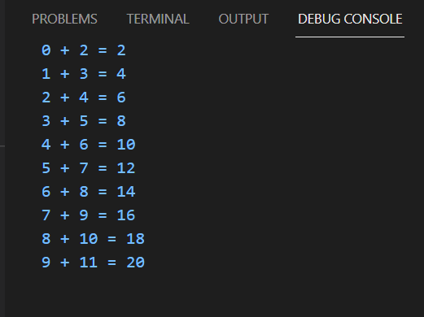
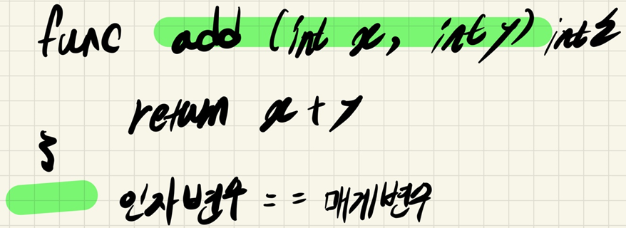
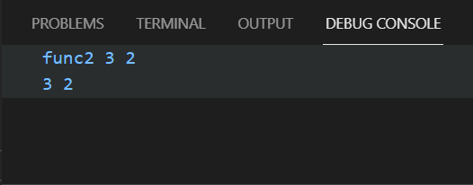
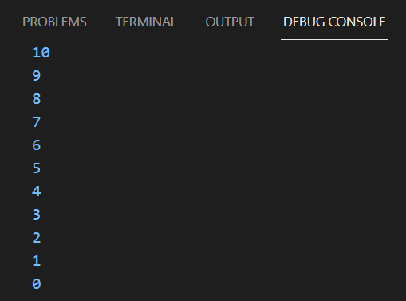
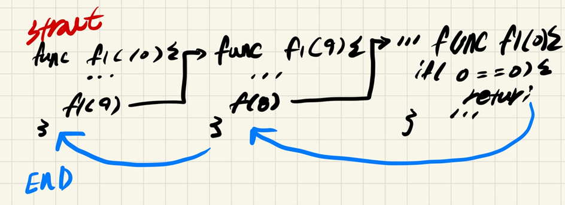
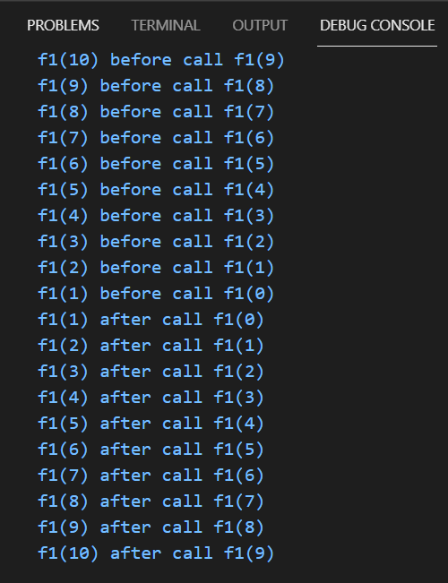
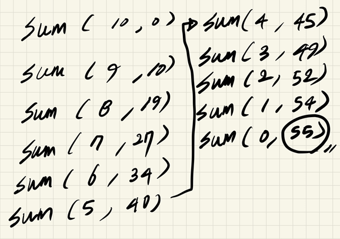
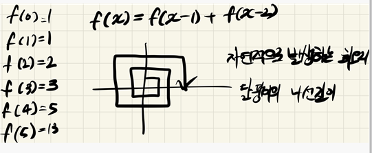
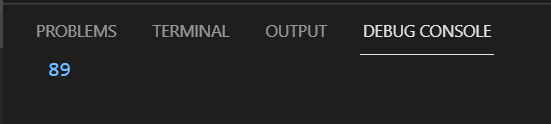

# 2021년 07월18일 함수
## 함수  
- 기능을 모아놓음  
- 반복기능있을 때 호출(call)하여 사용  
- return == output
- 함수는 모듈 이다
- 프로그래머 -> 자동화 (반복작업 하면 안됨)
## 함수의 기능  
- 모듈화  
- 분리  
## Test1  
```go
package main

import "fmt"

func add(x int, y int) int {
	return x + y
}

func main() {
	for i := 0; i < 10; i++ {
		fmt.Printf("%d + %d = %d\n", i, i+2, add(i, i+2))
	}
```



- 여기서는 값에 의한 복사가 되는 경우이다. 
##  Test2   

```go
package main

import "fmt"

func main() {
	a, b := func1(2, 3)
	fmt.Println(a, b)
	func2(a, b)
}

//함수에서 두개 이상의 인자를 한번에 리턴할 수 있다.
func func1(x, y int) (int, int) {
	return y, x
}

//함수는 함수를 호출할 수 있다.
func func2(x, y int) {
	func3(x, y)
}
func func3(x, y int) {
	fmt.Println("func2", x, y)
}
```

## 재귀 호출 (Recursive call)
``` go
func f1(){
  f1()
}
```
- 이런식으로 자기 자신을 호출 
- 위의 경우는 무한 호출인데 무한 호출을 염두하는 탈출 조건이 필요 
```
func f1 (x int){
	if x ==0 { //탈출 조건
		return;
	}
	f1( x-1 )
}
```
- 위와 같이 구성이 된다. 
## Test3  

```go
package main

import "fmt"

func main() {
	f1(10)
}

func f1(x int) {
	fmt.Println(x)
	if x == 0 {
		return
	}
	f1(x - 1)
}
```

## 동작 방식  

## Test4  
```go 
//재귀 동작확인
package main

import "fmt"

func main() {
	f1(10)
}

func f1(x int) {
	if x == 0 {
		return
	}
	fmt.Printf("f1(%d) before call f1(%d)\n", x, x-1)
	f1(x - 1)
	fmt.Printf("f1(%d) after call f1(%d)\n", x, x-1)

}
```

## Test5 - 재귀호출 1 ~ 10 합계 출력  
```go
package main

import (
	"fmt"
)

func main() {
	s := sum(10, 0)
	fmt.Println(s)
}
func sum(x, s int) int {
	if x == 0 {
		return s
	}
	s += x
	return sum(x-1, s)
}
```

- 결과 : 55 


- 계속 의식하면서 그려야 이해가 된다. 
- 반복 수행한다. 
- 모든 재귀호출은 반복문으로 바꿀수 있다. 

##  Test6 - 재귀를 반복문으로  
```go  
package main

import "fmt"

func main() {
	s := 0
	for i := 10; i >= 0; {
		s += i
		i--
	}
	fmt.Println(s)
}
```

## Test7 - 피보나치 수열  
```go
package main

import "fmt"

func main() {
	rst := f(10)
	fmt.Println(rst)
}
func f(x int) int {
	if x == 0 {
		return 1
	}
	if x == 1 {
		return 1
	}
	return f(x-1) + f(x-2)
}
```

## 재귀가 쉬운것  
- 피보나치 수열  
- 수학 정의 를 재귀호출 정의로 많이 사용  
## 단점
- 어렵고 느리다.
## 결론 함수는 ?
- 기능을 모아 놓은것 
- 모듈화 , 분리(Decoupling)
- 함수는 call 호출 -> 인자기록 -> IP( 함수 시작점) -> return 
### 응집도 높이고 종속성 낮추는것이 좋고 유연한 코드 인데 이것을 잘하는것이 중요
- 그 중의 하나가 함수이다. 