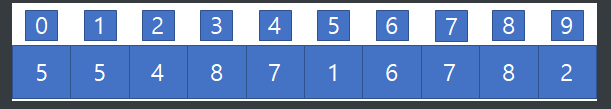
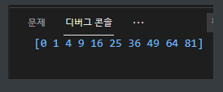
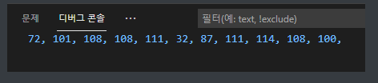
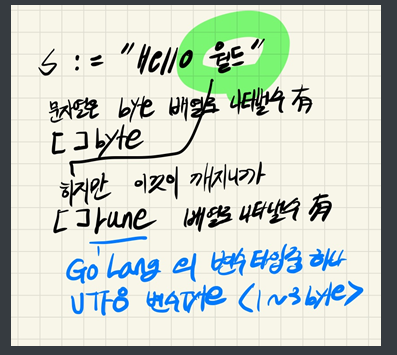

## 2021년 07월19일  Go Lang - 배열과 문자열  
- 배열 , Array 
- 배열은
  
  - A[0] == 5
  - A[1]== 5 
  ## 배열 선언 방법   
  ```go
  var A [10]int //10개 짜리 배열이 생성됨
  
  A := [10]int{1,2,3}
  
  A := [10]int{}
  ```
  - 따로 초기화 하지 않으면 0으로 초기화됨
  ## Test1
  ```go
  package main
  
  import "fmt"
  
  func main() {
  	var A [10]int
  
  	for i := 0; i < 10; i++ {
  		A[i] = i * i
  	}
  	fmt.Println(A)
  }
  ```

## String 문자열   
```go
s := "Hello world"
```
- [11]byte, 문자열은 11개의 바이트를 가진 배열
- ACCⅡ 는 1byte, go언어는 UTF8 문자길이 1 ~ 3 byte
## Test2  
```go
package main

import "fmt"

func main() {
	s := "Hello World"
	for i := 0; i < len(s); i++ {
		fmt.Print(s[i], ", ")
	}
}
```


- 저렇게 나오는 것은 문자은 0~255의  숫자를 가지고 있어서 저렇게 나옴 
- ​		fmt.Print(string(s[i]), ", ") 으로 해주면 문자로 찍힌다.

즉, 배열은 메모리

- 길이 : 항목길이 X 갯수  
- [10]int32 이것의 경우 10 * 4byte = 40byte이다.

##  Test3 - 한글 룬배열로 만들기  


```go
package main

import "fmt"

func main() {
	s := "Hello 월드"
	fmt.Println("바이트 일경우 len(s2) = ", len(s))
	for i := 0; i < len(s); i++ {
		//fmt.Print(s2[i], ", ")
		fmt.Print(string(s[i]), ", ")
	}
	fmt.Println()
	s2 := []rune(s)
	fmt.Println("룬 일경우 len(s2) = ", len(s2))
	for i := 0; i < len(s2); i++ {
		//fmt.Print(s2[i], ", ")
		fmt.Print(string(s2[i]), ", ")
	}
}

```
- 바이트 경우 한글이 제대로 출력되지 않지만 룬의 경우 제대로 출력이 된다.