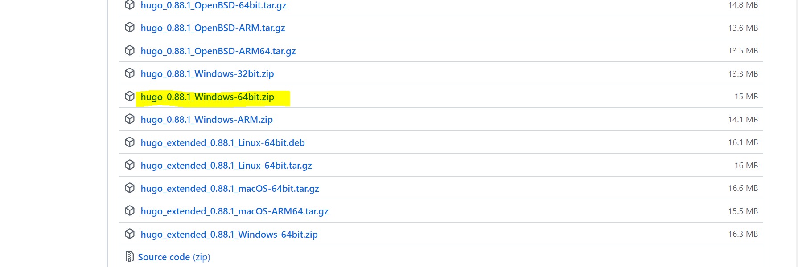

## 2021.09.19_Hugo설치

## 휴고 설치

[휴고설치 링크](https://github.com/gohugoio/hugo/releases)

- 위의 링크를 누름



- 위를 눌러서 다운해서 압축을 풀면 아래와 같은 파일이 있음
- 압축해제 할때 특정 위치에 해도됨
  - C:\temp\hugo


- 여기서 hugo 응용프로그램을 눌러서 설치

## 시스템 환경 변수 설정

- 시작 메뉴를 클릭해서 환경 변수 입력 후 클릭


- 계정의 환경 변수 편집 클릭


## 휴고 환경 설정 및 동작확인


```shell
hugo version
```

- version이 나오게 되면 환경 설정이 제대로 된것이다.

## Hugo 프로젝트 생성

- Hugo 프로젝트 생성할 경로 이동