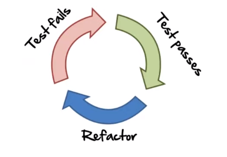
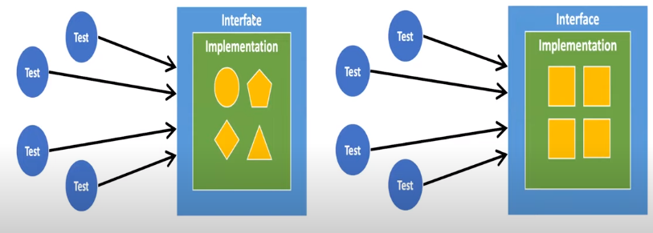
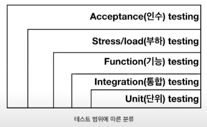

## 2021년 07월16일 TDD란 무엇?  
### TDD (Test-Driven Development)
- 테스트 코드를 먼저 만들고, 실제 프로덕션 코드를 나중에 만드는 개발 방법
- 손을 떼라
- 생각하지 말고 구현하는것 프로세스면에서 막아줌
## 기존 개발 프로세스  

## TDD 프로세스  

## Red, Green, Refactor

- Red : 실패하는 테스트를 구현
- Green : 테스트가 성공하도록 프로덕션 코드 구현
- Refactor : 프로덕션 코드와 테스트코드를 리팩토링
### 장점  
- 인지 못한 버그 테스트가 찾아줄 수 있다.
- 혼자 코딩을 해도 동료가 있는것 같다 
  - 내가 해야하는 일을 검증해줘서 확인할 수 있는 판단 내릴 수 있음
  - 오버엔지니어링을 막아줄 수 있음 (언제 멈춰야 하는지 알려줌)
    - 요구사항에 맞춰서 구현이 된다.
    - 기준이 있어서 할 것만 할 수 있다. (테스트 코드를 먼저 구현해서)
  - 내가 쓴 코드를 보고 어떤일을 할 수 있는지 알 수 있다(동료가 되든 과거의 자신이던지)
- 변화에 대한 두려움을 줄여준다.
- 디버깅 시간을 줄여준다.
- 동작하는 문서 역할을 한다.
- TDD하면 Test Coverage가 높아진다. (미루는것을 방지)
- 설계에 대한 피드백이 빠르다.
### 단점  
- 시간 오래걸린다. 
- TDD 했는데 버그가 발생하는것은 똑같다. 
  - TDD가 모든 일을 해결해주지 않는다. 즉, 모든 버그를 막아주는것은 아니다.
### TDD == 익스트림 프로그래밍(xp)??
- 절대 익스트림하지 않는다.
- 불안함 대신 지루함을 안겨주는 마법의 돌이다.

- 점이있는 곳을 예측하기 힘들고 알기 어렵지만 개발 비용을 줄일 수 있음
## TDD는 설계 방법론이다?
- 높은 응집을 유도하지 않음
- 단일 책임 원치과 인터페이스 분리 원칙 위배에 어떤 신호도 주지 않음
- 인터페이스 일관성을 도출하지 않음
- 리팩토링 단계는 좋은 구조를 안내하거나 좋은 구조를 갖도록 강제 하지 않음
## 주의할점 
- 테스트하기만 좋은 코드를 만들게 된다면,
결국 안 좋은 설계가 만들어진다.
## 실패하는 사람이 하는 테스트 
- 코드가 이루고자 하는 가치나 기능을 테스트하기 보다  그 기능을 어떻게 구현하고 있는지 테스트
- 결국 테스트 케이스들이 구현체와 결합도가 높아짐
- 구현체들을 리팩토링하면 결합되어 있는 테스트 케이스들이 모두 깨짐

- 즉, 구현체를 테스트하면 안되고 인터페이스를 테스트 해야한다.
`출처 : [OKKYCON:2018]이규원 - 당신들이 TDD가 실패하는 이유`
## 테스트의 범위

- 통합 테스트 : 여러 작업 단위가 연계된 워크플로우를 테스트 하기 위한 수단
(객체 간, 서비스 간 , 시스템 간)
-  기능 테스트 : 공개된 API의 가장 바깥쪽에 해당하는 코드 검
(Controller 호출, Security, http)
- 부하 테스트 : 주어진 단위 시간 동안 애플리케이션이 얼마나 많은 요청을 처리 할 수 있는지 검사
- 인수 테스트 : 고객 또는 대리인이 정의되어진 모든 목적에 부합되는지 확인해보고자 하는 검사  
## 단위 테스트  
- 가장 작은 단위의 테스트
- 일반적으로 메서드 레벨
- 검증이 필요한 코드에 대해 테스트 케이스를 작성하는 절차 또는 프로세스
- Unit Testing은 테스트 코드가 목적 코드의 완전성을 입증 해주기 때문에, 테스트 코드 그 자체만으로 주요한 가치가 있음
## 단위 테스트 목적
- 문제점 발견  (프로그램 안정성 확보)
- 쉬운 변경( 코드를 고치더라도 문제 파악과 어떻게 동작하는지 알기 때문에 쉽게 변경 가능) 
- 품질 향상 
- 코드의 문서화 (샘플코드 , 예외 상황, 용도, 의존 관계를 한눈에 파악할 수 있음 )
- 또한, 단위 테스트는 배포되는 코드와 일치 하므로 항상 최신 상태로 유지된다는 이점도 있음
## 좋은 단위 테스트를 위한  F.I.R.S.T 법칙
### F 
- Fast(빠르게) , 테스트는 빨라야 문제를 빨리 찾고 코드 품질을 올림
### I
- Independent(독립적으로), 테스트는 서로 의존하면 안된다. 하나실패하면 다 실패하고 원인 진단이 어렵다.
### R 
- Repeatable(반복 가능하게), 어떤환경에서든 반복이 되어야한다. 
### S 
- Self-Validating(자가 검증하는), Boolean으로 결과를 내야한다. 성공아니면 실패를 내지 않으면 보는 사람이 평가하니 수작업이 된다.
### T
- Timely(적시에), 실제코드 구현전에 작성을 해야한다.  그렇지 않으면 실제 코드가 테스트 하기 어렵다는 사실을 뒤늦게 발견함
