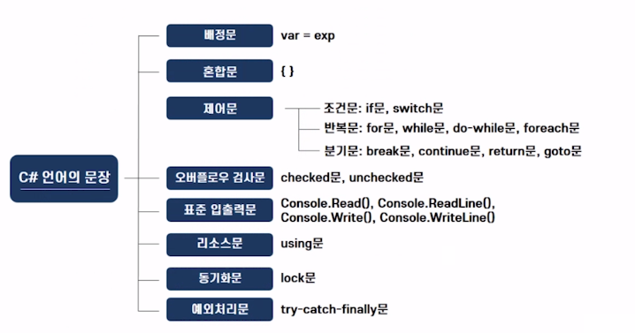
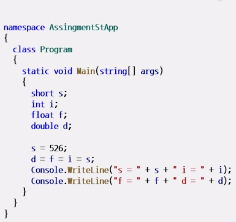
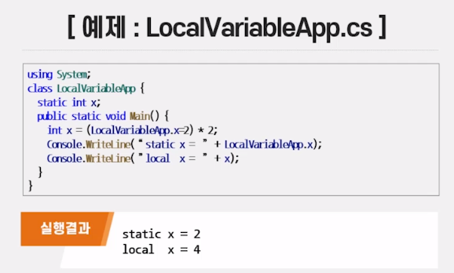
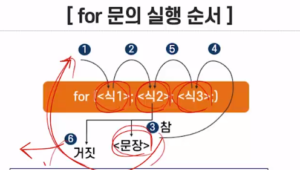
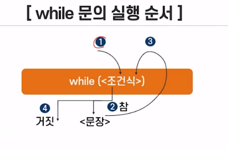
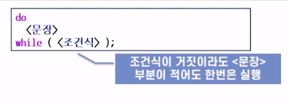
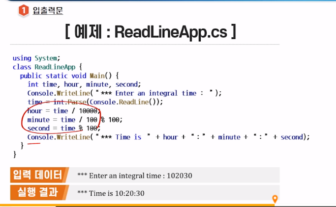
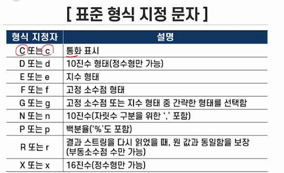
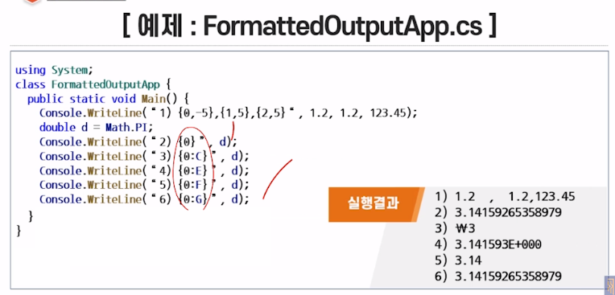

## 2021년 06월16일 C# 문장  
## 오늘의 Point  
##  알고리즘   
```
실세계에 존재하는 문제를 논리적으로 해결하기 위한 과정 

이를 컴퓨터가 해결하기 위해서는 프로그래밍 언어 문자으로 기술 해야한다.
```
## C# 제공 문장  
```
배정문, 혼합문, 제어문, 오버플로우 검사문, 표준 입출력문, 리소스문
동기화문, 예외 처리문
```
## 학습 목표   
```
- C# 언어의 문장의 종류를 이해하고 설명할 수 있음
- 배정문, 혼합문, 제어문을 효율적으로 구현할 수 있음
- 표준 입출력을 효율적으로 구현할 수 있음
```
## 문장의 종류  
## 1. 개요  
```
배정문, 혼합문, 제어문, 오버플로우 검사문, 표준 입출력문, 리소스문
동기화문, 예외 처리문 이렇게 가지고 있다.
```

## 배정문과 혼합물  
## 배정문  
```
값을 변수에 저장하는데 사용 한다.

<변수> = <식>; 형태는 C와 같다. 

a = b = exp;
좌측부분이 여러 번 나오는 경우 exp가 먼저 연산되어 그 결과가 b에 할당되고
다시 b값이 a에 할당됨 

변수의 초기값을 주는 데 유용함 

예시)
remainder = dividend % divisor;
i = j= k= 0;
var op = exp;
```
## 형변환   
```
1. 묵시적 형 변환 : 컴파일러에 의해 자동으로 변환
2. 명시적 형 변환 : 프로그래머가 캐스트(Cast) 연산자를 사용하여 변형해야함 
```

```
위에 경우에는 대게 다운 캐스트 또는 업 캐스트가 진행되는데 
대게 넓은 쪽으로 형이 변환이 된다. 그런것은 당연하듯이 
좁은 곳에 큰것을 못넣기 때문에 작은 것은 큰것에 넣는 이치
```
## 혼합문  
```
여러 문장을 한데 묶어 하나의 문장으로 나타냄  주로 문장의 범위를 표시
{<선언> 또는 <문장> }

if (a>b) a--; b++;
if (a>b) {a--; b++;}
```

## 지역 변수  
```
1. 블록의 내부에서 선언된 변수 
2. 선언된 블록 안에서만 참조 가능
```
## 제어문  
```
프로그램의 실행 순서를 바꾸는 데 사용 
```
## 실행 순서를 제어하는 방법  
```
[조건문]
if문, switch 문
[반복문]
for문, while문, do-while문, foreach문
[분기문]
break문, continue문, return문, goto문
```
## 조건문  
```
주어진 조건에 따라 수행되는 부분이 다를때 사용하는 문장 

if 문의 형태
if (<조건식>) <문장>
if (<조건식>) <문장1> else <문장2>

조건식의 연산결과 
논리형 (true of false)
```
## if문과 switch문  
```
if문: 조건식의 결과에 따라 참일 때 실행하는 부분과 거짓일때 실행할 부분
switch문: 조건에 따라 여러 경우로 나누어 각각을 처리해야 되는 경우
```
## switch문의 형태  
```
switch(<식>){ //정수 상수로 표현해야함 
	case<상수식1>:<문장1> break;
	case<상수식2>:<문장2> break;
	...
	default: <문장> break;
}

- 여기서, default의 의미는 otherwise
- 반드시, break문을 사용하여 탈출(단, C/C++에서는 붙이지 않아도 됨)
```
## 반복문  
```
프로그램의 일정한 부분을 주어진 조건이 만족될 때까지 반복해서 실행하는 문장
```
## for문   
```
정해진 횟수만큼 일련의 문장을 반복 실행 
일반적으로 가장 널리 사용되는 반복문

for문의 형태 
for (<식1> : <식2> : <식3>){
}
<식1>: 제어변수 초기화 
<식2>: 제어변수를 검사하는 조건식
<식3>: 제어변수의 값을 수정
<문장>: 루프몸체, <식2>의 조건식이 참인 동안 반복 실행되는 부분
```


## while문  
```
주어진 조건식이 참인 경우에만 프로그램의 일정한 부분을 반복해서 실행하는 반복문
```
## while문의 형태  
```
while (조건식)
	<문장>
	
i = 1; s = 0;
while(i<=N){
	s += i;
	++i;
}
```

## do-while문  
```
반복되는 문장을 먼저 한 번 실행 한 후에 조건식을 검사하여 
참이면 계속 반복, 거짓이면 반복 종료
```

## foreach문  
```
조건식을 검사하는 반복문과는 달리 데이터의 집합에 대한 반복을 수행

데이터의 집합을 구성하는 원소를 순차적으로 처리할 때 유용
```
## foreach문의 형태  
```
foreach (자료형 변수명 in 데이터의 집합)
	<문장>
	
예)
foreach ( stirng s in color )
	Console.WriteLine(s);
```
## 분기문  
```
지정된 곳으로 제어를 옮기는 역할
```
## break문  
```
반복문에서 현재의 실행을 멈추고 자기를 감싸고 있는 블록 밖으로 제어를 옮기는 역할
break; 로 형태로 쓰인다. 
그냥 어디서든 빠져나오고 싶을때
```
## continue문  
```
다음 반복이 시작되는 곳으로 제어를 옮기는 기능  
continue; 
반복문 쪽으로 다시 올라가서 반복문을 수행한다.
```
## goto문  
```
지정된 위치로 제어 흐름을 이동하는 문장 
Label

형태:
goto label;

goto case constant-expression;
goto default;

레이블: 지정된 위치를 나타내기 위한 방법으로 명칭 형태

이것이 분기할 수 없는 이유 
1. 외부에서 복합문 안으로 분기
2. 메소드 내에서 외부로 분기
3. finally블록에서 블록 밖으로 분기
```
## return문  
```
메소드의 실행을 종료하고 호출한 메소드(caller)에게 제어를 넘겨주는 문장 

형태:
return;
return <식>;
```
## 오버플로우 검사문과 표준 입출력  
## 오버플로우란  
```
정수식 연산의 결과가 정수형이 표현할 수 있는 범위를 넘어가는것

잘못된 계산 결과를 초래할 수 있음 
정수식에서 오버플로우가 일어나는 지를 명시적으로 검사하여 처리하는 것이 바람직
```
## checked문  
```
오버플로우를 명시적으로 검사하는 문장 
System 네임스페이스에 있는 OverflowException 예외가 발생 

형태:
checked{
	//오버플로우가 발생하는지를 확인하려는 문장
}
수식 checked문의 형태 :
checked(오버플로우가 발생하는지를 확인하려는 수식)
```
## unchecked문  
```
오버플로우를 의도적으로 검사하지 않을 경우 
형태는 checked 문과 비슷
```
## 입출력문  
```
1. 입출력 : 입력과 출력 
2. 입력 : 외부 입력 장치로부터 데이터를 프로그램으로 읽어 들이는 행위  
3. 출력: 프로그램상의 어떤 값을 출력 장치로 내보내는 행위
```
## 입출력문의 의미  
```
- 입출력 장치가 미리 정해진 입출력을 의미 
- C# 언어의 기본 네임스페이스인 System으로부터 제공 
```
## 표준 입력 메소드  
```
1. Console.Read() 
- 키보드로부터 한개의 문자를 읽어 그 문자의 코드값을 정수형으로 반환하는 기능
2. console.ReadLine()
- 한라인을 읽어 string형으로 반환하는 기능
- 숫자 값으로 바꿔야 하는데 정수인 경우 
int.Parse() 메소드 사용
```
## 표준 출력 메소드  
```
1. Consol.Write() 
- 화면에 매개 변수의 값을 출력
2. Consol.WriteLine()
- 화면에 매개 변수의 값을 출력한 후 다음 라인으로 출력 위치를 이동
```

## 형식화된 출력  
```
출력하려는 값에 형식을 명시하여 원하는 형태로 출력하는 것 

출력 포맷의 형태  
{N,[ ,W][:formatCharacter]}
-N : 매개변수를 위치적으로 지칭하는 정수 (단 0부터 시작)
-W : 출력될 자리수의 폭을 나타내며 선택으로 명시 '-' 기호를 붙이면 좌측정렬로 출력
-formatCharacter : 한문자로 이루어진 형식 지정 문자를 의미 
```
## 형식 지정 스트링  
```
매개 변수의 개수와 일치하는 출력 포맷
```



