## 2021년 06월17일 C# 클래스  
## 클래스  
```
C# 프로그램 구성 기본 단위 
재 사용성, 이식성, 유연성 증가 
객체를 정의하는 탬플릿 - 객체의 구조와 행위를 정의하는 방법
자료 추상화의 방법 
```
## 객체  
```
유형적(사물), 무형적인(개념, 논리) 것들 
프로그래밍에서의 객체는 클래스에 정의된 내용이 메모리에 생성된 것
```
## 학습 목표  
```
1. 클래스와 객체를 이해하고 설명할 수 있다. 
2. 필드, 메소드, 프로퍼티를 이해하고 구현할 수 있다.
3. 인덱서, 델리게이트, 이벤트를 이해하고 구현할 수 있다. 
4. 연산자 중복과 구조체를 이해하고 구현할 수 있다.
```
## 클래스  
```
1. C# 프로그래밍의 기본단위 - 재사용성, 이식성, 유연성 증가 
2. 객체를 정의하는 탬플릿 - 객체의 구조와 행위를 정의하는 방법
3. 자료 추상화의 방법 
```
## 클래스의 구조  
```
속성: 필드
행위: 메소드 
이외에 상수와 프로퍼티, 인덱서, 연산자 중복, 이벤트 클래스형이나 
델리게이트형과 같은 자료형이 클래스 안에 포함 될 수 있음
```
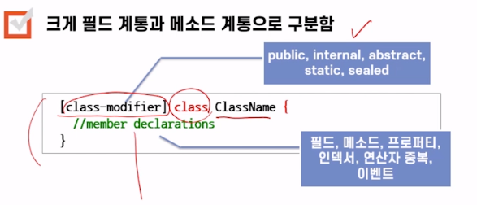
## 수정자(Modifier)  
```
부가적인 속성을 명시하는 방법 
```
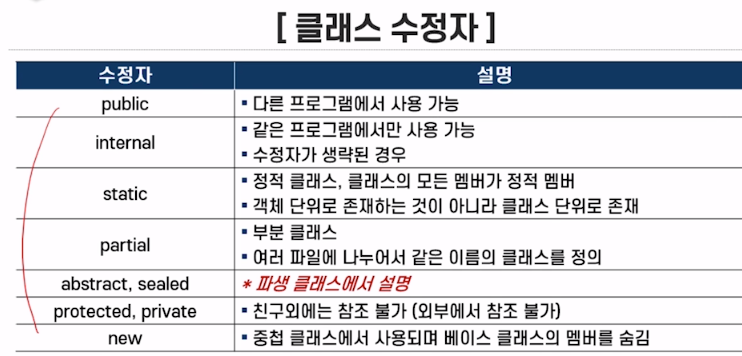
## 클래스형의 변수 선언  
```
객체를 선언하는 방법 : 클래스 이름을 쓰고 그에 해당하는 객체들을 나열 
Fraction f1, f2;
이렇게 객체를 참조하는 변수 선언 참조 변수 
```
## 객체를 생성하는 방법  
```
new 연산자와 함께 생성자를 명시하는 형태로 기술  
f1 = new Fraction();
Fracton f1 = new Fraction();
```
## 생성자  
```
- 객체를 생성할 때 객체의 초기화를 위해 자동으로 호출되는 루틴
- 클래스와 동일한 이름을 갖는 메소드 
- 객체 생성 시에 필요한 초기 값을 매개변수로 가질 수 있음
```
## 객체 이름과 멤버 사이에 멤버  접근 연산자인  점연산자 사용  
```
예) 
필드 참조: f1.numerator 
메소드 참조: f1.Add(f2)

멤버의 참조 형태:
objectName.MemberName
```
## 필드, 메소드, 프로퍼티  
## 필드  
```
클래스의 형태에서 객체의 구조를 기술하는 자료 부분 
변수들의 선언으로 구성 
```
## 필드 선언 형태   
```
[field-modifier] DataType fieldnames;
```
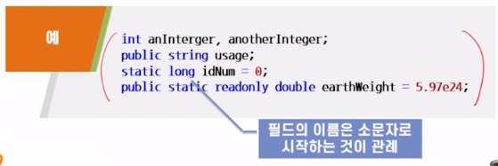
## 접근 수정자   
```
다른 클래스에서 필드의 접근 허용 정도를 나타내는 속성 
```
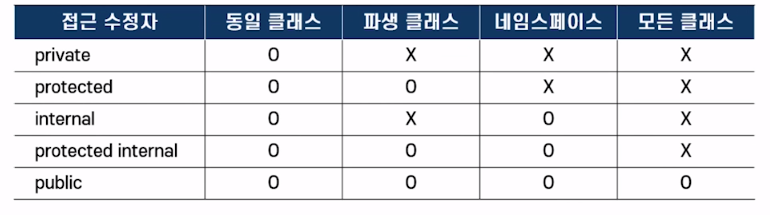
## private  
```
- 정의된 클래스 내에서만 필드 접근 허용 
- 접근 수정자가 생략된 경우 
```
## public  
```
모든 클래스 및 네임스페이스에서 자유롭게 접근  
```
## internal  
```
같은 네임스페이스 내에서 자유롭게 접근
```
## protected  
```
파생 클래스에서만 참조 가능
```
## protected inernal 혹은 internal protected  
```
파생 클래스와 동일 네임스페이스 내에서도 자유롭게 접근
```
## new  
```
상속 계층에서 상위 클래스에서 선언된 멤버를 하위 클래스에서 새롭게 재정의 하기 위해
사용 
```
## static  
```
- 정적 필드 
- 클래스 단위로 존재
- 생성 객체가 없는 경우에도 존재하는 변수  
- 정적 필드의 참조 형태 
ClassName.staticField
```
## readonly  
```
- 읽기 전용 필드 
- 값이 변할 수 없는 속성 
- 실행 중에 값에 값이 결정
```
## const  
```
- 값이 변할 수 없는 속성  
- 컴파일 시간에 값이 결정
- 상수 멤버의 선언 형태
[const-modifiers] const DataType constNames;
```
## 메소드  
```
객체의 행위를 기술하는 방법  
- 객체의 상태를 검색하고 변경하는 작업  
- 특정한 행동을 처리하고 프로그램 코드를 포함하고 있는 함수의 형태 
```
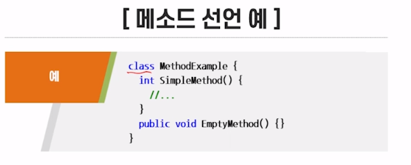
## 메소드 수정자  
```
매소드 수정자는 총 11개 있고 
접근 수정자는 public, protected, internal, private 가있다.
```
## static  
```
- 정적 메소드  
- 전역 함수와 같은 역할
- 정적 메소드는 해당 클래스의 정적 필드 또는 정적 메소드만 참조 가능
- 정적 메소드 호출 형태 객체의 상태를 검색하고 변경하는 작업 
- 특정한 행동을 처리하는 프로그램 코드를 포함하고 있는 함수의 형태 
ClassName.MethodName();
```
## abstract/ extern  
```
메소드 몸체 대신에 세미콜론; 이 나옴
abstract: 메소드가 하위 클래스에 정의 
extern: 메소드가 외부에 정의 
```
## 이 외의 메소드 수정자  
```
new, virtual, override, sealed 
```
##  매개 변수  
```
메소드 내에서만 참조될 수 있는 지역변수 

- 형식 매개변수(foraml parameter)
: 메소드를 정의할 때, 사용하는 매개변수 
- 실 매개변수(actual parameter)
: 메소드를 호출할 때 사용하는 매개 변수 
```
## 매개변수의 자료형  
```
기본형과 참조형이 있다. 
ex)
void parameterPass(int i, Fraction f){
 //todo sth...
}
```
## this 지정어  
```
자기 자신의 객체를 가리키는 포인터 특별한 포인터 
클래스 필드와 매개변수를 구별하기 위함 
```
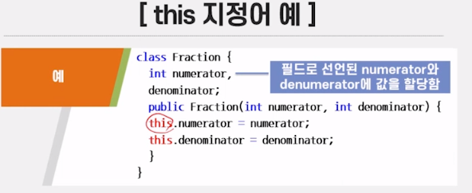
```
메소드 안에서 사용되는 모든 필드와 메소드 이름 앞에는 내부적으로 this가 붙어 있음
```
## 매개변수 전달  
```
메소드 호출 시에 실 매개변수가 형식 매개변수로 전달 되는 것  
전달된 실 매개변수가 호출된 매소드 내에서 사용 
```
## C#에서의 매개변수 전달 방법  
```
1. 값 호출 (Call by value) 
- 실 매개변수의 값이 형식 매개변수로 전달 
2. 참조 호출 (Call by reference)
- 주소 호출 
- 실 매개변수의 주소가 형식 매개변수로 전달 
- C# 에서 제공하는 방법 
  매개 변수 수정자 이용
  ,객체 참조를 매개변수로 사용 
```
## 매개변수 수정자  
```
ref: 매개변수가 전달될 때 반드시 초기화 
out: 매개변수가 전달될 때 초기화하지 않아도 됨 
```
## 매개변수 배열  
```
- 실 매개변수의 개수가 상황에 따라 가변적인 경우 
- 매소드를 정의할 때 형식 매개변수를 결정할 수 없음
```

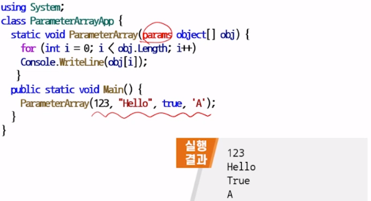
## C# 응용 프로그램의 시작점  
```
Main 메소드의 기본 형태 
public static void Main(string[] args){
//...
}
- 매개변수 : 명령어 라인으로부터 스트링 전달 
- 명령어 라인으로부터 스트링 전달 방법 
c:\> 실행파일명 인수1 인수2 ... 인수n
- args[0]= 인수1, args[1]= 인수2, args[n-1]= 인수n
```
## 시그너처(Signature)  
```
메소드를 구별하는데 쓰이는 정보 
메소드이름, 매개변수의 개수, 매개변수의 자료형, 메소드 반환형 제외
```
## 매소드 중복  
```
메소드의 이름은 같은데 매개변수의 개수와 형이 다른 경우
호출시 컴파일러에 의해 메소드 구별

void SameNameMethod(int i){}
void SameNameMethod(int i, int j){}
```
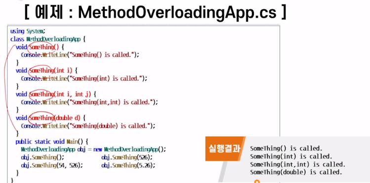
## 생성자  
```
객처가 생성될 때 자동으로 호출되는 메소드 
클래스 이름과 동일하며 반환형을 갖지 않음
주로 객체를 초기화하는 작업에 사용 
생성자 중복 가능
```
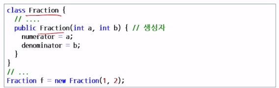
## 정적 생성자 (Static constructor)  
```
수정자가 static으로 선언된 생성자 
매개변수와 접근 수정자를 가질 수 없음
클래스의 정적 필드를 초기화 할 때 사용
Main() 매소드보다 먼저 실행
```
## 정적 필드 초기화 방법  
```
- 정적 필드 선언과 동시에 초기화 
- 정적 생성자 이용 
```
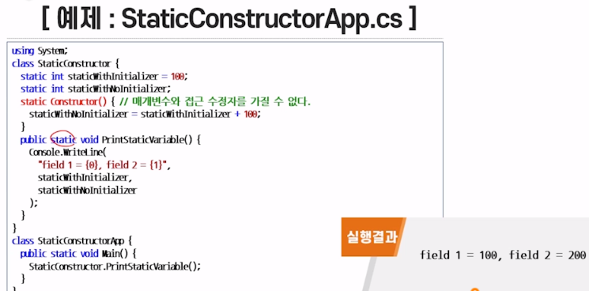
## 소멸자  
```
클래스의 객체가 소멸될 때 필요한 행위를 기술한 매소드 
소멸자의 이름은 생성자와 동일하나 이름 앞에 
~ (tilde)를 붙임
```
## Finalize() 메소드  
```
- 컴파일 시 소멸자를 Finalize() 메소드로 변환해서 컴파일
- Finalize() 메소드 재정의할 수 없음
- 객체가 더 이상 참조되지 않을 때 GC(Garbage Collection)에 의해 호출
```
## Dispose()메소드  
```
CLR에서 관리되지 않은 자원을 직접 해제할 때 사용 
자원이 스코프를 벗어나면 즉시 시스템에 의해 호출
```
## 프로퍼티란?  
```
클래스의 private 필드를 형식적으로 다루는 일종의 메소드
셋-접근자 : 값을 지정
겟-접근자 : 값을 참조
겟-접근자 혹은 셋 : 접근자만 정의할 수 있음
```
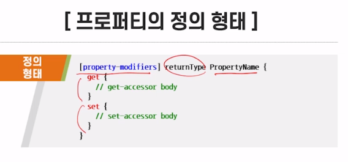
```
프로퍼티 수정자
수정자의 종류와 의미는 메소드와 모두 동일
```
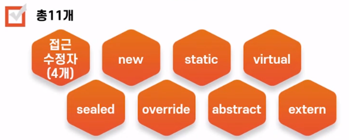
## 프로퍼티의 동작   
```
- 필드처럼 사용되지만, 메소드처럼 동작  
- 배정문의 왼쪽에서 사용되면 셋- 접근자 호출
- 배정문의 오른쪽에서 사용되면 겟- 접근자 호출
```
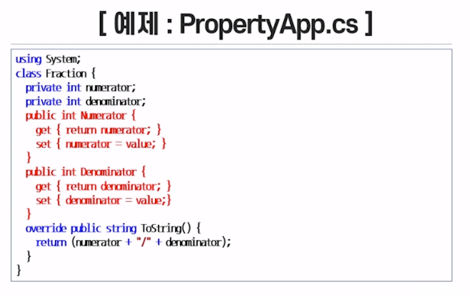
