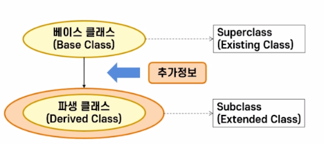
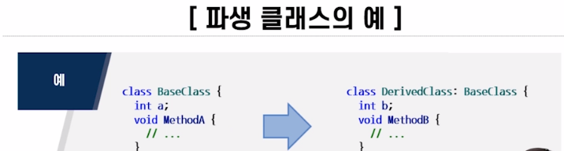
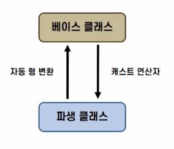
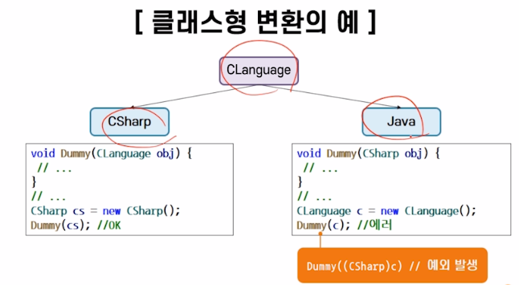
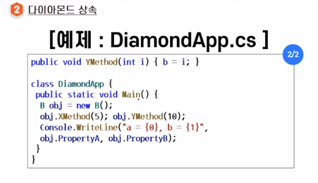

## 2021년 06월17일 파생클래스와 인터페이스   
## 오늘의 Point


```
파생 클래스
베이스 클래스의 모든 기능을 재사용, 확장, 수정가능 
결과적으로 코드 재사용성을 높여 개발 기간 단축

상속
캡슐화, 다형성과 함께 객체지향 프로그래밍에서 중요한 특징
프로그램의 논리적 구조를 계층적으로 구성 가능

인터페이스 
지정어: interface 사용 (다중 접속 가능)
멤버: 메소드, 프로퍼티, 인덱스, 이벤트 
접근 수정자: public, protected, internal, private, new
메소드 원형들의 집합에 이름을 붙인 것으로 
사용자 접속을 기출할 수 있는 프로그래밍 단위

선언만 하고 정의는 하지 않고, 인터페이스를 통해 다중 상속이 가능
```
## 학습 목표  
```
파생클래스를 이해하고 설명할 수 있다.

인터페이스를 이해하고 구현할 수 있다.

네임스페이스를 이해하고 구현할 수 있다.
```
## 파생 클래스 개념  

## 상속 이란?  
```
- 베이스 클래스의 모든 멤버들이 파생 클래스로 전달 되는 기능임
- 클래스의 재사용성 증가함

단일 상속 : 베이스 클래스 1개
다중 상속 : 베이스 클래스 2개 이상 두개의 부모를 갖는 것

하지만 C#에서는 단일 상속만 지원 
```
## 파생 클래스의 정의 형태  
```
[class-modifiers] class DerivedClassName: BaseClassName{
}

파생 클래스의 필드:
- 클래스의 필드 선언 방법과 동일함
- 베이스 클래스의 필드명과 다른 경우 : 상속됨
- 베이스 클래스의 필드명과 동일한 경우 : 숨겨짐 

base 지정어 쓰면 베이스 클래스 멤버 참조 

파생 클래스의 생성자:
- 형태와 의미는 클래스의 생성자와 동일함
- 명시적으로 호출하지 않으면, 기본 생성자가 컴파일러에 의해 자동적으로 호출함
- base() //베이스 클래스의 생성자를 명시적으로 호출
- 실행 과정:
필드의 초기화 부분 실행,
베이스 클래스의 생성자 실행,
파생 클래스의 생성자 실행 
```

## 매소드의 재정의  
```
베이스 클래스에서 구현된 메소드를 파생 클래스에서 구현된 메소드로 대체함
메소드의 시그너처가 동일한 경우 : 매소드 재정의
매소드의 시그너처가 다른 경우 : 매소드 중복
```
## 가상 메소드  
```
지정어 virtual로 선언된 인스턴스 매소드
파생 클래스에서 재정의해서 사용할 것임을 알려주는 역할을 함
- new 지정어: 객체 형에 따라 호출
- override 지정어: 객체 참조가 가리키는 객체에 따라 호출
```
## 봉인 메소드  
```
- 수정자가 sealed로 선언된 매소드
- 파생 클래스에서 재정의를 허용하지 않음
- 봉인 클래스: 모든 메소드는 묵시적으로 봉인 메소드임
```
## 추상 클래스  
```
추상 메소드를 갖는 클래스 
추상 메소드 (실질적인 구현을 갖지 않고 메소드 선언만 있는 경우)

추상클래스는 구현되지 않고, 단지 외형만을 제공
추상클래스는 객체를 가질 수 없음, 다른 외부 클래스에서 메소드를 일관성 있게 
다루기 위한 방법 제공함
다른 클래스에 의해 상속 후 사용 가능함
```

## abstract 수정자는 virtual 수정자의 의미 포함  
```
추상 클래스를 파생 클래스에서 구현 
override 수정자를 사용하여 추상 메소드를 재정의함 
접근 수정자 항상 일치함 
```
## 매소드를 파생 클래스에서 재정의하여 사용  
```
C#프로그래밍에 유용한 기능임
베이스 클래스에 있는 메소드에 작업을 추가하여 새로운 기능을 갖는 메소드 정의
: base 지정어 사용
```
## 클래스형 변환  
```
상향식 캐스트(캐스팅-업):
타당한 변환, 파생클래스형의 객체가 베이스 클래스형의 객체로 변환함

하향식 캐스트(캐스팅-다운):
타당하지 않은 변환, 캐스트 연산자 사용 : 예외 발생 
```



## 다형성의 의미  
```
적용하는 객체에 따라 메소드의 의미가 달라지는 것을 의미
C#프로그래밍 -virtual과 override의 조합으로 매소드 선언함
CLanguage c = new Java();
c.Print();
C의 형은 CLanguage이지만 Java 클래스의 객체를 가리킴
```
## 인터페이스  
```
1. 사용자 접속을 기술할 수 있는 프로그래밍 단위
2. 구현되지 않은 멤버들로 구성된 순수한 설계의 표현

특징:
지정어 interface 사용
멤버로는 메소드, 프로퍼티, 인덱스, 이벤트가 올 수 있으며 모두 구현부분이 없음
다중상속 가능함
접근 수정자:
public, protected, internal, private, new

선언형태:
[interface-modifiers][partial] interface InterfaceName{
}
확장형태:
[modifiers] interface InterfaceName  : ListOfBaseInterfaces {
// method declarations
// property   ``
// indexer    ``
// event      ``
}
```
## 인터페이스 구현 규칙  
```
- 인터페이스에 있는 모든 멤버는 묵시적으로 public이므로 
접근 수정자를 public으로 명시함
- 멤버 중 하나라도 구현하지 않으면 derived 클래스는 추상 클래스가 됨

구현 형태 :
[class-modifiers] class ClassName : ListOfInterfaces{
}
```
## 클래스 확장과 동시에 인터페이스 구현  
```
[class-modifiers] class ClassName : BaseClass, ListOfInterfaces{
}
```




## 인터페이스와 추상클래스 비교  
```
공통점은 
객체를 가질 수 없음

차이점은 
인터페이스 :
다중 상속 지원
오직 메소드 선언만 가능
메소드 구현 시, override 지정어를 사용할 수 있음

추상 클래스 :
단일 상속 지원
메소드의 부분적인 구현 가능
메소드 구현시 , override 지정어 사용할 수 없음
```
## 네임 스페이스  
```
서로 연관된 클래스나 인터페이스, 구조체, 열거형, 델리게이트, 
하위 네임스페이스를 하나의 단위로 묶어주는것

예) 여러 개의 클래스와 인터페이스, 구조체, 열거형, 델리게이트 등을 
하나의 그룹으로 다루는 수단을 제공함
클래스의 이름을 지정할 때 발생 되는 이름 충돌 문젤르 해결함

선언형태:
namespace NamespaceName{
}

네임스페이스 사용:
using NamespaceName;//사용하고자하는 네임스페이스 명시
```
## 핵심요약  
## 파생 클래스   
```
C#은 이미 존재하는 클래스에 정보를 추가하여 새로운 클래스를 만들수 있음
이때 기존의 클래스를 베이스 클래스 라고 부르며 
새로 정의된 클래스를 파생 클래스라고 부름
베이스 클래스의 모든 멤버들이 파생 클래스로 옮겨지는 특성을 상속이라고 함
베이스 클래스로 부터 메소드를 상속받을 때, 파생 클래스 내에 같은 이름의
메소드가 있는 경우에 시그니처가 다르면 중복이되고, 같으면 재정의가 됨
```
## 인터페이스   
```
C#에서 인터페이스란 사용자 접속을 기술할 수 있는 프로그래밍 단위,
다시말해서 구현되지 않은 멤버들로 구성된 순수한 설계의 표현이 C#에서 
클래스는 단일 상속만 가능하기 때문에 다중 상속이 가능한 인터페이스를 지원

파생 인터페이스는 여러개의 베이스 인터페이스를 가질 수 있으며,
이와 같이 여러 개의 인터페이스로부터 상속받는 것을 다중 상속이라고 부름
```
## 네임 스페이스  
```
서로 연관된 클래스나 인터페이스, 구조체, 열거형, 델리게이트, 하위 네임스페이스를
하나의 단위로 묶는 방법
```