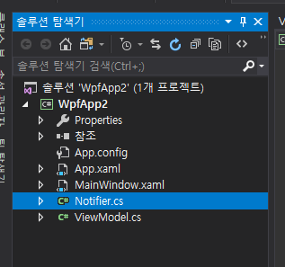
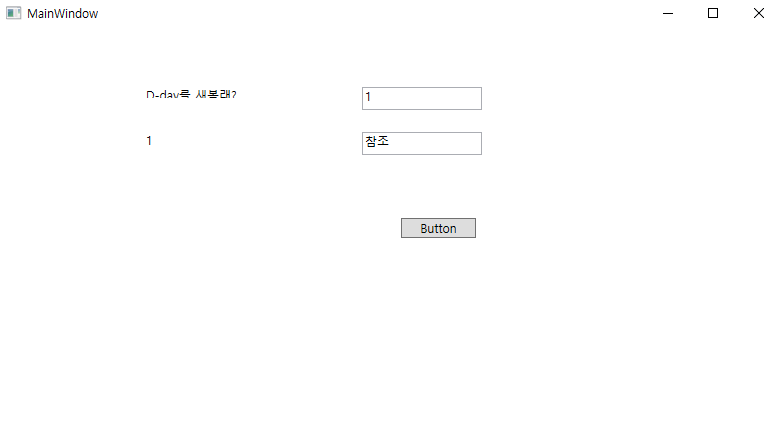
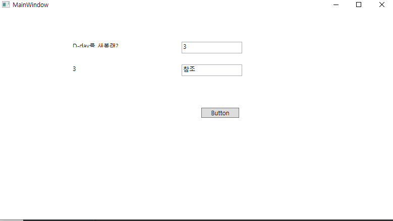

## 2021년 06월19일 WPF공부  
- INotifyPropertyChanged 구현 방법  
```
PropertyChanged 속성 값이 변경될 때 발생
```
  - INotifyPropertyChanged 상속  

```
여기서 INotyfyPropertyChanged 는 무엇인가?
WPF를 사용하면 Xaml 파일이있는데 
그 부분에서 view 단에 해당하는 것으로 
Source(Model)를 바인딩을 시켜서 화면에 보여주게 되는데 
이 바인딩된 값이 바뀔때 마다 변하는 것을 인지해주어 
백단의 값을 자동으로 바뀌게 해주는 역활을 해줘서 
View와 ViewModel의 값을 실시간으로 바꿔주는것
```
## MainWindow.xaml  
```
<Window x:Class="WpfApp2.MainWindow"
        xmlns="http://schemas.microsoft.com/winfx/2006/xaml/presentation"
        xmlns:x="http://schemas.microsoft.com/winfx/2006/xaml"
        xmlns:d="http://schemas.microsoft.com/expression/blend/2008"
        xmlns:mc="http://schemas.openxmlformats.org/markup-compatibility/2006"
        xmlns:local="clr-namespace:WpfApp2"
        mc:Ignorable="d"
        Title="MainWindow" Height="450" Width="800">
    <Grid>
        <TextBlock Text="{Binding Title}" HorizontalAlignment="Left" Margin="148,58,0,0" TextWrapping="Wrap" VerticalAlignment="Top" Height="11"/>
        <TextBlock Text="{Binding Num}" HorizontalAlignment="Left" Margin="148,103,0,0" TextWrapping="Wrap" VerticalAlignment="Top"/>
        <TextBox Text="{Binding Path=Num, Mode=TwoWay}" HorizontalAlignment="Left" Height="23" Margin="364,58,0,0" TextWrapping="Wrap" VerticalAlignment="Top" Width="120"/>
        <TextBox Text="참조" HorizontalAlignment="Left" Height="23" Margin="364,103,0,0" TextWrapping="Wrap" VerticalAlignment="Top" Width="120"/>
    </Grid>
</Window>
```
## Notifier.cs  
```c#
using System;
using System.Collections.Generic;
using System.Linq;
using System.Text;
using System.Threading.Tasks;
using System.ComponentModel;

namespace WpfApp2
{
    public class Notifier : INotifyPropertyChanged
    {
        public event PropertyChangedEventHandler PropertyChanged;
        protected void OnPropertyChanged(string propertyName)
        {
            if(PropertyChanged != null)
            {
                PropertyChanged(this, new PropertyChangedEventArgs(propertyName));
            }
        }
    }
}
```
## ViewModel.cs  
```c#
using System;
using System.Collections.Generic;
using System.Linq;
using System.Text;
using System.Threading.Tasks;

namespace WpfApp2
{
    public class ViewModel :Notifier
    {
        string title = "D-day를 새볼래?";
        public string Title
        {
            get { return title; }
            set
            {
                title = value;
                OnPropertyChanged("Title");
            }
        }
        int num = 0;
        public int Num
        {
            get { return num; }
            set
            {
                num = value;
                OnPropertyChanged("Num");
            }
        }
    }
}
```
## ## MainWindow.xaml.cs  
```C#
using System;
using System.Collections.Generic;
using System.Linq;
using System.Text;
using System.Threading.Tasks;
using System.Windows;
using System.Windows.Controls;
using System.Windows.Data;
using System.Windows.Documents;
using System.Windows.Input;
using System.Windows.Media;
using System.Windows.Media.Imaging;
using System.Windows.Navigation;
using System.Windows.Shapes;

namespace WpfApp2
{
    /// <summary>
    /// MainWindow.xaml에 대한 상호 작용 논리
    /// </summary>
    public partial class MainWindow : Window
    {
        public MainWindow()
        {
            InitializeComponent();
            this.DataContext = new ViewModel();
       }

    }
}
```
## ICommand 인터페이스  
```
windows 런타임 앱에 대한 .net으로 작성된 명령의 코드 계약?
이 명령은 windows 런타임 xaml 및 특히 ui 요소에 대한 명령 동작을 제공

Button , AppBarButton 
```
## 메서드  
```
CanExecute(Object) 명령을 현재 상태에서 실행할 수 있는지 결정하는 메서드를 정의
Execute(Object) 명령이 호출될 메서드를 정의
```
## 이벤트  
```
CanExecuteChanged 명령을 실행해야 하는지 여부에 영향을 주는 변경이 발생 시 발생
```

## DelegateCommand.cs  
```c#
using System;
using System.Windows.Input;

namespace WpfApp2
{
    internal class DelegateCommand : ICommand
    {
        private readonly Func<bool> canExecute;
        private readonly Action execute;

        public DelegateCommand(Action execute) : this(execute, null)
        {
        }

        public DelegateCommand(Action excute, Func<bool> canExecute)
        {
            this.execute = excute;
            this.canExecute = canExecute;
        }

        public event EventHandler CanExecuteChanged;

        public bool CanExecute(object o)
        {
            if (this.canExecute == null)
            {
                return true;
            }
            return this.canExecute();
        }

        public void Execute(object o)
        {
            this.execute();
        }
        public void RaiseCanExecuteChanged()
        {
            if (this.CanExecuteChanged != null)
            {
                this.CanExecuteChanged(this, EventArgs.Empty);
            }
        }
    }
}
```
##  ViewModel.cs  
```c#
        private ICommand checkCommand;
        public ICommand CheckCommand
        {
            get { return (this.checkCommand) ?? (this.checkCommand = new DelegateCommand(Check)); }
        }
        private void Check()
        {
            num++;
            OnPropertyChanged("Num");
        }
    }
}

아래 부분에 추가
```
## MainWindow.xaml  
```
<Button Command="{Binding CheckCommand}" Content="Button" HorizontalAlignment="Left" Margin="403,189,0,0" VerticalAlignment="Top" Width="75" />

버튼 부분 추가
```

