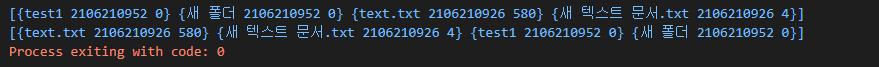
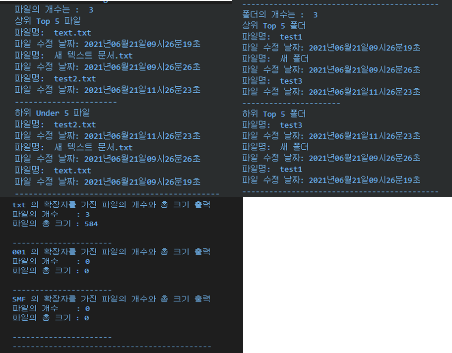

## 2021년 06월21일  

## 과제 요구사항 정리  
  - **요구사항**  
    - 환경 설정에서 지정한 폴더의 경로를 모니터링 
      - 가장 최근 변경(top) & 가장 오래 변경 안 된(under) 파일과 폴더를 모니터링
      - 확장 단위로 요약 정보(개수, 크기)를 제공
      **1.  환경 설정**  
```
- 환경 설정 파일은 .yml 파일
- 환경 설정 파일 정보 
  period: 30s    // 모니터링 수집 주기 30초 단위로 정보 수집
  top: 5         // 수정된 시간 정렬 상위(가장 최근에 수정) 5개
  under: 5       // 수정된 시간 정렬 하위(가장 오래 전 수정) 5개
  path: ["감시폴더명1","감시폴더명2"]  // 모니터링 폴더
  extensions: ["TIFF","001","SMF"]  // 모니터링 파일 확장자
```
**2. 모니터링**  
```
path에 정의된 폴더를 지정한 period인 30초 주기로 모니터링
모니터링 정보를 파일과 콘솔에 출력한다.
 - 총 파일 개수 
 - top 파일 정보 : 파일명, 파일 만든 날짜, 파일 수정한 날짜, 파일 액세스한 날짜
```

```
- 총 폴더 개수 
- top 폴더 정보:  폴더명, 폴더 만든 날짜, 폴더 수정한 날짜
- under 파일, 폴더 : top 동일
---------------------------------------------------------
paths 경로에 있는 파일 중에서 extensions에 있는 확장자 기준으로 
정보를 추가로 제공한다.
 - 파일 개수
 - 파일 크기 : 총 확장자 파일 크기
예.
> a.tif 10mb
> b.tif 20mb
> c.tif 30mb
tif 3개
tif 60mb
```
## 계획   
- [x] 1. 우선 모든 경로의 파일이나 폴더 탐색하게 하기
- [ ] 2. 만든날짜 가져오는 소스//
- [x] 3. 수정한 날짜 소스
- [ ] 4. 엑세스한 날짜 소스//
- [ ] 5. 환경 설정.yml이랑 연결 방법 생각
- [ ] 6. 연결했다면 주기로 해당 경로확인
- [x]  상위 5개 하위 5개 뽑고 정렬하고
- [x] 파일 확장자의 기준으로 몇개 있는지 각 확장자별로 그 확장자를 가지는 파일 크기의 총합 저장
## 날짜 문자열 형식으로 바꾸기  
```
		year := f.ModTime().Year()
		month := f.ModTime().Month().String()
		day := f.ModTime().Day()
		hour := f.ModTime().Hour()
		minute := f.ModTime().Minute()
		second := f.ModTime().Second()

		fmt.Println(reflect.TypeOf(year))
		fmt.Println(reflect.TypeOf(month))
		fmt.Println(reflect.TypeOf(day))
		fmt.Println(reflect.TypeOf(hour))
		fmt.Println(reflect.TypeOf(minute))
		fmt.Println(reflect.TypeOf(second))
현재 Month만 String이므로 숫자가 아닌 June 이므로 
제대로 숫자로 바꾸고 전체를 문자열로 만들어주자.
	checkMonth := map[string]string{
		"January":   "01",
		"February":  "02",
		"March":     "03",
		"April":     "04",
		"May":       "05",
		"June":      "06",
		"July":      "07",
		"August":    "08",
		"September": "09",
		"October":   "10",
		"Nobvember": "11",
		"December":  "12",
	}
		s := ""
		s += strconv.Itoa(year)
		s += checkMonth[month]
		s += strconv.Itoa(day)
		s += strconv.Itoa(hour)
		s += strconv.Itoa(minute)
		s += strconv.Itoa(second)
		fmt.Println(s)
결국은 202106211026 이렇게 들어가게 문자열을 생성 
Num, _ := strconv.Atoi(s)      // 정수형으로 변환

		year := f.ModTime().Year()
		month := f.ModTime().Month().String()
		day := f.ModTime().Day()
		hour := f.ModTime().Hour()
		minute := f.ModTime().Minute()
		second := f.ModTime().Second()
		stringDay := "0"
		if day < 10 { //1~9 01~09 만들기
			stringDay += strconv.Itoa(day)
		} else {
			stringDay = strconv.Itoa(day)
		}
		stringHour := "0"
		if hour < 10 { //1~9 01~09 만들기
			stringHour += strconv.Itoa(hour)
		} else {
			stringHour = strconv.Itoa(hour)
		}
		stringMinute := "0"
		if minute < 10 { //1~9 01~09 만들기
			stringMinute += strconv.Itoa(minute)
		} else {
			stringMinute = strconv.Itoa(minute)
		}
		stringSecound := "0"
		if second < 10 { //1~9 01~09 만들기
			stringSecound += strconv.Itoa(second)
		} else {
			stringSecound = strconv.Itoa(second)
		}
		s := ""
		s += strconv.Itoa(year - 2000) //21년도로 들어가게함
		s += checkMonth[month]
		s += stringDay
		s += stringHour
		s += stringMinute
		//s += stringSecound
		fmt.Println(s)
		fmt.Println("파일 크기", f.Size()) //바이트 크기로 가져옴
		fmt.Println(11111111111111)
		Num, _ := strconv.Atoi(s) // 정수형으로 변환
		fileInfoSlice = append(fileInfoSlice, fileData{f.Name(), Num})
```
## 데이터 정렬전 구조체 슬라이스에 저장후 정렬하기  
```
type data struct {
	size int
	time int
}

var fileInfoSlice = make([]fileData, 0)

이렇게 해서 전역변수로 모든 데이터 저장하기
	sort.Slice(fileInfoSlice, func(i, j int) bool {
		return fileInfoSlice[i].dataNum < fileInfoSlice[j].dataNum
	})
	fmt.Println(fileInfoSlice)
}
```

## 여기까지 전체 소스  
```
package main

import (
	"fmt"
	"io/ioutil"
	"os"
	"sort"
	"strconv"
)

type fileData struct { //파일 데이터정보 : 파일이름, 수정날짜만 적용
	file     string
	dataNum  int
	fileSize int64
}

var checkMonth = map[string]string{ //month 숫자로 변환
	"January":   "01",
	"February":  "02",
	"March":     "03",
	"April":     "04",
	"May":       "05",
	"June":      "06",
	"July":      "07",
	"August":    "08",
	"September": "09",
	"October":   "10",
	"Nobvember": "11",
	"December":  "12",
}
var fileInfoSlice = make([]fileData, 0)

func main() {
	//파라메터를 안 받았다면 현재 경로 "." 이하 파일, 디렉토리들 출력
	if len(os.Args) == 1 {
		listDir("C:\\go")
	} else {
		listDir(os.Args[1])
	}
	fmt.Println(fileInfoSlice)
	sort.Slice(fileInfoSlice, func(i, j int) bool {
		return fileInfoSlice[i].dataNum < fileInfoSlice[j].dataNum
	})
	fmt.Println(fileInfoSlice)
}

func listDir(dirFile string) {

	files, _ := ioutil.ReadDir(dirFile)
	for _, f := range files {
		year := f.ModTime().Year()
		month := f.ModTime().Month().String()
		day := f.ModTime().Day()
		hour := f.ModTime().Hour()
		minute := f.ModTime().Minute()
		second := f.ModTime().Second()
		stringDay := "0"
		if day < 10 { //1~9 01~09 만들기
			stringDay += strconv.Itoa(day)
		} else {
			stringDay = strconv.Itoa(day)
		}
		stringHour := "0"
		if hour < 10 { //1~9 01~09 만들기
			stringHour += strconv.Itoa(hour)
		} else {
			stringHour = strconv.Itoa(hour)
		}
		stringMinute := "0"
		if minute < 10 { //1~9 01~09 만들기
			stringMinute += strconv.Itoa(minute)
		} else {
			stringMinute = strconv.Itoa(minute)
		}
		stringSecound := "0"
		if second < 10 { //1~9 01~09 만들기
			stringSecound += strconv.Itoa(second)
		} else {
			stringSecound = strconv.Itoa(second)
		}
		s := ""
		s += strconv.Itoa(year - 2000) //21년도로 들어가게함
		s += checkMonth[month]
		s += stringDay
		s += stringHour
		s += stringMinute
		//s += stringSecound
		fmt.Println("파일 크기", f.Size()) //바이트 크기로 가져옴
		Num, _ := strconv.Atoi(s)      // 정수형으로 변환
		fileInfoSlice = append(fileInfoSlice, fileData{f.Name(), Num, f.Size()})
		if f.IsDir() {
			listDir(dirFile + "/" + f.Name())
		}
	}

}
```
## 파일과 폴더 데이터 나누기  
```
// 좀 위험하긴 하지만 파일과 폴더의 유무 . 이 있고 없고로 판단하기 
해도되지만
if f.IsDir() == true {    // 폴더
	folderInfoSlice = append(folderInfoSlice, fileData{f.Name(), Num, f.Size()})

} else {
	fileInfoSlice = append(fileInfoSlice, fileData{f.Name(), Num, f.Size()})
}

IsDir 유무로 폴더 파일 유무 파악 참이면 폴더임
아니면 파일임
```
## 파일 확장자별로 나누기  
```
	for i := 0; i < len(fileInfoSlice); i++ {

		finalDot := 0 // 최종 위치 점 확인
		fmt.Println(finalDot)
		for j := 0; j < len(fileInfoSlice[i].file); j++ { // 점 위치 확인
			if fileInfoSlice[i].file[j] == '.' {
				finalDot = j
			}
		}
		for k := 0; k < len(extensions); k++ { //확장자 확인
			extensionInfo := fileInfoSlice[i].file[finalDot+1:]
			fmt.Println(extensionInfo)
			if extensions[k] == extensionInfo { // 확장자 별로 저장하기, 개수, 사이즈 총량
				extensionFileMap[k].name = fileInfoSlice[i].file[finalDot+1:]
				extensionFileMap[k].cnt++
				extensionFileMap[k].sumSize += fileInfoSlice[i].fileSize
			}
		}
	}
```
## 여기까지 최종 소스  
```
package main

import (
	"fmt"
	"io/ioutil"
	"os"
	"sort"
	"strconv"
)

type fileData struct { //파일 데이터정보 : 파일이름, 수정날짜만 적용
	file     string
	dataNum  int
	fileSize int64
}

type fileExtensionData struct {
	name    string //이름
	cnt     int    //개수
	sumSize int64  // 총 사이즈량
}

var checkMonth = map[string]string{ //month 숫자로 변환
	"January":   "01",
	"February":  "02",
	"March":     "03",
	"April":     "04",
	"May":       "05",
	"June":      "06",
	"July":      "07",
	"August":    "08",
	"September": "09",
	"October":   "10",
	"Nobvember": "11",
	"December":  "12",
}
var fileInfoSlice = make([]fileData, 0)
var folderInfoSlice = make([]fileData, 0)

func main() {

	//파라메터를 안 받았다면 현재 경로 "." 이하 파일, 디렉토리들 출력
	//확장자 별로 정리하기
	extensions := []string{"txt", "001", "SMF"} //확장자
	var extensionFileMap = make([]fileExtensionData, len(extensions))
	for i := 0; i < len(extensions); i++ {
		extensionFileMap[i].name = extensions[i]
		extensionFileMap[i].cnt = 0
		extensionFileMap[i].sumSize = 0
	}
	if len(os.Args) == 1 {
		listDir("C:\\go")
	} else {
		listDir(os.Args[1])
	}
	fmt.Println(fileInfoSlice)
	sort.Slice(fileInfoSlice, func(i, j int) bool {
		return fileInfoSlice[i].dataNum < fileInfoSlice[j].dataNum
	})
	// fmt.Println(fileInfoSlice)
	// fmt.Println(folderInfoSlice)
	//확장자 기준으로 각 파일의 총합 나오게 하기

	for i := 0; i < len(fileInfoSlice); i++ {

		finalDot := 0 // 최종 위치 점 확인
		fmt.Println(finalDot)
		for j := 0; j < len(fileInfoSlice[i].file); j++ { // 점 위치 확인
			if fileInfoSlice[i].file[j] == '.' {
				finalDot = j
			}
		}
		for k := 0; k < len(extensions); k++ { //확장자 확인
			extensionInfo := fileInfoSlice[i].file[finalDot+1:]
			fmt.Println(extensionInfo)
			if extensions[k] == extensionInfo { // 확장자 별로 저장하기, 개수, 사이즈 총량
				extensionFileMap[k].name = fileInfoSlice[i].file[finalDot+1:]
				extensionFileMap[k].cnt++
				extensionFileMap[k].sumSize += fileInfoSlice[i].fileSize
			}
		}
	}
	//fmt.Println(extensionFileMap)//확장자 개수 총 용량
	
}

func listDir(dirFile string) {

	files, _ := ioutil.ReadDir(dirFile)
	for _, f := range files {
		year := f.ModTime().Year()
		month := f.ModTime().Month().String()
		day := f.ModTime().Day()
		hour := f.ModTime().Hour()
		minute := f.ModTime().Minute()
		second := f.ModTime().Second()
		stringDay := "0"
		if day < 10 { //1~9 01~09 만들기
			stringDay += strconv.Itoa(day)
		} else {
			stringDay = strconv.Itoa(day)
		}
		stringHour := "0"
		if hour < 10 { //1~9 01~09 만들기
			stringHour += strconv.Itoa(hour)
		} else {
			stringHour = strconv.Itoa(hour)
		}
		stringMinute := "0"
		if minute < 10 { //1~9 01~09 만들기
			stringMinute += strconv.Itoa(minute)
		} else {
			stringMinute = strconv.Itoa(minute)
		}
		stringSecound := "0"
		if second < 10 { //1~9 01~09 만들기
			stringSecound += strconv.Itoa(second)
		} else {
			stringSecound = strconv.Itoa(second)
		}
		s := ""
		s += strconv.Itoa(year - 2000) //21년도로 들어가게함
		s += checkMonth[month]
		s += stringDay
		s += stringHour
		s += stringMinute
		s += stringSecound
		Num, _ := strconv.Atoi(s) // 정수형으로 변환
		if f.IsDir() == true {    // 폴더 데이터 저장
			folderInfoSlice = append(folderInfoSlice, fileData{f.Name(), Num, f.Size()})

		} else { //파일 데이터 저장
			fileInfoSlice = append(fileInfoSlice, fileData{f.Name(), Num, f.Size()})
		}

		if f.IsDir() {
			listDir(dirFile + "/" + f.Name())
		}
	}

}
```
## 출력 부분   
```
//fmt.Println(extensionFileMap)//확장자 개수 총 용량
	//출력
	//파일의 이름 , 수정 날짜 출력
	fileSize := len(fileInfoSlice)
	fmt.Println("파일의 개수는 : ", fileSize)
	fmt.Printf("상위 Top %d 파일\n", top)
	for topI := 0; topI < len(fileInfoSlice) && topI < top; topI++ {
		fmt.Println("파일명: ", fileInfoSlice[topI].file)
		fmt.Print("파일 수정 날짜: ")
		calender(fileInfoSlice[topI].dataNum)
		fmt.Println()
	}
	fmt.Println("----------------------")
	fmt.Printf("하위 Under %d 파일\n", under)
	for underI := len(fileInfoSlice) - 1; underI >= 0 && underI >= len(fileInfoSlice)-under; underI-- {
		fmt.Println("파일명: ", fileInfoSlice[underI].file)
		fmt.Print("파일 수정 날짜: ")
		calender(fileInfoSlice[underI].dataNum)
		fmt.Println()
	}
	fmt.Println("--------------------------------------------")
	//폴더의 이름 , 수정 날짜 출력
	folderSize := len(folderInfoSlice)
	fmt.Println("폴더의 개수는 : ", folderSize)
	fmt.Printf("상위 Top %d 폴더\n", top)
	for topI := 0; topI < len(folderInfoSlice) && topI < top; topI++ {
		fmt.Println("파일명: ", folderInfoSlice[topI].file)
		fmt.Print("파일 수정 날짜: ")
		calender(fileInfoSlice[topI].dataNum)
		fmt.Println()
	}
	fmt.Println("----------------------")
	fmt.Printf("하위 Top %d 폴더\n", under)
	for underI := len(folderInfoSlice) - 1; underI >= 0 && underI >= len(folderInfoSlice)-under; underI-- {
		fmt.Println("파일명: ", folderInfoSlice[underI].file)
		fmt.Print("파일 수정 날짜: ")
		calender(fileInfoSlice[underI].dataNum)
		fmt.Println()
	}
	fmt.Println("--------------------------------------------")
	//확장 단위 요약 정보 이름, 개수 크기 순
	for i := 0; i < len(extensions); i++ {
		fmt.Println(extensionFileMap[i].name, "의 확장자를 가진 파일의 개수와 총 크기 출력")
		fmt.Println("파일의 개수    :", extensionFileMap[i].cnt)
		fmt.Println("파일의 총 크기 :", extensionFileMap[i].sumSize)
		fmt.Println()
		fmt.Println("----------------------")
	}
	fmt.Println("--------------------------------------------")
```
## 현재 구현된 소스의 출력 값  

## 아직 구현 못한것과 찾아야하는 것   
```
현재 여기까지 구현 안된것은 yml환경 설정을 안가져온것이랑
만든시간, 액세스시간 못가져온 것

찾아야하는것 만든날짜랑 액세스 날짜 가져오는것 찾고 파일의 경우

yml 문서를 받아와서 그 환경에 적용을 해야하는지와 그것을 적용하는 예로 

리팩토링하기 
```

