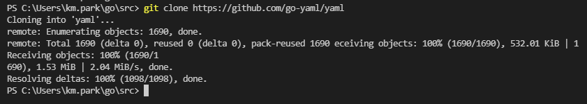
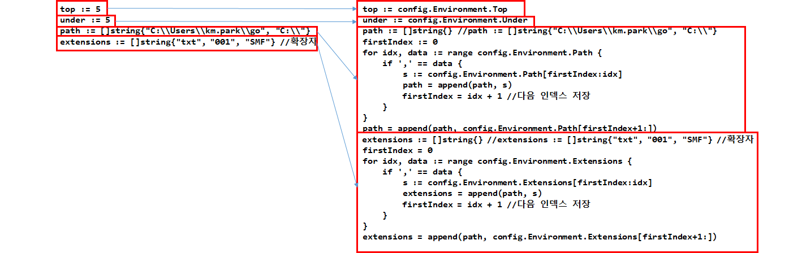
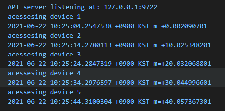
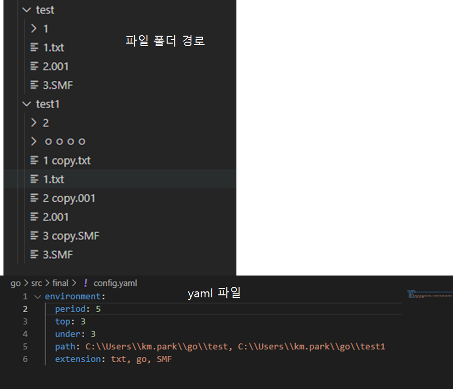
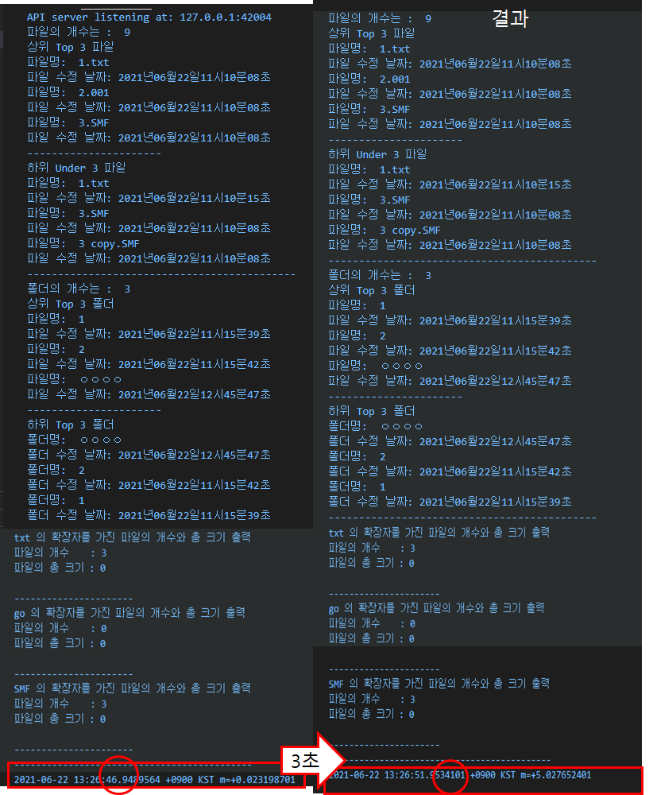

## 2021년 06월22일  Go 언어 폴더 모니터링 3  
## 계획   
- [x] 1. 우선 모든 경로의 파일이나 폴더 탐색하게 하기
- [ ] 2. 만든날짜 가져오는 소스//
- [x] 3. 수정한 날짜 소스
- [ ] 4. 엑세스한 날짜 소스//
- [x] 5. 환경 설정.yml이랑 연결 방법 생각
- [x] 6. 연결했다면 주기로 해당 경로확인
- [x] 상위 5개 하위 5개 뽑고 정렬하고
- [x] 파일 확장자의 기준으로 몇개 있는지 각 확장자별로 그 확장자를 가지는 파일 크기의 총합 저장
## 이전 오류수정까지한 소스
```go
package main

import (
	"fmt"
	"io/ioutil"
	"os"
	"sort"
	"strconv"
)

type fileData struct { //파일 데이터정보 : 파일이름, 수정날짜만 적용
	file     string
	dataNum  int
	fileSize int64
}

type fileExtensionData struct {
	name    string //이름
	cnt     int    //개수
	sumSize int64  // 총 사이즈량
}

var checkMonth = map[string]string{ //month 숫자로 변환
	"January":   "01",
	"February":  "02",
	"March":     "03",
	"April":     "04",
	"May":       "05",
	"June":      "06",
	"July":      "07",
	"August":    "08",
	"September": "09",
	"October":   "10",
	"November":  "11",
	"December":  "12",
}
var fileInfoSlice = make([]fileData, 0)
var folderInfoSlice = make([]fileData, 0)
var stringDateData = [6]string{"년", "월", "일", "시", "분", "초"}

func calender(number int) {
	sNumber := strconv.Itoa(number)

	for i := 0; i < len(sNumber); i++ {
		fmt.Print(sNumber[i] - '0')
		if i == 3 {
			fmt.Print(stringDateData[i-3])
		}
		if i == 5 {
			fmt.Print(stringDateData[i-4])
		}
		if i == 7 {
			fmt.Print(stringDateData[i-5])
		}
		if i == 9 {
			fmt.Print(stringDateData[i-6])
		}
		if i == 11 {
			fmt.Print(stringDateData[i-7])
		}
		if i == 13 {
			fmt.Print(stringDateData[i-8])
		}
	}
}
func main() {

	//파라메터를 안 받았다면 현재 경로 "." 이하 파일, 디렉토리들 출력
	//확장자 별로 정리하기
	// period := 30
	top := 5
	under := 5
	path := []string{"C:\\Users\\km.park\\go", "C:\\"}
	extensions := []string{"txt", "001", "SMF"} //확장자
	fmt.Println(path[0])
	var extensionFileMap = make([]fileExtensionData, len(extensions))
	for i := 0; i < len(extensions); i++ {
		extensionFileMap[i].name = extensions[i]
		extensionFileMap[i].cnt = 0
		extensionFileMap[i].sumSize = 0
	}
	if len(os.Args) == 1 {
		listDir(path[0])
	} else {
		listDir(os.Args[1])
	}
	//fmt.Println(fileInfoSlice)
	sort.Slice(fileInfoSlice, func(i, j int) bool {
		return fileInfoSlice[i].dataNum < fileInfoSlice[j].dataNum
	})
	//fmt.Println(fileInfoSlice)
	sort.Slice(folderInfoSlice, func(i, j int) bool {
		return folderInfoSlice[i].dataNum < folderInfoSlice[j].dataNum
	})
	// fmt.Println(fileInfoSlice)
	// fmt.Println(folderInfoSlice)
	//확장자 기준으로 각 파일의 총합 나오게 하기
	for i := 0; i < len(fileInfoSlice); i++ {
		finalDot := 0 // 최종 위치 점 확인
		//fmt.Println(finalDot)
		for j := 0; j < len(fileInfoSlice[i].file); j++ { // 점 위치 확인
			if fileInfoSlice[i].file[j] == '.' {
				finalDot = j
			}
		}
		for k := 0; k < len(extensions); k++ { //확장자 확인
			extensionInfo := fileInfoSlice[i].file[finalDot+1:]
			//  fmt.Println(extensionInfo)
			if extensions[k] == extensionInfo { // 확장자 별로 저장하기, 개수, 사이즈 총량
				extensionFileMap[k].name = fileInfoSlice[i].file[finalDot+1:]
				extensionFileMap[k].cnt++
				extensionFileMap[k].sumSize += fileInfoSlice[i].fileSize
			}
		}
	}
	//fmt.Println(extensionFileMap)//확장자 개수 총 용량
	//출력
	//파일의 이름 , 수정 날짜 출력
	fileSize := len(fileInfoSlice)
	fmt.Println("파일의 개수는 : ", fileSize)
	fmt.Printf("상위 Top %d 파일\n", top)
	for topI := 0; topI < len(fileInfoSlice) && topI < top; topI++ {
		fmt.Println("파일명: ", fileInfoSlice[topI].file)
		fmt.Print("파일 수정 날짜: ")
		calender(fileInfoSlice[topI].dataNum)
		fmt.Println()
	}
	fmt.Println("----------------------")
	fmt.Printf("하위 Under %d 파일\n", under)
	for underI := len(fileInfoSlice) - 1; underI >= 0 && underI >= len(fileInfoSlice)-under; underI-- {
		fmt.Println("파일명: ", fileInfoSlice[underI].file)
		fmt.Print("파일 수정 날짜: ")
		calender(fileInfoSlice[underI].dataNum)
		fmt.Println()
	}
	fmt.Println("--------------------------------------------")
	//폴더의 이름 , 수정 날짜 출력
	folderSize := len(folderInfoSlice)
	fmt.Println("폴더의 개수는 : ", folderSize)
	fmt.Printf("상위 Top %d 폴더\n", top)
	for topI := 0; topI < len(folderInfoSlice) && topI < top; topI++ {
		fmt.Println("파일명: ", folderInfoSlice[topI].file)
		fmt.Print("파일 수정 날짜: ")
		calender(folderInfoSlice[topI].dataNum)
		fmt.Println()
	}
	fmt.Println("----------------------")
	fmt.Printf("하위 Top %d 폴더\n", under)
	for underI := len(folderInfoSlice) - 1; underI >= 0 && underI >= len(folderInfoSlice)-under; underI-- {
		fmt.Println("폴더명: ", folderInfoSlice[underI].file)
		fmt.Print("폴더 수정 날짜: ")
		calender(folderInfoSlice[underI].dataNum)
		fmt.Println()
	}
	fmt.Println("--------------------------------------------")
	//확장 단위 요약 정보 이름, 개수 크기 순
	for i := 0; i < len(extensions); i++ {
		fmt.Println(extensionFileMap[i].name, "의 확장자를 가진 파일의 개수와 총 크기 출력")
		fmt.Println("파일의 개수    :", extensionFileMap[i].cnt)
		fmt.Println("파일의 총 크기 :", extensionFileMap[i].sumSize)
		fmt.Println()
		fmt.Println("----------------------")
	}
	fmt.Println("--------------------------------------------")
}

func listDir(dirFile string) {

	files, _ := ioutil.ReadDir(dirFile)
	for _, f := range files {
		//fmt.Printf("%#v\n", f.ModTime())
		year := f.ModTime().Year()
		month := f.ModTime().Month().String()
		day := f.ModTime().Day()
		hour := f.ModTime().Hour()
		minute := f.ModTime().Minute()
		second := f.ModTime().Second()
		stringDay := "0"
		if day < 10 { //1~9 01~09 만들기
			stringDay += strconv.Itoa(day)
		} else {
			stringDay = strconv.Itoa(day)
		}
		stringHour := "0"
		if hour < 10 { //1~9 01~09 만들기
			stringHour += strconv.Itoa(hour)
		} else {
			stringHour = strconv.Itoa(hour)
		}
		stringMinute := "0"
		if minute < 10 { //1~9 01~09 만들기
			stringMinute += strconv.Itoa(minute)
		} else {
			stringMinute = strconv.Itoa(minute)
		}
		stringSecound := "0"
		if second < 10 { //1~9 01~09 만들기
			stringSecound += strconv.Itoa(second)
		} else {
			stringSecound = strconv.Itoa(second)
		}
		s := ""
		s += strconv.Itoa(year) //21년도로 들어가게함
		s += checkMonth[month]
		s += stringDay
		s += stringHour
		s += stringMinute
		s += stringSecound
		Num, _ := strconv.Atoi(s) // 정수형으로 변환

		if f.IsDir() == true { // 폴더 데이터 저장
			folderInfoSlice = append(folderInfoSlice, fileData{f.Name(), Num, f.Size()})
			listDir(dirFile + "/" + f.Name())
		} else { //파일 데이터 저장
			fileInfoSlice = append(fileInfoSlice, fileData{f.Name(), Num, f.Size()})
		}
	}

}
```
```
이전에 file이랑 folder 혼동하여 출력한 부분 수정과
오탈자로 인한 출력이상 문제까지 해놓은 상태
```
## 환경 설정.yml이랑 연결 방법 생각

## yml 사용 이유  

```
프로그램의 외부 시스템이 변경하게 되면 이를 적용해야하는데 
코드에 그대로 반영할 수 없으니
외부 설정 파일을 생성해서 이를 읽어 시스템에 반영하게 됨
전역으로 config 변수를 설정해서 주입해주는 것이라고 함
```
## Yaml 예시  
```
database:
  Type: mysql
  User: Riverandeye
  Password: hello
  Host: 1.2.3.4:5
  Name: todo
  TablePrefix: todo_
 
server:
  RunMode: debug
  HTTPPort: 4000
  ReadTimeout: 60
  WriteTimeout: 60
```
## yaml에 대한 타입 명시  
```
// DatabaseConfig Type
type DatabaseConfig struct {
	Type        string `yaml:"Type"`
	User        string `yaml:"User"`
	Password    string `yaml:"Password"`
	Host        string `yaml:"Host"`
	Name        string `yaml:"Name"`
	TablePrefix string `yaml:"TablePrefix"`
}
 
// ServerConfig Type
type ServerConfig struct {
	RunMode      string `yaml:"RunMode"`
	HTTPPort     string `yaml:"HTTPPort"`
	ReadTimeout  int    `yaml:"ReadTimeout"`
	WriteTimeout int    `yaml:"WriteTimeout"`
}
 
// Config Type
type Config struct {
	Database DatabaseConfig `yaml:"database"`
	Server   ServerConfig   `yaml:"server"`
}
```

## yaml 테스트   
```
src 디렉토리에 우선 git clone https://github.com/go-yaml/yaml
해서 우선 yaml 사용할 수 있게 패키지 설치함
```



```
package main

import (
	"fmt"
	"io/ioutil"
	"log"
	"os"
	"yaml"
)

// DatabaseConfig Type
type DatabaseConfig struct {
	Type        string `yaml:"Type"`
	User        string `yaml:"User"`
	Password    string `yaml:"Password"`
	Host        string `yaml:"Host"`
	Name        string `yaml:"Name"`
	TablePrefix string `yaml:"TablePrefix"`
}

// ServerConfig Type
type ServerConfig struct {
	RunMode      string `yaml:"RunMode"`
	HTTPPort     string `yaml:"HTTPPort"`
	ReadTimeout  int    `yaml:"ReadTimeout"`
	WriteTimeout int    `yaml:"WriteTimeout"`
}

// Config Type
type Config struct {
	Database DatabaseConfig `yaml:"database"`
	Server   ServerConfig   `yaml:"server"`
}

func check(err error) {
	if err != nil {
		log.Fatal(err)
	}
}
func main() {
	var config Config
	file, err := os.Open("config.yaml")
	check(err)
	defer file.Close()

	content, err := ioutil.ReadAll(file)
	check(err)

	err = yaml.Unmarshal(content, &config)
	check(err)

	fmt.Println(config)

	// filename, _ := filepath.Abs("config.yaml")
	// yamlFile, err := ioutil.ReadFile(filename)
	// var config Config

	// err = yaml.Unmarshal(yamlFile, &config)
	// fmt.Println(config)
	// if err != nil {
	// 	panic(err)
	// }
}
```

```
"yaml"	
이게 좀 디렉토리가 go root 있는 src에 들어가 있어야 제대로 실행이된다. 
```
## yaml 정보가져 오는 방법 2가지   
```
	var config Config
	file, err := os.Open("config.yaml")
	check(err)
	defer file.Close()

	content, err := ioutil.ReadAll(file)
	check(err)

	err = yaml.Unmarshal(content, &config)
	check(err)

	fmt.Println(config)
```
```
	var config Config
	file, err := os.Open("config.yaml")
	check(err)
	defer file.Close()

	content, err := ioutil.ReadAll(file)
	check(err)

	err = yaml.Unmarshal(content, &config)
	check(err)

	fmt.Println(config)
```
## 이것을 폴더 모니터링 환경으로 설정하기  
## yaml정보 가져오기  
```
package main

import (
	"fmt"
	"io/ioutil"
	"log"
	"os"
	"yaml"
)

// DatabaseConfig Type
type EnvironmentConfig struct {
	Period     int    `yaml:"period"`
	Top        int    `yaml:"top"`
	Under      int    `yaml:"under"`
	Path       string `yaml:"path"`
	Extensions string `yaml:"extension"`
}

// Config Type
type Config struct {
	Environment EnvironmentConfig `yaml:"environment"`
}

func check(err error) {
	if err != nil {
		log.Fatal(err)
	}
}
func main() {
	var config Config
	file, err := os.Open("config.yaml")
	check(err)
	defer file.Close()

	content, err := ioutil.ReadAll(file)
	check(err)

	err = yaml.Unmarshal(content, &config)
	check(err)

	fmt.Println(config.Environment.Path)
}
```
## yaml 파일  
```
environment:
  period: 30
  top: 5
  under: 5
  path: C:\\Users\\km.park\\go, C:\\
  extension: txt,001,SMF
```



```
path := []string{} //path := []string{"C:\\Users\\km.park\\go", "C:\\"}
firstIndex := 0
for idx, data := range config.Environment.Path {
	if ',' == data {
		s := config.Environment.Path[firstIndex:idx]
		path = append(path, s)
		firstIndex = idx + 2 //다음 인덱스 저장
	}
}
path = append(path, config.Environment.Path[firstIndex:])
extensions := []string{} //extensions := []string{"txt", "001", "SMF"} //확장자
firstIndex = 0
for idx, data := range config.Environment.Extensions {
	if ',' == data {
		s := config.Environment.Extensions[firstIndex:idx]
		extensions = append(extensions, s)
		firstIndex = idx + 2 //다음 인덱스 저장
	}
}
extensions = append(extensions, config.Environment.Extensions[firstIndex:])
```
## 시간 10초마다 실행  
```
package main

import (
	"fmt"
	"time"
)

func test(x int) {
	fmt.Println("acessesing device", x)
}
func main() {
	i := 0
	for {
		i++
		test(i)
		fmt.Println(time.Now())
		time.Sleep(time.Duration(time.Second * 10))
	}
}
```

## 주기 적용 하기  
```
package main

import (
	"fmt"
	"io/ioutil"
	"log"
	"os"
	"sort"
	"strconv"
	"time"
	"yaml"
)

type EnvironmentConfig struct { //yaml을 위한 구조체들
	Period     int    `yaml:"period"`
	Top        int    `yaml:"top"`
	Under      int    `yaml:"under"`
	Path       string `yaml:"path"`
	Extensions string `yaml:"extension"`
}

// Config Type
type Config struct {
	Environment EnvironmentConfig `yaml:"environment"`
}

type fileData struct { //파일 데이터정보 : 파일이름, 수정날짜만 적용
	file     string
	dataNum  int
	fileSize int64
}

type fileExtensionData struct {
	name    string //이름
	cnt     int    //개수
	sumSize int64  // 총 사이즈량
}

var checkMonth = map[string]string{ //month 숫자로 변환
	"January":   "01",
	"February":  "02",
	"March":     "03",
	"April":     "04",
	"May":       "05",
	"June":      "06",
	"July":      "07",
	"August":    "08",
	"September": "09",
	"October":   "10",
	"November":  "11",
	"December":  "12",
}
var fileInfoSlice = make([]fileData, 0)
var folderInfoSlice = make([]fileData, 0)
var stringDateData = [6]string{"년", "월", "일", "시", "분", "초"}

func calender(number int) {
	sNumber := strconv.Itoa(number)

	for i := 0; i < len(sNumber); i++ {
		fmt.Print(sNumber[i] - '0')
		if i == 3 {
			fmt.Print(stringDateData[i-3])
		}
		if i == 5 {
			fmt.Print(stringDateData[i-4])
		}
		if i == 7 {
			fmt.Print(stringDateData[i-5])
		}
		if i == 9 {
			fmt.Print(stringDateData[i-6])
		}
		if i == 11 {
			fmt.Print(stringDateData[i-7])
		}
		if i == 13 {
			fmt.Print(stringDateData[i-8])
		}
	}
}
func check(err error) { //파일 에러 확인 위한 것
	if err != nil {
		log.Fatal(err)
	}
}
func main() {

	for {

		//파라메터를 안 받았다면 현재 경로 "." 이하 파일, 디렉토리들 출력
		//확장자 별로 정리하기
		var config Config
		file, err := os.Open("config.yaml")
		check(err)
		defer file.Close()

		content, err := ioutil.ReadAll(file)
		check(err)

		err = yaml.Unmarshal(content, &config)
		check(err)

		period := config.Environment.Period
		top := config.Environment.Top
		under := config.Environment.Under
		path := []string{} //path := []string{"C:\\Users\\km.park\\go", "C:\\"}
		firstIndex := 0
		for idx, data := range config.Environment.Path {
			if ',' == data {
				s := config.Environment.Path[firstIndex:idx]
				path = append(path, s)
				firstIndex = idx + 1 //다음 인덱스 저장
			}
		}
		path = append(path, config.Environment.Path[firstIndex+1:])
		extensions := []string{} //extensions := []string{"txt", "001", "SMF"} //확장자
		firstIndex = 0
		for idx, data := range config.Environment.Extensions {
			if ',' == data {
				s := config.Environment.Extensions[firstIndex:idx]
				extensions = append(path, s)
				firstIndex = idx + 1 //다음 인덱스 저장
			}
		}
		extensions = append(path, config.Environment.Extensions[firstIndex+1:])
		////////////////////////
		var extensionFileMap = make([]fileExtensionData, len(extensions))
		for i := 0; i < len(extensions); i++ {
			extensionFileMap[i].name = extensions[i]
			extensionFileMap[i].cnt = 0
			extensionFileMap[i].sumSize = 0
		}
		if len(os.Args) == 1 {
			listDir(path[0])
		} else {
			listDir(os.Args[1])
		}
		//fmt.Println(fileInfoSlice)
		sort.Slice(fileInfoSlice, func(i, j int) bool {
			return fileInfoSlice[i].dataNum < fileInfoSlice[j].dataNum
		})
		//fmt.Println(fileInfoSlice)
		sort.Slice(folderInfoSlice, func(i, j int) bool {
			return folderInfoSlice[i].dataNum < folderInfoSlice[j].dataNum
		})
		// fmt.Println(fileInfoSlice)
		// fmt.Println(folderInfoSlice)
		//확장자 기준으로 각 파일의 총합 나오게 하기
		for i := 0; i < len(fileInfoSlice); i++ {
			finalDot := 0 // 최종 위치 점 확인
			//fmt.Println(finalDot)
			for j := 0; j < len(fileInfoSlice[i].file); j++ { // 점 위치 확인
				if fileInfoSlice[i].file[j] == '.' {
					finalDot = j
				}
			}
			for k := 0; k < len(extensions); k++ { //확장자 확인
				extensionInfo := fileInfoSlice[i].file[finalDot+1:]
				//  fmt.Println(extensionInfo)
				if extensions[k] == extensionInfo { // 확장자 별로 저장하기, 개수, 사이즈 총량
					extensionFileMap[k].name = fileInfoSlice[i].file[finalDot+1:]
					extensionFileMap[k].cnt++
					extensionFileMap[k].sumSize += fileInfoSlice[i].fileSize
				}
			}
		}
		//fmt.Println(extensionFileMap)//확장자 개수 총 용량
		//출력
		//파일의 이름 , 수정 날짜 출력
		fileSize := len(fileInfoSlice)
		fmt.Println("파일의 개수는 : ", fileSize)
		fmt.Printf("상위 Top %d 파일\n", top)
		for topI := 0; topI < len(fileInfoSlice) && topI < top; topI++ {
			fmt.Println("파일명: ", fileInfoSlice[topI].file)
			fmt.Print("파일 수정 날짜: ")
			calender(fileInfoSlice[topI].dataNum)
			fmt.Println()
		}
		fmt.Println("----------------------")
		fmt.Printf("하위 Under %d 파일\n", under)
		for underI := len(fileInfoSlice) - 1; underI >= 0 && underI >= len(fileInfoSlice)-under; underI-- {
			fmt.Println("파일명: ", fileInfoSlice[underI].file)
			fmt.Print("파일 수정 날짜: ")
			calender(fileInfoSlice[underI].dataNum)
			fmt.Println()
		}
		fmt.Println("--------------------------------------------")
		//폴더의 이름 , 수정 날짜 출력
		folderSize := len(folderInfoSlice)
		fmt.Println("폴더의 개수는 : ", folderSize)
		fmt.Printf("상위 Top %d 폴더\n", top)
		for topI := 0; topI < len(folderInfoSlice) && topI < top; topI++ {
			fmt.Println("파일명: ", folderInfoSlice[topI].file)
			fmt.Print("파일 수정 날짜: ")
			calender(folderInfoSlice[topI].dataNum)
			fmt.Println()
		}
		fmt.Println("----------------------")
		fmt.Printf("하위 Top %d 폴더\n", under)
		for underI := len(folderInfoSlice) - 1; underI >= 0 && underI >= len(folderInfoSlice)-under; underI-- {
			fmt.Println("폴더명: ", folderInfoSlice[underI].file)
			fmt.Print("폴더 수정 날짜: ")
			calender(folderInfoSlice[underI].dataNum)
			fmt.Println()
		}
		fmt.Println("--------------------------------------------")
		//확장 단위 요약 정보 이름, 개수 크기 순
		for i := 0; i < len(extensions); i++ {
			fmt.Println(extensionFileMap[i].name, "의 확장자를 가진 파일의 개수와 총 크기 출력")
			fmt.Println("파일의 개수    :", extensionFileMap[i].cnt)
			fmt.Println("파일의 총 크기 :", extensionFileMap[i].sumSize)
			fmt.Println()
			fmt.Println("----------------------")
		}
		fmt.Println("--------------------------------------------")
		fmt.Println(time.Now())
		time.Sleep(time.Duration(time.Second * time.Duration(period)))
		fmt.Println()
	}
}

func listDir(dirFile string) {

	files, _ := ioutil.ReadDir(dirFile)
	for _, f := range files {
		//fmt.Printf("%#v\n", f.ModTime())
		year := f.ModTime().Year()
		month := f.ModTime().Month().String()
		day := f.ModTime().Day()
		hour := f.ModTime().Hour()
		minute := f.ModTime().Minute()
		second := f.ModTime().Second()
		stringDay := "0"
		if day < 10 { //1~9 01~09 만들기
			stringDay += strconv.Itoa(day)
		} else {
			stringDay = strconv.Itoa(day)
		}
		stringHour := "0"
		if hour < 10 { //1~9 01~09 만들기
			stringHour += strconv.Itoa(hour)
		} else {
			stringHour = strconv.Itoa(hour)
		}
		stringMinute := "0"
		if minute < 10 { //1~9 01~09 만들기
			stringMinute += strconv.Itoa(minute)
		} else {
			stringMinute = strconv.Itoa(minute)
		}
		stringSecound := "0"
		if second < 10 { //1~9 01~09 만들기
			stringSecound += strconv.Itoa(second)
		} else {
			stringSecound = strconv.Itoa(second)
		}
		s := ""
		s += strconv.Itoa(year) //21년도로 들어가게함
		s += checkMonth[month]
		s += stringDay
		s += stringHour
		s += stringMinute
		s += stringSecound
		Num, _ := strconv.Atoi(s) // 정수형으로 변환

		if f.IsDir() == true { // 폴더 데이터 저장
			folderInfoSlice = append(folderInfoSlice, fileData{f.Name(), Num, f.Size()})
			listDir(dirFile + "/" + f.Name())
		} else { //파일 데이터 저장
			fileInfoSlice = append(fileInfoSlice, fileData{f.Name(), Num, f.Size()})
		}
	}
}
```
```
여기까지 문제는 전역변수로 해준것을 초기화해준 단계가 없어서 
초기화를 진행 
```
## 경로 두가지라면 두가지 다 검사하기  
```
if len(os.Args) == 1 {
	listDir(path[pathInx])
} else {
	listDir(os.Args[1])
}
---------------------------------------
for i := 0; i < len(extensions); i++ {
	extensionFileMap[i].name = extensions[i]
	extensionFileMap[i].cnt = 0
	extensionFileMap[i].sumSize = 0
}
```
## 최종 소스  
```
package main

import (
	"fmt"
	"io/ioutil"
	"log"
	"os"
	"sort"
	"strconv"
	"time"
	"yaml"
)

type EnvironmentConfig struct { //yaml을 위한 구조체들
	Period     int    `yaml:"period"`
	Top        int    `yaml:"top"`
	Under      int    `yaml:"under"`
	Path       string `yaml:"path"`
	Extensions string `yaml:"extension"`
}

// Config Type
type Config struct {
	Environment EnvironmentConfig `yaml:"environment"`
}

type fileData struct { //파일 데이터정보 : 파일이름, 수정날짜만 적용
	file     string //파일 이름
	dataNum  int    //수정한 날짜
	fileSize int64  //파일 크기
	//	makeNum  int    //만든 날짜
	//  accessNum int	//엑세스 날짜
	//
}

type fileExtensionData struct {
	name    string //이름
	cnt     int    //개수
	sumSize int64  // 총 사이즈량
}

var checkMonth = map[string]string{ //month 숫자로 변환
	"January":   "01",
	"February":  "02",
	"March":     "03",
	"April":     "04",
	"May":       "05",
	"June":      "06",
	"July":      "07",
	"August":    "08",
	"September": "09",
	"October":   "10",
	"November":  "11",
	"December":  "12",
}
var fileInfoSlice = make([]fileData, 0)
var folderInfoSlice = make([]fileData, 0)
var stringDateData = [6]string{"년", "월", "일", "시", "분", "초"}

func calender(number int) {
	sNumber := strconv.Itoa(number)

	for i := 0; i < len(sNumber); i++ {
		fmt.Print(sNumber[i] - '0')
		if i == 3 {
			fmt.Print(stringDateData[i-3])
		}
		if i == 5 {
			fmt.Print(stringDateData[i-4])
		}
		if i == 7 {
			fmt.Print(stringDateData[i-5])
		}
		if i == 9 {
			fmt.Print(stringDateData[i-6])
		}
		if i == 11 {
			fmt.Print(stringDateData[i-7])
		}
		if i == 13 {
			fmt.Print(stringDateData[i-8])
		}
	}
}
func check(err error) { //파일 에러 확인 위한 것
	if err != nil {
		log.Fatal(err)
	}
}
func main() {

	for {
		fileInfoSlice = make([]fileData, 0)
		folderInfoSlice = make([]fileData, 0)
		//파라메터를 안 받았다면 현재 경로 "." 이하 파일, 디렉토리들 출력
		//확장자 별로 정리하기
		var config Config
		file, err := os.Open("config.yaml")
		check(err)
		defer file.Close()

		content, err := ioutil.ReadAll(file)
		check(err)

		err = yaml.Unmarshal(content, &config)
		check(err)

		period := config.Environment.Period
		top := config.Environment.Top
		under := config.Environment.Under
		path := []string{} //path := []string{"C:\\Users\\km.park\\go", "C:\\"}
		firstIndex := 0
		for idx, data := range config.Environment.Path {
			if ',' == data {
				s := config.Environment.Path[firstIndex:idx]
				path = append(path, s)
				firstIndex = idx + 2 //다음 인덱스 저장
			}
		}
		path = append(path, config.Environment.Path[firstIndex:])
		extensions := []string{} //extensions := []string{"txt", "001", "SMF"} //확장자
		firstIndex = 0
		for idx, data := range config.Environment.Extensions {
			if ',' == data {
				s := config.Environment.Extensions[firstIndex:idx]
				extensions = append(extensions, s)
				firstIndex = idx + 2 //다음 인덱스 저장
			}
		}
		extensions = append(extensions, config.Environment.Extensions[firstIndex:])
		////////////////////////
		var extensionFileMap = make([]fileExtensionData, len(extensions))
		for i := 0; i < len(extensions); i++ {
			extensionFileMap[i].name = extensions[i]
			extensionFileMap[i].cnt = 0
			extensionFileMap[i].sumSize = 0
		}
		for pathInx := 0; pathInx < len(path); pathInx++ {
			if len(os.Args) == 1 {
				listDir(path[pathInx])
			} else {
				listDir(os.Args[1])
			}
		}
		//fmt.Println(fileInfoSlice)
		sort.Slice(fileInfoSlice, func(i, j int) bool {
			return fileInfoSlice[i].dataNum < fileInfoSlice[j].dataNum
		})
		//fmt.Println(fileInfoSlice)
		sort.Slice(folderInfoSlice, func(i, j int) bool {
			return folderInfoSlice[i].dataNum < folderInfoSlice[j].dataNum
		})
		// fmt.Println(fileInfoSlice)
		// fmt.Println(folderInfoSlice)
		//확장자 기준으로 각 파일의 총합 나오게 하기
		for i := 0; i < len(fileInfoSlice); i++ {
			finalDot := 0 // 최종 위치 점 확인
			//fmt.Println(finalDot)
			for j := 0; j < len(fileInfoSlice[i].file); j++ { // 점 위치 확인
				if fileInfoSlice[i].file[j] == '.' {
					finalDot = j
				}
			}
			for k := 0; k < len(extensions); k++ { //확장자 확인
				extensionInfo := fileInfoSlice[i].file[finalDot+1:]
				//  fmt.Println(extensionInfo)
				if extensions[k] == extensionInfo { // 확장자 별로 저장하기, 개수, 사이즈 총량
					extensionFileMap[k].name = fileInfoSlice[i].file[finalDot+1:]
					extensionFileMap[k].cnt++
					extensionFileMap[k].sumSize += fileInfoSlice[i].fileSize
				}
			}
		}
		//fmt.Println(extensionFileMap)//확장자 개수 총 용량
		//출력
		//파일의 이름 , 수정 날짜 출력
		fileSize := len(fileInfoSlice)
		fmt.Println("파일의 개수는 : ", fileSize)
		fmt.Printf("상위 Top %d 파일\n", top)
		for topI := 0; topI < len(fileInfoSlice) && topI < top; topI++ {
			fmt.Println("파일명: ", fileInfoSlice[topI].file)
			fmt.Print("파일 수정 날짜: ")
			calender(fileInfoSlice[topI].dataNum)
			fmt.Println()
		}
		fmt.Println("----------------------")
		fmt.Printf("하위 Under %d 파일\n", under)
		for underI := len(fileInfoSlice) - 1; underI >= 0 && underI >= len(fileInfoSlice)-under; underI-- {
			fmt.Println("파일명: ", fileInfoSlice[underI].file)
			fmt.Print("파일 수정 날짜: ")
			calender(fileInfoSlice[underI].dataNum)
			fmt.Println()
		}
		fmt.Println("--------------------------------------------")
		//폴더의 이름 , 수정 날짜 출력
		folderSize := len(folderInfoSlice)
		fmt.Println("폴더의 개수는 : ", folderSize)
		fmt.Printf("상위 Top %d 폴더\n", top)
		for topI := 0; topI < len(folderInfoSlice) && topI < top; topI++ {
			fmt.Println("파일명: ", folderInfoSlice[topI].file)
			fmt.Print("파일 수정 날짜: ")
			calender(folderInfoSlice[topI].dataNum)
			fmt.Println()
		}
		fmt.Println("----------------------")
		fmt.Printf("하위 Top %d 폴더\n", under)
		for underI := len(folderInfoSlice) - 1; underI >= 0 && underI >= len(folderInfoSlice)-under; underI-- {
			fmt.Println("폴더명: ", folderInfoSlice[underI].file)
			fmt.Print("폴더 수정 날짜: ")
			calender(folderInfoSlice[underI].dataNum)
			fmt.Println()
		}
		fmt.Println("--------------------------------------------")
		//확장 단위 요약 정보 이름, 개수 크기 순
		for i := 0; i < len(extensions); i++ {
			fmt.Println(extensionFileMap[i].name, "의 확장자를 가진 파일의 개수와 총 크기 출력")
			fmt.Println("파일의 개수    :", extensionFileMap[i].cnt)
			fmt.Println("파일의 총 크기 :", extensionFileMap[i].sumSize)
			fmt.Println()
			fmt.Println("----------------------")
		}
		fmt.Println("--------------------------------------------")
		fmt.Println(time.Now())
		time.Sleep(time.Duration(time.Second * time.Duration(period)))
		fmt.Println()
	}
}

func listDir(dirFile string) {

	files, _ := ioutil.ReadDir(dirFile)
	for _, f := range files {
		//fmt.Printf("%#v\n", f.ModTime())
		year := f.ModTime().Year()
		month := f.ModTime().Month().String()
		day := f.ModTime().Day()
		hour := f.ModTime().Hour()
		minute := f.ModTime().Minute()
		second := f.ModTime().Second()
		stringDay := "0"
		if day < 10 { //1~9 01~09 만들기
			stringDay += strconv.Itoa(day)
		} else {
			stringDay = strconv.Itoa(day)
		}
		stringHour := "0"
		if hour < 10 { //1~9 01~09 만들기
			stringHour += strconv.Itoa(hour)
		} else {
			stringHour = strconv.Itoa(hour)
		}
		stringMinute := "0"
		if minute < 10 { //1~9 01~09 만들기
			stringMinute += strconv.Itoa(minute)
		} else {
			stringMinute = strconv.Itoa(minute)
		}
		stringSecound := "0"
		if second < 10 { //1~9 01~09 만들기
			stringSecound += strconv.Itoa(second)
		} else {
			stringSecound = strconv.Itoa(second)
		}
		s := ""
		s += strconv.Itoa(year) //21년도로 들어가게함
		s += checkMonth[month]
		s += stringDay
		s += stringHour
		s += stringMinute
		s += stringSecound
		Num, _ := strconv.Atoi(s) // 정수형으로 변환

		if f.IsDir() == true { // 폴더 데이터 저장
			folderInfoSlice = append(folderInfoSlice, fileData{f.Name(), Num, f.Size()})
			listDir(dirFile + "/" + f.Name())
		} else { //파일 데이터 저장
			fileInfoSlice = append(fileInfoSlice, fileData{f.Name(), Num, f.Size()})
		}
	}
}
```

```
만든날짜와 엑세스날짜만 빼고 완료
```

## 리팩토링  

```
// 이전 숫자 20211105124040를 2021년11월05일12시40분40초로 바꿔주는 함수
func calender(number int) {
	sNumber := strconv.Itoa(number)

	for i := 0; i < len(sNumber); i++ {
		fmt.Print(sNumber[i] - '0')
		if i == 3 {
			fmt.Print(stringDateData[i-3])
		}
		if i == 5 {
			fmt.Print(stringDateData[i-4])
		}
		if i == 7 {
			fmt.Print(stringDateData[i-5])
		}
		if i == 9 {
			fmt.Print(stringDateData[i-6])
		}
		if i == 11 {
			fmt.Print(stringDateData[i-7])
		}
		if i == 13 {
			fmt.Print(stringDateData[i-8])
		}
	}
}

// 리펙토링한 숫자 20211105124040를 2021년11월05일12시40분40초로 바꿔주는 함수
func calender(number int) {
	sNumber := strconv.Itoa(number)
	wordCheck := 3
	stringChkIdx := 3
	for i := 0; i < len(sNumber); i++ {
		fmt.Print(sNumber[i] - '0')
		if i == wordCheck {
			fmt.Print(stringDateData[i-stringChkIdx])
			wordCheck += 2
			stringChkIdx++
		}
	}
}
```
## 패키지  
```go
import (
	"fmt"
	"io/ioutil"
	"log"
	"os"
	"sort"
	"strconv"
	"time"
	"yaml"
)
```
## 구조체   
```
type EnvironmentConfig struct { //yaml을 위한 구조체들
	Period     int    `yaml:"period"`
	Top        int    `yaml:"top"`
	Under      int    `yaml:"under"`
	Path       string `yaml:"path"`
	Extensions string `yaml:"extension"`
}

// Config Type
type Config struct {
	Environment EnvironmentConfig `yaml:"environment"`
}

type fileData struct { //파일 데이터정보 : 파일이름, 수정날짜만 적용
	file     string //파일 이름
	dataNum  int    //수정한 날짜
	fileSize int64  //파일 크기
	//	makeNum  int    //만든 날짜
	//  accessNum int	//엑세스 날짜
	//
}

type fileExtensionData struct {
	name    string //이름
	cnt     int    //개수
	sumSize int64  // 총 사이즈량
}
```
## 전역스코프인 배열과 슬라이스  
```
var checkMonth = map[string]string{ //month 숫자로 변환
	"January":   "01",
	"February":  "02",
	"March":     "03",
	"April":     "04",
	"May":       "05",
	"June":      "06",
	"July":      "07",
	"August":    "08",
	"September": "09",
	"October":   "10",
	"November":  "11",
	"December":  "12",
}
var fileInfoSlice = make([]fileData, 0)   //파일데이터 저장 슬라이스
var folderInfoSlice = make([]fileData, 0) // 폴더데이터 저장 슬라이스
var stringDateData = [6]string{"년", "월", "일", "시", "분", "초"}
```
## 스트링으로 만든날짜 년,월,일,시,분,초 다시 format 출력  
```go
func calender(number int) {
	sNumber := strconv.Itoa(number)
	wordCheck := 3
	stringChkIdx := 3
	for i := 0; i < len(sNumber); i++ {
		fmt.Print(sNumber[i] - '0')
		if i == wordCheck {
			fmt.Print(stringDateData[i-stringChkIdx])
			wordCheck += 2
			stringChkIdx++
		}
	}
}
```
## 에러확인 소스  
```
func check(err error) { //파일 에러 확인 위한 것
	if err != nil {
		log.Fatal(err)
	}
}
```
##   yaml 파일의 path, extention 정보 수집하는 함수  
```
func pathAndExtensionsInfoSave(config Config, path []string, extensions []string, extensionFileMap []fileExtensionData) ([]string, []string, []fileExtensionData) {
	//환경설정중 path와 extensions, extensionFileMap 슬라이스에 저장함수
	firstIndex := 0
	for idx, data := range config.Environment.Path {
		if ',' == data {
			s := config.Environment.Path[firstIndex:idx]
			path = append(path, s)
			firstIndex = idx + 2 //다음 인덱스 저장
		}
	}
	path = append(path, config.Environment.Path[firstIndex:])
	firstIndex = 0
	for idx, data := range config.Environment.Extensions {
		if ',' == data {
			s := config.Environment.Extensions[firstIndex:idx]
			extensions = append(extensions, s)
			firstIndex = idx + 2 //다음 인덱스 저장
		}
	}
	extensions = append(extensions, config.Environment.Extensions[firstIndex:])
	extensionFileMap = make([]fileExtensionData, len(extensions))
	for i := 0; i < len(extensions); i++ {
		extensionFileMap[i].name = extensions[i]
		extensionFileMap[i].cnt = 0
		extensionFileMap[i].sumSize = 0
	}
	return path, extensions, extensionFileMap
}
```
##  확장자 기준으로 각 파일의 총합 계산하는 함수  
```
func extensionsFileSizeAndNumSave(extensions []string, extensionFileMap []fileExtensionData) {
	for i := 0; i < len(fileInfoSlice); i++ {
		finalDot := 0 // 최종 위치 점 확인
		//fmt.Println(finalDot)
		for j := 0; j < len(fileInfoSlice[i].file); j++ { // 점 위치 확인
			if fileInfoSlice[i].file[j] == '.' {
				finalDot = j
			}
		}
		for k := 0; k < len(extensions); k++ { //확장자 확인
			extensionInfo := fileInfoSlice[i].file[finalDot+1:]
			//  fmt.Println(extensionInfo)
			if extensions[k] == extensionInfo { // 확장자 별로 저장하기, 개수, 사이즈 총량
				extensionFileMap[k].name = fileInfoSlice[i].file[finalDot+1:]
				extensionFileMap[k].cnt++
				extensionFileMap[k].sumSize += fileInfoSlice[i].fileSize
			}
		}
	}
}
```
## 슬라이스 오름차순으로 정렬하는 함수  
```
func sortData() { //슬라이스 정렬 함수
	sort.Slice(fileInfoSlice, func(i, j int) bool {
		return fileInfoSlice[i].dataNum < fileInfoSlice[j].dataNum
	})
	sort.Slice(folderInfoSlice, func(i, j int) bool {
		return folderInfoSlice[i].dataNum < folderInfoSlice[j].dataNum
	})
}
```
## 최종 top 5 , under5 , 확장자별 개수, 총 용량  
```
func printResult(period int, top int, under int, extensions []string, extensionFileMap []fileExtensionData) {
	// 결과 출력하는 함수
	//fmt.Println(extensionFileMap)//확장자 개수 총 용량
	//출력
	//파일의 이름 , 수정 날짜 출력
	fileSize := len(fileInfoSlice)
	fmt.Println("파일의 개수는 : ", fileSize)
	fmt.Printf("상위 Top %d 파일\n", top)
	for topI := 0; topI < len(fileInfoSlice) && topI < top; topI++ {
		fmt.Println("파일명: ", fileInfoSlice[topI].file)
		fmt.Print("파일 수정 날짜: ")
		calender(fileInfoSlice[topI].dataNum)
		fmt.Println()
	}
	fmt.Println("----------------------")
	fmt.Printf("하위 Under %d 파일\n", under)
	for underI := len(fileInfoSlice) - 1; underI >= 0 && underI >= len(fileInfoSlice)-under; underI-- {
		fmt.Println("파일명: ", fileInfoSlice[underI].file)
		fmt.Print("파일 수정 날짜: ")
		calender(fileInfoSlice[underI].dataNum)
		fmt.Println()
	}
	fmt.Println("--------------------------------------------")
	//폴더의 이름 , 수정 날짜 출력
	folderSize := len(folderInfoSlice)
	fmt.Println("폴더의 개수는 : ", folderSize)
	fmt.Printf("상위 Top %d 폴더\n", top)
	for topI := 0; topI < len(folderInfoSlice) && topI < top; topI++ {
		fmt.Println("파일명: ", folderInfoSlice[topI].file)
		fmt.Print("파일 수정 날짜: ")
		calender(folderInfoSlice[topI].dataNum)
		fmt.Println()
	}
	fmt.Println("----------------------")
	fmt.Printf("하위 Top %d 폴더\n", under)
	for underI := len(folderInfoSlice) - 1; underI >= 0 && underI >= len(folderInfoSlice)-under; underI-- {
		fmt.Println("폴더명: ", folderInfoSlice[underI].file)
		fmt.Print("폴더 수정 날짜: ")
		calender(folderInfoSlice[underI].dataNum)
		fmt.Println()
	}
	fmt.Println("--------------------------------------------")
	//확장 단위 요약 정보 이름, 개수 크기 순
	for i := 0; i < len(extensions); i++ {
		fmt.Println(extensionFileMap[i].name, "의 확장자를 가진 파일의 개수와 총 크기 출력")
		fmt.Println("파일의 개수    :", extensionFileMap[i].cnt)
		fmt.Println("파일의 총 크기 :", extensionFileMap[i].sumSize)
		fmt.Println()
		fmt.Println("----------------------")
	}
	fmt.Println("--------------------------------------------")
	fmt.Println(time.Now())
	time.Sleep(time.Duration(time.Second * time.Duration(period)))
	fmt.Println()
}
```
## 폴더 , 파일 정보 찾으면서 저장하는 함수  
```
func listDir(dirFile string) { // 폴더, 파일 정보 저장하고 가져오는 함수

	files, _ := ioutil.ReadDir(dirFile)
	for _, f := range files {
		//fmt.Printf("%#v\n", f.ModTime())
		year := f.ModTime().Year()
		month := f.ModTime().Month().String()
		day := f.ModTime().Day()
		hour := f.ModTime().Hour()
		minute := f.ModTime().Minute()
		second := f.ModTime().Second()
		stringDay := "0"
		if day < 10 { //1~9 01~09 만들기
			stringDay += strconv.Itoa(day)
		} else {
			stringDay = strconv.Itoa(day)
		}
		stringHour := "0"
		if hour < 10 { //1~9 01~09 만들기
			stringHour += strconv.Itoa(hour)
		} else {
			stringHour = strconv.Itoa(hour)
		}
		stringMinute := "0"
		if minute < 10 { //1~9 01~09 만들기
			stringMinute += strconv.Itoa(minute)
		} else {
			stringMinute = strconv.Itoa(minute)
		}
		stringSecound := "0"
		if second < 10 { //1~9 01~09 만들기
			stringSecound += strconv.Itoa(second)
		} else {
			stringSecound = strconv.Itoa(second)
		}
		s := ""
		s += strconv.Itoa(year) //21년도로 들어가게함
		s += checkMonth[month]
		s += stringDay
		s += stringHour
		s += stringMinute
		s += stringSecound
		Num, _ := strconv.Atoi(s) // 정수형으로 변환

		if f.IsDir() == true { // 폴더 데이터 저장
			folderInfoSlice = append(folderInfoSlice, fileData{f.Name(), Num, f.Size()})
			listDir(dirFile + "/" + f.Name())
		} else { //파일 데이터 저장
			fileInfoSlice = append(fileInfoSlice, fileData{f.Name(), Num, f.Size()})
		}
	}
}
```
## 결과확인  




